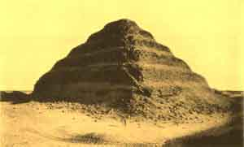
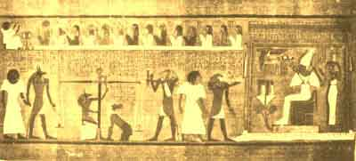

  
[Intangible Textual Heritage](../../index)  [Egypt](../index) 
[Index](index)  [Previous](eml09)  [Next](eml11) 

------------------------------------------------------------------------

[Buy this Book on
Kindle](https://www.amazon.com/exec/obidos/ASIN/B002KKCXC6/internetsacredte)

------------------------------------------------------------------------

  
*Egyptian Myth and Legend*, by Donald Mackenzie, \[1907\], at Intangible
Textual Heritage

------------------------------------------------------------------------

p. 87

# CHAPTER VII

### Death and the Judgment

The Human Triad--Ghosts--Spirits of the Living--Why the Dead were given
Food--Souls as Birds--The Shadow and the Name--Beliefs of Divergent
Origin--Burial Customs--The Crouched Burial--Secondary
Interment--Extended Burials--Mummies--Life after Death--Two
Conceptions--Souls in the Sun Boat--The Osirian Paradise--journey to the
Other World --Perils on the Way--Conflicts with Demons--The River of
Death--The judgment Hall--Weighing the Heart--The Happy Fields.

IN the maze of Egyptian beliefs there were divergent views regarding the
elements which constitute the human personality. One triad was a unity
of the Ka, spirit; the Khu, soul; and Khat, the body. Another grouped
Khaybet, the shadow, with Ba, the soul, and Sahu, the mummy. The
physical heart was called Hati; it was supposed to be the seat of the
intelligence, and its "spirit" was named Ab, which signified the will
and desires. The "vital spark", or controlling force, was symbolized as
the Sekhem, and the Ran was the personal name.

The Ka of the first triad is the most concrete conception of all. It was
probably, too, the oldest. The early people appear to have believed that
the human personality combined simply the body and the spirit. In those
tomb scenes which depict the birth of kings the royal babe is
represented by two figures-the visible body and the invisible "double".
The Ka began to be at birth; it continued to live on after death.

But a human being was not alone in possessing a

p. 88

\[paragraph continues\] Ka. Everything
that existed was believed to have its "double". A fish or other animal
had a Ka; so also had a tree; and there were spirits in water, in
metals, in stone, and even in weapons and other articles manufactured by
man. These spirits were invisible to all save the seers, who were able
to exercise on occasion the "faculty" which Scottish Highlanders call
"second sight".

It was conceived that the Ka could leave the human body during sleep, or
while the subject lay in a trance. It then wandered forth and visited
people and places, and its experience survived in memory. Dreams were
accounted for in this way as actual happenings. When a man dreamt of a
deceased friend, he believed that his Ka had met with the Ka of the
dead, held converse with it, and engaged in the performance of some
Other-World duty. Sometimes the wandering Ka could be observed at a
distance from where the sleeper reposed. It had all the appearance of
the individual, because it was attired in the "doubles" of his clothing
and might carry the "double" of his staff. Ghosts, therefore, included
"the spirits of the living", which were not recognized to be spirits
until they vanished mysteriously. They might also be simply heard and
not seen.

In the story of Anpu and Bata is contained the belief that the Ka could
exist apart from the body. Its habitation was a blossom, and when the
petals were scattered the younger brother fell dead. He revived,
however., when the seed was placed n a vessel of water. This conception
was associated with belief in the transmigration of souls. Bata entered
a new state of existence after he left his brother.

During normal life the Ka existed in the human body. It was sustained by
the "doubles" of everything

p. 89

that was partaken of. After death it required food and drink) and
offerings were made to it at the grave. The practice of feeding the dead
continues in Egypt even in our own day.

In ancient times a cult believed that the Ka could be fed by magic.
Mourners or ancestor worshippers who visited the tomb simply named the
articles of food required, and these were immediately given existence
for the spirit. The "good wishes" were thus considered to be potent and
practical.

It was essential that the dead should receive the service of the living,
and those who performed the necessary ceremonies and made the offerings
were called the "servants". Thus the Egyptian word for "priest"
signified a "servant". But the motive which prompted the mourners to
serve the departed was not necessarily sorrow or undying affection, but
rather genuine fear. If the Ka or ghost were neglected, and allowed to
starve, it could leave the grave and haunt the offenders. Primitive man
had a genuine dread of spirits, and his chief concern was ever to
propitiate them, no matter how great might be the personal sacrifice
involved.

Sometimes a small "soul house" was provided by the wayside for the
wandering Ka, but oftener an image of wood or stone was placed for its
use in the grave. The statues of kings which have been found in their
tombs were constructed so that their disembodied spirits might be given
material bodies, and those which they caused to be erected in various
parts of the kingdom were primarily intended for a similar purpose and
not merely to perpetuate their fame, although the note of vanity is
rarely absent in the inscriptions.

The Khu, or "soul", was a vague conception. It was really another form
of the Ka, but it was the

p. 90

"double" of the intellect. will, and intentions, rather than the
"double" of the physical body. The Khu was depicted as a bird, [1](#fn_80) and was called "the bright one" or "the
glorious one".

The Ba of the second triad was a conception uniting both the Ka and the
Khu. It is represented in bird form with a human head, hovering over the
Sahu, or mummy, on which it gazes wistfully, always seeking to re-enter
the bandaged form. Like the Ka, it required nourishment, which was
provided, however, by the goddess of the consecrated burial ground.

The Khaybet, or shadow, is evidently the survival of an early belief. It
is really another manifestation of the Ka. Like all primitive peoples,
the archaic Egyptians believed that their shadows were their souls.
Higher conceptions evolved in time, but their cultured descendants clung
to the old belief, which was perpetuated by folk customs associated with
magical practices. Spells were wrought by casting shadows upon a man.,
and he might be insulted or injured if an offence were committed against
his shadow.

The Ran, or name, was also a manifestation of the Ka. Power could be
exercised by uttering the name, because there was magical influence in
those words which were believed to have spiritual "doubles". A personal
name was the spirit identified; its service was secured when the name
was uttered. The spirit was the name and the name was the spirit. If a
magician desired to work evil against an individual, he made use of the
name when uttering potent magical formulæ. The dead were similarly
conjured up when their names were spoken

p. 91

in invocations; evil spirits were cast out by those who knew their
names. [1](#fn_81) To guard himself against
wizards who uttered "words of power", or verbal spells, the Egyptian
therefore considered it necessary to have two names--the big name and
the little name, or the true name and the good name. He kept his "big,
true name" secret, because it was the Ran; his "good little name" was
his nickname, and was not a part of his living being.

The naming ceremony was conducted in secret. The child's fate was bound
up in the true name and his character was influenced by it. After it was
conferred, a nickname was used, but the true name was the grave name and
was uttered when the welfare of the spirit was secured by the utterance
of magical spells which "opened the way" in the land of the dead. The
gods had Rans also. When Isis obtained the secret name of Ra, she became
his equal.

The divergent conceptions regarding the soul in Egyptian religion arose
from the mingling of beliefs caused by the mingling of peoples, and also
the Egyptian tendency to cling to every belief, or form of belief, which
evolved in the course of time in Egypt. A people who believed in the
existence of "doubles" and in the transmigration of souls had many vague
and complex conceptions. Incoherencies were a feature of their religious
beliefs. It must be borne in mind, at the same time, that our review
covers a vast period of time, during which various religious cults
exercised supreme influence in moulding Egyptian thought. One cult
predominated at one period; another cult arose in turn to teach its own
peculiar tenets, with the result that all beliefs were ultimately
accepted. This process is clearly indicated by the

p. 92

various burial customs and the complex religious ceremonies which
prevailed in different ages.

As we have seen, the early people buried their dead crouched up in
shallow graves with due provision of nourishment and implements. [1](#fn_82) They appear to have believed that the Ka
remained beside the body until the flesh decayed. Then it either ceased
to be, or it haunted the cemetery. Among primitive peoples at the
present day much concern is evinced regarding the ghosts of the newly
dead. When a negro, for instance, is questioned about his remote
ancestors, he is unable to express an opinion as to whether or not their
spirits continue to exercise any influence upon the living, but he
trembles if asked about his dead father.

The Egyptian tree worshippers conceived of a tree goddess which gave
food cakes and poured out drink to disembodied Kas. The influence of
this ancient cult is traced in the Osiris and Bata folk tales. In late
Dynastic times tree worship was revived when the persisting beliefs of
the common people gained ascendancy, and it has not yet wholly
disappeared in the Delta region. The sacred tree and the holy well are
still regarded with reverence.

The. Horites, or Dynastic Egyptians, who pressed northward on their
gradual campaign of conquest, introduced a new burial custom. Instead of
digging shallow graves they erected brick-lined tombs, in which the dead
were laid upon their backs, fully extended, clad in state, and adorned
with articles of jewellery. In the inscriptions the Ka and Khu are
referred to. But no attempt was made, even in the First and Second
Dynasties, to preserve the body from decay, and sumptuous offerings were
placed in the tombs,

p. 93

Another burial custom involved secondary interment, as was the case in
those European districts where early graves have been found to contain
disconnected skeletons. In Egypt attempts were sometimes made to arrange
the bones in proper position, but they were often heaped in confusion.
It appears that temporary interment was a ceremony of riddance, the
object being probably to hasten the departure of the Ka. Dismemberment
was also practised, and many graves show that decapitation was effected
after death.

In one of the sacred books of ancient Egypt the mutilation of dead
bodies is referred to with horror. "I shall not be destroyed," we read,
"my head will not be cut off, nor my tongue taken out, nor will the hair
of my head or my eyebrows be shaved off. My body will endure for all
time."

The revolt against dismemberment took place at the beginning of the
Third Dynasty, about 3000 B.C. Massive stone tombs were then constructed
and the bodies of the dead were mummified. The idea was either that the
Ka would ultimately return and cause the dead to live again, or that the
existence of the soul in the Nether World depended upon the existence of
the body upon earth. The embalming of the dead ultimately became general
throughout Egypt, but the belief in dismemberment survived in the
practise of disjointing one of the mummy's feet. During the Middle
Kingdom period the dead were laid on their left sides, as if to peer
through the Osiris or Horus eyes depicted outside the mummy cases.

Herodotus, who visited Egypt in the fifth century before Christ, found
the people "adhering contentedly to the customs of their ancestors, and
averse to foreign manners". He related that when an influential man
died, the females of the household smeared their hands

p. 94

and faces with dirt, and ran through the streets with their clothes in
disorder, beating their bodies and lamenting aloud. The men behaved in
similar manner after the corpse was removed from the house.

Embalmers were licensed to practise their profession, and they displayed
much ingenuity and surgical skill. When a body was carried to them, they
produced models of mummies and arranged a price. The quality of their
work depended on the amount of money expended by the dead man's friends.

The costliest method of embalming was as follows. The brain was
extracted through the nostrils with the aid of instruments and after the
infusion of a chemical preparation. Then a stone knife was used to make
an incision on one side of the body. The liver, heart, lungs, and
intestines were immediately drawn out, and, after being cleansed, they
were steeped in palm wine and sprinkled with rich perfume. The body was
dried, and stuffed with powdered myrrh, cassia, &c., and sewn up. It was
afterwards covered with nitre for seventy days. Then it was washed all
over and carefully wrapped in bandages which had been dipped in a strong
gum. As soon as it was carried back to the home it was placed in a large
coffin, shaped like a human form, which was inscribed with magical
charms and decorated with sacred symbols and figures of gods and
goddesses. The face of the dead was carved upon the lid; in the Roman
period it was painted.

A cheaper method of embalmment was to inject a chemical preparation
before the body was covered with nitre. At the end of seventy days the
intestines were drawn out. Nothing then remained except the skin and
bones; the flesh had been eaten away by the nitre. Poor people could
only afford to have a cheap preservative

p. 95

injected into the veins, after which the body was left in nitre for the
usual period.

The intestines were placed in four canopic jars, on the lids of which
were often shaped the heads of the four protecting gods, who were the
sons of Horus, and represented the north, south, east, and west. These
were Amset, with human face, who guarded the stomach and large
intestines; Hapi, with dog's head, who guarded the small intestines;
Dûamûtef, with jackal's head, who guarded lungs and heart, and
Kebeh-senuf, the hawk-headed, who guarded the liver and gall bladder.
These jars were placed in a chest and deposited in the tomb. The organs
they contained were those which were believed to have caused the various
sins to be committed.

The funeral procession was a solemn and touching spectacle. All the
family were present, and women mourners wailed aloud on the way to the
cemetery on the western bank of the Nile. The mummy was drawn upon a
sledge. When the tomb was reached, the coffin was set up on end, facing
the south, and an elaborate ceremony was gone through. It was conducted
by the chief mourner, who recited the ritual from a papyrus roll, while
responses were made by the relatives. Two females represented Isis and
Nepthys, for a part of the ceremony was a reproduction of the scene
enacted around the body of Osiris when it was restored and prepared for
burial. The dead had also to be instructed how to reach the Egyptian
heaven. The journey could not be accomplished in safety without the aid
of magical formulæ. So these were spoken into the ears of the corpse, as
was probably the custom in the days of crouched burials. But the danger
was ever present that the dead would fail to remember all the priestly
instructions which were repeated over them. The formulæ were therefore
inscribed

p. 96

on the coffin and on the walls of the tomb, and as time went on it
became customary to prepare rolls of papyrus, which were ultimately
collected into *The Book of the Dead*. This papyrus might be wrapped
under the mummy bandages, or else laid within the coffin. A bull was
slaughtered to provide food for the sustenance of the Ka and as a
sacrifice to the gods.

The coffin was afterwards lowered down the grave shaft to the secret
chamber in which had been placed the image of the dead, his weapons and
clothing, his ornaments and perfumes and, perhaps, several articles of
furniture. Then the entrance was closed up with stonework. A funeral
feast in the antechamber concluded a ceremony which grew more and more
elaborate as time went on. Food offerings were afterwards brought at
intervals by faithful mourners.

There were two distinct conceptions of the after-life and these became
confused in the ages that followed. The sun worshippers believed that
the souls of the dead passed to the first division of night, where those
who were privileged to utter the magical spells, which could compel the
obedience of the gods, were permitted to enter the bark of Ra. In their
tombs were placed models of the sun boat.

The Other-World conception of the Osirian cult made more permanent
appeal to the Egyptian mind. Heaven is pictured as the "double" of the
Delta region, where apparently the conception had its origin. But,
before it can be reached, the soul must needs travel a long and weary
way which is beset with many perils. The Paradise of Aalu is situated in
the west. Bleak and waterless deserts have to be crossed, and these are
infested by fierce reptiles; boiling streams also intercept the pilgrim,
who is ever in danger of being compelled to turn back.

p. 97

When the soul sets forth, he takes with him his staff and his weapons,
and food for nourishment. He climbs the western mountains and then
enters the Kingdom of the Dead. An immense sycamore tree towers before
him with great clusters of fruit amidst its luxuriant foliage. As he
approaches it a goddess leans out from the trunk as from a window,
displaying the upper part of her body. In her hands she holds a tray
heaped with cakes and fruit; she has also a pot of clear fresh water.
The soul must needs eat of the magic food and drink of the magic water,
and thus become a servant of the gods, if he is to proceed farther. If
he rejects the hospitality of the tree goddess, he will have to return
again to the dark and narrow tomb whence he came, and lead forever there
a solitary and joyless existence.

The soul of him who is faithful eats and drinks as desired, and then
proceeds on the journey, facing many perils and enduring great trials.
Evil spirits and fierce demons compass him about, desiring that he
should die a second death and cease to be. A gigantic tortoise rises
against him; he must fight against it with his lance; serpents are
poised to strike, and they must be overcome. The very insects have
venomous stings and must be driven away. But his most formidable enemy
is the fierce god Set, the murderer of Osiris, the terror of the good
gods and of men, who appears as an enormous red monster, with a head
like a camel and the body of a hound, his long and forked tail erect and
venomous. Fain would that wrathful demon devour the pilgrim on his way.

When the evil god is overcome and driven back, the soul goes forward
until he reaches the bank of a wide river There a magic boat awaits him.
The crew consist of silent divinities who give him no aid. But ere he

p. 98

can embark he must needs answer each question which the boat addresses
to him. He must know and tell how it is constructed in every part, and
if the papyrus roll which was laid beside his mummy contains the secrets
of the boat. and the magical formulæ which must also be repeated, he
will be ferried over the river and taken to the Osirian kingdom. The
sulky "ferryman" is called "Turnface": his face is always turned away
from the dead who call to him.

After entering the boat the soul's journey is not near to an end. He
desires greatly to join those happy beings who have their dwellings in
the blessed fields of Aalu but he must first be tried before Osiris the
King of the Dead and Judge of All. The only approach to Paradise is
through the Hall of justice, which rises before him stupendous and dark
and full of mystery. The gate is shut fast; no man can draw the bolts or
enter without permission of the king.

Alone, and trembling with fear, the pilgrim soul stands before the gate
with both hands uplifted in adoration. He is beheld by the shining god
who is within. Then in a clear, full voice the soul cries out in the
deep silence:

Hail, unto thee, O thou great god, thou who art lord of truth!  
Lo! I draw nigh to thee now, O my lord, and mine eyes behold thy
beauty.  
Thee I know, and I know also the two-and-forty gods assembled with thee
in the Hall of justice;  
They observe all the deeds of the wicked; They devour those who seek to
do evil;  
They drink the blood of those who are condemned before thee, O just and
good king.  
Hail! Lord of justice; Thee I know,  
I come before thee even now to speak what is true,  
I will not utter what is false, O Lord of All.

p. 99

The soul then recites the ritual confession in which he claims to be
guiltless of the offences which are punishable.

I have done no evil against any man.  
I have never caused my kinsfolk to be put to death,  
I have not caused false witnesses to speak in the Hall of justice.  
I have not done that which is hated by the gods.  
I am not a worker of wickedness.  
I have never oppressed a servant with too much work.  
I have not caused men to hunger nor to weep.  
I have not been devoid of good works, nor have I acted weakly or with
meanness.  
I am not a murderer.  
I have not conspired to have another put to death.  
I have not plotted to make another grieve.  
I have not taken away temple offerings.  
I have not stinted the food offered to the gods.  
I have not despoiled the dead.  
I have never committed adultery.  
I have not failed to keep myself pure as a priest.  
I have not lessened the corn measure.  
I have not shortened the hand measure.  
I have not tampered with the balance.  
I have not deprived children of milk.  
I have not stolen cattle from the meadows.  
I have not snared the birds consecrated to the gods.  
I have not taken fish from holy lakes.  
I have not prevented (Nile) water from running (in channels).  
I have not turned aside the water.  
I have not stolen water from a channel.  
I have not put out the fire when it should burn.  
I have never kept from the Nine Gods what was their due.  
I have not prevented the temple cattle from grazing on my land.  
I have not obstructed a god (his image) when he came forth (in a
festival procession).

The soul concludes by declaring that he is sinless,

p. 100

and expresses the hope that no ill will befall him in the Hall of
Judgment.

The jackal-headed god Anubis, "Opener of the Ways", then strides from
the hall and leads the soul by the hand before Osiris, who had heard the
confession in silence. No word is uttered as the dead man enters. The
King of the Dead sits in his high throne within a dim pavilion. His
crown is upon his head. In one hand he holds the crook and in the other
the flail. He is the supreme judge of the Dead.. Before him stands the
sure balance on which the heart of the dead man will be weighed. Thoth,
the recording god, is beside it, and Horus and Maat, goddess of truth
and justice, are there also. The guardian of the balance is a monster
which is ready to fall upon sinners who are condemned before the great
god. Around the dread hall crouch the two-and-forty animal gods who tear
the wicked to pieces.

In the tingling silence which prevails, the pilgrim again recites the
confession. Osiris makes no comment. Then, quivering with fear, the soul
watches the gods deliberately weighing his heart in the balance, while
Maat, the goddess of truth and justice, or her symbol, an ostrich
feather, occupies the opposite scale.

The trembling soul cries out to his heart not to witness against him. "O
heart that was mine," he says, "do not say 'Behold the things he hath
done'. Permit me not to be wronged in presence of the great god."

If the heart is found to be neither too heavy nor too light, the dead
man is acquitted. Thoth makes known the result of the weighing to
Osiris, who then orders the heart to be restored to the man on trial.
"He hath won the victory," the King of the Dead exclaims. "Now let him
dwell with the spirits and the gods in the fields of Aalu."

 

THE STEP PYRAMID OF SAKKARA

(Tomb of Zoser, of which Imhotep was the architect)

p. 101

 

JUDGEMENT SCENE: WEIGHING THE HEART

The judge is Osiris, behind whom stand Isis and Nepthys. Horus and
Anubis lead in two forms of deceased. Thoth makes the record, another
form of Anubis adjusts the balance, and the monster waits to destroy
deceased if the verdict is unfavorable. On the upper part of the picture
deceased salutes some of the two-and-forty gods who surround the
Judgement Hall.

From "Book of the Dead" papyrus.

Released and rejoicing, the dead man goes forth to gaze upon the wonders
of the Nether World. The divine kingdom is a greater and more glorious
Egypt, in which the souls work and hunt and combat against their enemies
as in other days. To each man is allotted his task. He must till the
soil and reap the grain which grows in abundance and to a great height.
The harvest never fails, and famine and sorrow are unknown.

When the soul desires to return to visit familiar scenes upon earth it
enters the body of a bird or an animal, or perhaps it blossoms as a
flower. It may also visit the tomb as the Ba, and reanimate the mummy
and go forth to gaze on scenes which were familiar and dear in other
days.

The souls of dead men whom Osiris condemns, because of sins committed
upon earth, are subjected to terrible tortures ere they are devoured by
the animal gods which crouch, waiting, in the silent and awful Hall of
Judgment.

------------------------------------------------------------------------

### Footnotes

[90:1](eml10.htm#fr_80) According to Celtic folk
belief the dead sometimes appear as birds. This idea may be a survival
of the transmigration-of-souls conception; the soul passed through many
animals before re-entering a human body.

[91:1](eml10.htm#fr_81) The "ceremony of
riddance" referred to by Isocrates.

[92:1](eml10.htm#fr_82) This burial custom
survived at least as late as the Fifth Dynasty, when mummification was
well established.

------------------------------------------------------------------------

[Next: Chapter VIII: The Religion of the Stone Workers](eml11)

