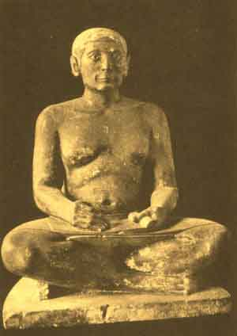
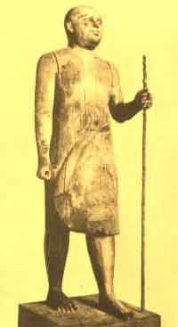

  
[Intangible Textual Heritage](../../index)  [Egypt](../index.md) 
[Index](index)  [Previous](eml11)  [Next](eml13.md) 

------------------------------------------------------------------------

[Buy this Book on
Kindle](https://www.amazon.com/exec/obidos/ASIN/B002KKCXC6/internetsacredte.md)

------------------------------------------------------------------------

  
*Egyptian Myth and Legend*, by Donald Mackenzie, \[1907\], at Intangible
Textual Heritage

------------------------------------------------------------------------

p. 116

# CHAPTER IX

### A Day in Old Memphis

In the Streets--The Temple of Ptah--Glimpses of Life--A Dispute--Old Age
is honoured--A Dignified Nobleman--High--born Ladies--Racial
Types--Bearers of Temple Offerings--In the Slums--Artisans at Work--The
Marketplace--Fresh Fish on Sale--On the Quays--Sailors from
Crete--Pharaoh's Soldiers--Arrest of the Tax Collectors--A Significant
Folk Tale--The Wronged Peasant--His Appeal to the judge--Eloquent
Speeches--Honoured by His Majesty.

As we gaze upon the scenes depicted in tombs, read the inscriptions, and
piece together fragments of papyri containing old legends, we are
afforded vivid glimpses of life in the Old Kingdom. The great city of
Memphis is conjured up before us; its gates lie open, and armed guards
permit us to enter. We walk through the crowded streets, pausing now and
again to gaze upon the people as they come and go, or, perchance, we
loiter in front of a yard or workshop, watching the busy artisans plying
their trades.

We pass through a main thoroughfare. Most of the houses are built of
brick; the dwellings of the poor are of wattles daubed with clay. . . .
Now we enter a spacious square, in the centre of which towers a sublime
statue of the Pharaoh. The sun is hot, although it is yet early
forenoon, and we seek the shadow of that vast dominating building round
which the city has grown up. It is the stone temple of the god Ptah,
grandly severe in outline and fronted by two noble pylons of massive

p. 117

proportions. We peer through the gateway as we pass. A procession of
priests is crossing an inner court on which lie the broad shadows of
great square pillars set widely apart, and supporting immense blocks of
limestone. One is impressed by the air of mystery and solemnity which
pervades the temple interior.

We can seat ourselves here on the stone bench and watch the crowds
pouring from the streets. Memphis is a wonderfully quiet city. You hear
a constant hum of voices; it murmurs like a great beehive. But there is
no clatter of traffic, for the streets are devoid of vehicles, and
horses are as yet unknown in the land of Egypt. Peasants from the
country are leading their asses laden with salt, corded bales, rushes
for basket makers, bundles of papyrus stalks, and hard stones. Great
burdens are carried on the shoulders of labourers; even boys stagger
under heavy loads.

Everyone is scantily clad. Men of the lower classes wear only a
loincloth, while those of higher social rank have short kilts of linen
which are strapped round their waists with leather belts. Women of all
ranks are gowned to the ankles, and ladies have skirts so narrow that
they walk with short steps, but yet not ungracefully.

Half-naked the men may be, yet it is not difficult to distinguish the
various classes. There is no mistaking the labourer, even although his
burden has been delivered, or the tradesman, for he carries his tools.
Here is a busy merchant knitting his brows, and there a bland-faced
scribe with dry, pouting lips and peering eyes set in cobwebs of
wrinkles. A few merry students are walking leisurely towards the temple
with papyrus rolls under their arms.

A loud clamour of voices in dispute has broken out at a street corner.
Two carriers have collided, and the

p. 118

one who has fallen is an Egyptian; the other is a tall negro. The
smaller man leaps to his feet. Insult has been added to injury, for the
alien is but. a slave, and, fuming with anger, he throws himself on the
black man, who is hampered by his load, and belabours him with his
fists. A crowd collects, and its sympathy is evidently with the
Egyptian. But suddenly a few city guards rush forward; they smite the
combatants with their staves, force them apart, and cause them to hasten
away. The crowd disperses speedily, and order is again restored.

Note the studied politeness of the greater number of pedestrians. Age is
highly honoured, young men stand aside to allow their seniors to pass;
three lads have risen from a shaded seat near to us to make room for an
old man who is frail and breathless and desires to rest a little ere he
enters the temple.

Now the moving crowd breaks apart, for somebody of importance is coming
up the street. He is a nobleman and a royal official of high rank. In.
the Court he is "Keeper of the Royal Robes" and "Sandal-bearer to the
Pharaoh". He is also one of those great judges who sit in the Hall of
justice. In his youth he was a college friend of the monarch's, and is
now privileged at Court ceremonies to kiss the royal toe instead of the
dust on which it trod. He owns a large estate, and has much wealth and
influence. As he walks past, the pedestrians salute him respectfully
with uplifted arms. He makes no response; he appears to be oblivious to
their presence. Mark his imperious air and lordly gait. . . . His kilt
is finely embroidered; the upper part of his body is bare; on his head
he wears a great stiff wig which falls down behind over his shoulders,
protecting his neck from the hot sun. He is square-chested and muscular;
he walks erect, with tilted chin. His face is drawn and severe; he

p. 119

has firmly set, drooping lips, and his eyes are stern and proud. He is
obviously a man accustomed to command and to be obeyed. . . . A servant
shuffles after him carrying his sandals and water bottle.

He has just acknowledged with a curt bow the profound obeisance of that
rich merchant. But now he meets an equal in the middle of the
square--Imhotep, Chief Architect to the King. Ere they speak they both
bow gravely, bending their backs, with hands reaching to their knees.
Then they converse for a few moments, salute one another again, and turn
gravely away.

Some high-born ladies have gathered in the shade. Two carry bunches of
lotus flowers, and the others smell them with appreciation. Their faces
are refined and vivacious, and one is "black but comely", for she is a
Nubian by birth. How they chatter as they flicker their broad fans!
Their white gowns are elaborately embroidered in colours, and they all
wear sandals, for the builders have left much grit in the streets. Their
wigs are drawn low on their foreheads, round which they are clasped by
graven bands of silver and gold. Gems sparkle in their necklaces, which
are of elaborate design, and one or two wear their wigs set well back to
display heavy car-rings, which are becoming fashionable. A handsome girl
is wearing a broad gold armlet which came from Crete. The others examine
it with interest, and when they break into laughter, displaying gleaming
white teeth, the girl looks sideways in confusion, for they tease her
about her far-travelled lover who gifted her that rare ornament. Now
they saunter in pairs across the square; they are going down to the
quays to sail on the Nile.

There is a variety of racial types about us. The southern Egyptians are
almost black, those from the centre of the kingdom are brown, and the
Delta people

p. 120

have yellow skins. That bearded man who has just gone past is a Semite
from Arabia; and here comes a soft-featured Syrian, walking with an
oblique-eyed Sumerian from Babylonia. These tall negroes are Nubian
mercenaries, who were taken captive in a frontier war. Of late the stone
builders have been purchasing them in large numbers, for they have great
muscular strength and make excellent labourers.

There is no mistaking the awkward, wide-eyed peasant who came to the
market with salt, and is now surveying the great city of wonderful
buildings and endless streets.

That red-haired man who is hurrying past is an Amorite; he came south to
barter rugs for corn. He looks behind with an ugly scowl-a carrier has
shouted something after him, because an Egyptian peasant dislikes a man
who reminds him of red-haired Set, the slayer of Osiris.

Now here comes a handsome stranger who is exciting much interest. Men
and women turn round to look after him. Children regard him with wonder.
Not only is he taller than the majority of Memphites, but he is
distinguished by his lightly coloured hair and his strange blue eyes.
Some would fain know if his cheeks are a natural red or smeared with
face paint. No one doubts whence he came. He is one of the fair Libyans,
and he is evidently a man of some importance, for even royal officials
acknowledge his salutations.

Ere we turn away, let us watch that little procession of young peasants
walking past. They are bearers of offerings, and are going to the
temple. One lad has shouldered a live calf, another brings a bundle of
papyrus stalks, and a third has a basket of flour upon his head. The
girls carry bunches of flowers, doves in pairs, and tame pelicans. One
or two calves are led by boys. Little

p. 121

notice is taken of the peasants. Processions of similar character are
seen daily in Memphis.

We had better cross over quickly, for here comes a great herd of
unwilling goats driven by shouting peasants who wield their staves
rather freely, nor care whether they miss a goat and strike a
pedestrian. The city guards are watching them with interest, for they
know their men.

Now turn down this narrow twisting street. Houses are lower here, and
some are built with brick, but most of them are constructed of
clay-plastered wickerwork. Why not enter this little dwelling? The door
lies open, and there is nobody within. Man and wife labour in a potter's
yard. The furniture consists of one or two tough stools, a low bed over
which hangs a gnat-protecting net, and here and there are a few jars and
pots of coarse pottery. Within the window lattice a bunch of lotus
leaves is drying in the sun; a cut of salted fish hangs on the wall; a
flint knife lies on the floor. The house is used mainly as a sleeping
apartment, and if there is a baby it is near the mother in the potter's
yard.

Outside, a few children are playing a curious game, which appears to be
an imitation of a temple ceremony. Wives of artisans sit gossiping in
the shade of a brick building; some are sewing, and others are cutting
vegetables which they have brought from the market. Two girls go past
with water pots on their heads.

We have glimpses, as they walk on, of long narrow lanes of small and
low-roofed houses. There is evidently much congestion in the poorer
quarters of the city. Look through that open door and you will see an
industrious family. A widow and her three daughters are spinning and
weaving fine linen, which might well be mistaken for silk.

p. 122

Here is a brickyard. Labourers are mixing the clay; others shape the
bricks with a binding of straw and lay them out to dry. Carriers come
for those which are ready, and take heavy loads in two slings suspended
from poles which they lift upon their shoulders. An overseer hastens
them on, for the builders cannot be kept waiting.

Farther on is a stoneworker's yard. Under an awning squat several
skilled artisans who are engaged making vessels of alabaster and
porphyry. The process is slow and arduous. One has shaped and polished a
handsome jar with fluted lip and narrow neck, and is hollowing it out
with a copper-tipped drill which is fed with ground emery. He pauses for
a moment to wipe the perspiration from his forehead. and remarks to a
fellow: "This is certainly a handsome vessel." The other looks up and
surveys it critically. "It is your masterpiece," he remarks, with a
smile, and then goes on drilling a large shallow milk bowl.

Two men are cutting a block of porphyry with a copper saw, while an
apprentice supplies the emery, and relieves now one and then the other.
See how skilfully those labourers are levering a granite boulder into
position; it is mounted on a rounded wooden cradle, and slewed this way
and that. A lad is gathering wedges with which to raise it up. One or
two naked boys, squatted in a shady corner, are watching the proceedings
with interest. They are going to saw stone too, when they grow strong.

We enter another street and our ears are assailed by the clamour of
metal workers. It is a noisy quarter. Bang, bang, go the hammers on a
large sheet of copper. One would be deafened if he stayed here long.
Passersby twitch their eyes and foreheads and hurry on. Look

p. 123

at these naked men kneeling round the blazing furnace, puffing their
cheeks and blowing through long pipes. No Egyptian inventor has yet
contrived a mechanical bellows. Now the glowing metal is pulled from the
furnace, and a dozen exhausted workers rise, with their blowpipes in
their hands, coughing and rubbing their eyes, to wait until the
hammermen require them again.

Here are goldsmiths at work. A man is weighing precious metal in a
balance, and a scribe sits in front of him making careful records on a
sheet of papyrus. Near by are men with clever fingers and keen eyes, who
engrave and pierce little pieces of gold and silver, shape ear-rings and
necklaces, and hammer out sheets of gold which are to be inscribed with
hieroglyphics. An overseer moves to and fro from bench to bench and
artisan to artisan, surveying everything that is being done with
critical eyes.

So we pass from street to street, here watching potters at work, there
sculptors and carvers of wood and ivory, and anon the sandal makers and
those deft leather cutters who provide gentlemen with slitted network to
suspend on the back of their kilts for sitting upon.

Now we reach the principal marketplace. The scene is animated and
intensely human. Merchants are squatted beside their stalls, some
drowsing in the heat while they await purchasers, and others
gesticulating excitedly at bargain making. There is a good deal of
wrangling, and voices are often raised in dispute, while friends gather
in knots and chatter and laugh or engage in lively argument. Some make
purchases with ring money, but the majority engage in barter. Here a
merchant has displayed a fine collection of vases and bowls. A lady
surveys his wares critically and shakes her head over the prices he
demands; but he waits patiently, for he knows

p. 124

she is tempted to purchase and notes that she always returns to a
particular porphyry jar of exquisite design.

A woman of the working class leans over a basket of fish, and doubts if
they are quite fresh. The vendor lifts one, presses it with his fingers,
and smiles to her. "Caught this morning," he says. She decides to have
it for her husband's dinner, and gives in exchange a piece of red
pottery. Another woman barters a small carved box for ointment and
perfume, while a man gives a fan for a bundle of onions.

A steward from a nobleman's house passes from stall to stall,
accompanied by two servants, making numerous purchases, because several
guests of note are coming to the evening meal. He is welcomed, although
a hard bargainer, for he pays with money.

We catch, as we turn away, a soothing glimpse of the broad blue river,
and turn towards it, for the streets are dusty and hot, and we know the
air is cooler beside the quays. We cross an open space in which are
piled up the cargoes of unloaded boats. Here come half a dozen foreign
sailors who are going sightseeing. They also intend to make private
purchases for their friends at home. You can tell by their pants and
characteristic "wasp waists" that they are Cretans. They are short of
stature and slim and have sharp features like the Delta coast dwellers,
and their movements are active. Their dark hair is pleated in three long
coils which fall over their shoulders, and they affect small coloured
turbans. They all wear armlets, which are greatly favoured in the
distant island kingdom.

A company of Pharaoh's soldiers are marching towards the great limestone
fortress. They are naked, save for their loincloths, and about half of
them are archers; the others are armed with long spears and

 

A SEATED SCRIBE

From the limestone statue in the Louvre, Paris

p. 125

 

AN OLD KINGDOM OFFICIAL

The name "Sheikh-el Beled" (village chief) was given to the statue by
the Arabs on account of its resemblance to a familiar specimen of that
modern functionary

From the wooden statue in the Cairo Museum

carry wooden shields, square at the bottom and arching to a point at the
top. They go past with a fine swing, although they have been drilling
all forenoon on an open space two miles southward of the city.

Yonder are boatbuilders at work. The Cretan traders have brought them a
fresh supply of seasoned timber as well as a raft of drifted logs from
Lebanon. Wood is scarce and dear in Egypt, and watchmen are on duty in
the yard day and night.

Three commodious river boats are being constructed. The work is well
advanced, for the carpenters are fitting in the benches, which are being
pierced and prepared for jointing on trestles by men who sit astride
them. The artisans are skilled and active, and the overseers who direct
operations are easily recognized; they carry long staffs in their right
hands and constantly urge on the men.

But what is happening yonder in front of the Government buildings? A
large crowd has assembled, and the jeers and roars of laughter indicate
that something of amusing character is in progress. We press forward to
find that the city guards have made several arrests, and are hauling
their protesting prisoners through the doorway. The spectators are
delighted to see "the tables turned", for these are their
oppressors--the tax collectors--who are being taken before the Pharaoh's
accountants so that their accounts may be audited. There have been
several complaints of late of extortionate dealings and dishonest
transactions. In a large hall within we see the stern auditors kneeling
at their low desks, on which are piled the official records. Scribes
record the proceedings. Each arrested man crouches on his knees, and is
held firmly by a guard while he is sharply questioned and his accounts
are checked. All his private

p. 126

papers have been seized; he must explain every entry and prove that he
is a man above suspicion. It is a rough-and-ready, but effective, manner
of doing business. Punishments for dishonesty or oppression are sharp
and peremptory.

The Pharaoh is the protector of all his subjects great and small. A poor
man may suffer a great wrong and find himself unable to have it righted
even in the Hall of justice; but if the great monarch is appealed to, he
will prove to be no respecter of persons, and visit the wrongdoer with
punishment of great severity.

A tale has come down the ages which was often related in the dwellings
of poor and great alike, to show how Pharaoh might espouse the cause of
the humblest man in the kingdom. Scribes recorded it on papyri, and
fragments of these still survive.

Once upon a time a peasant had his dwelling in the Fayum, and it was his
custom to load his ass with nitre and reeds, salt and stones, and seeds
and bundles of wood, and drive it to a town in the south, where in the
marketplace he exchanged what he had brought for other things that he
and his family required. He began to be prosperous.

One day, when it was nigh to harvesttime, he journeyed townwards and
reached the estate of a great royal official named Meritensa. As he
passed through it he came to the farm of Hamti, a feudal tenant. The
farmer saw him approach, and to himself he said: "May the god permit me
to rob the peasant of his ass and its burden. I have need of salt."

The path along the river bank was exceedingly narrow, for Hamti had
sowed much land. Between his corn and the water there was scarcely the
breadth of a man's body.

p. 127

Said the farmer to one of his servants: "Bring me a rug from within."
The man ran to Hamti's house and came back with a rug, which was spread
out upon the path, and it reached from the corn to the river edge.

The peasant drove his ass along the narrow way, past the corn, and when
he drew nigh, the farmer called to him, saying: "Observe where you are
going; do not soil my rug."

"I will do according to your will," remarked the peasant, "and avoid
troubling you."

So he smote his ass and turned it inland to pass round the field. But
the farmer would not be satisfied with that even. He shouted with an
angry voice, saying: "Would you dare to trample upon my corn? There is
no path that way."

"What else can I do?" remonstrated the peasant; "you prevent me from
using the path by laying a rug upon it."

As he spoke his ass began to eat the grain, and the farmer seized it and
said: "I will take this animal in payment for the damage it has done."

The peasant cried indignantly: "What? first you close the path against
me, and now you seize my ass because it has taken a few ears of barley.
Dare not to wrong me on this estate; it belongs to the just Meritensa,
the great judge, who is a terror to all evildoers in the kingdom. Well
you know that I speak truly. Do not imagine that you can oppress me on
the land of such a good and high nobleman."

But the farmer laughed. "Heard you not," he asked, "the maxim which
says: 'A peasant is esteemed only by himself?' Know now, too, that I am
even Meritensa, the judge, of whom you have spoken. I will deal with you
here and now."

p. 128

Having spoken thus, the farmer seized a scourge and lashed the peasant
fiercely, seeking to drive him away. But the wronged man refused to
depart. His body ached with many wounds. He waited about all day, but
neither by threat nor tearful appeal could he prevail upon the farmer to
give him back his ass and the burden it carried.

Then the peasant hastened towards the dwelling of Meritensa. He waited
the coming forth of that great lord, sitting patiently beside the wall
gate. Hours went past, and at length he saw Meritensa walking out to
step into a boat at the river side.

"Hail to thee, my lord!" he called. "Bid one of your servants to hear
the tale of my wrong."

As the man desired, so did the nobleman do. He bade a scribe to converse
with the peasant, who related how he had been wronged by Hamti.

So it happened that, when sitting in the Hall of justice next morning,
Meritensa repeated the accusations which the peasant had made against
the farmer. The other judges heard, and then said:

"It is our rule here that these peasants should bring witnesses. We know
their ways. If it is proved that the farmer stole some nitre and salt,
he can be ordered to make payment, or else he can be scourged. But we
must first hear evidence to confirm what is said by this peasant
fellow."

Meritensa made no reply. He was indignant at the other judges, and
scorned to discuss the matter with them any further. He decided to
advise the wronged man what to do.

But the peasant could not find witnesses, and again he waited the coming
forth of the good judge. Then he praised him with a loud voice, saying:
"Thou art

p. 129

mighty among the mighty ones and the good friend of poor men. May fair
winds waft thee on the lake of truth; may no wave smite thee or any
terror come nigh. Thou art a father to the fatherless, and a husband to
the widow and a brother to the girl in need. I laud thy name, for thou
dost give excellent counsel without desire of reward. Thou art the enemy
of the wrongdoer and the lover of justice. My cry thou didst hear, and
thou hast permitted me to speak. Thou art esteemed by those who are
worthy. Now show me mercy and undo my wrong; consider my prayer, enquire
regarding me, and thou wilt find that I have been plundered."

Meritensa was on his way to the palace, and he repeated unto Pharaoh
what the peasant had said, and related how he had been robbed by the
farmer.

His Majesty said: "This man hath great eloquence. See that his wrong is
not righted for a little time yet, and arrange that all his fine
speeches are recorded by your scribes. I should like to hear them word
by word. Meantime see that his wife and his children do not want for
food."

The peasant was given a supply of bread each day, and Meritensa arranged
that his wife and children should also be supplied with food in
abundance.

Daily did the wronged man wait the coming forth of the noble, whom he
addressed with great eloquence and poetic fervour. The scribes recorded
all the words of his mouth. But Meritensa pretended not to heed him, and
he even had him beaten.

Nine times did the peasant make appeal to the judge, and at length two
servants went and spoke to the man, who, when he saw them approach,
feared that he was about to be scourged once again. But the words which
they spake for their lord were:

p. 130

"You have no cause to be afraid because you addressed the judge these
many times. The Pharaoh has read your speeches and has praised them, and
you will be rewarded."

Meritensa then caused his scribes to take down the evidence of the
peasant regarding the robbery of his ass and its burden of nitre and
salt, and he laid the document before His Majesty.

Pharaoh said: "I cannot attend to this matter. Consider it yourself and
see that justice is done."

Meritensa then dispatched his officers to the farm, and he caused
Hamti's house and all his goods to be confiscated and given unto the
peasant.

All that was done was confirmed and approved by the Pharaoh, who
commanded that the eloquent peasant should be brought to the palace. His
Majesty took delight in his speeches and honoured him greatly, for he
caused rich dainties from the royal table to be sent unto the man and
his family.

------------------------------------------------------------------------

[Next: Chapter X: The Great Pyramid Kings](eml13.md)

