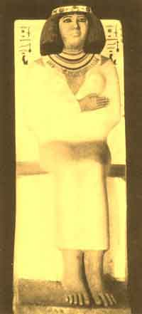

  
[Intangible Textual Heritage](../../index)  [Egypt](../index.md) 
[Index](index)  [Previous](eml16)  [Next](eml18.md) 

------------------------------------------------------------------------

[Buy this Book on
Kindle](https://www.amazon.com/exec/obidos/ASIN/B002KKCXC6/internetsacredte.md)

------------------------------------------------------------------------

  
*Egyptian Myth and Legend*, by Donald Mackenzie, \[1907\], at Intangible
Textual Heritage

------------------------------------------------------------------------

p. 185

# CHAPTER XIV

### Father Gods and Mother Goddesses

An Obscure Period--Popularity of Osiris Worship--A Mythical Region--The
Lake of Fire--Her-shef, who resembles Ptah--Links with Khnûmû--A Wind
God and Earth God--Giants and Elves--The God of Mendes--The Ram a Corn
Spirit--Deities fused with Osiris--Feline Goddesses--Flying
Serpents--The Mother of Mendes--Abydos, the Egyptian Mecca--Foreign
Invaders--A Buffer State--North and South in Revolt.

WE have entered upon an obscure and disturbed period which extends over
an interval of about three hundred years. The petty states of Egypt
continued to wage sporadic wars of conquest one against another, and a
prolonged struggle was in progress for supreme power. In time the
political units grew less numerous, and several federated tribes were
ruled over by powerful feudal lords. The chief centres of government in
Upper Egypt were established at Thebes, Siut, and Heracleopolis. Memphis
was for a time the capital of a group of allied nomes in Middle Egypt,
and at Sais in the north there was a reigning family of whom we know
nothing except from casual references in later times. The eastern Delta
lay open to the invader, and it is believed that foreign settlements
were effected there. Ultimately Egypt was divided into two great states.
The southern group of allies was governed by the Theban power, and the
northern by the Heracleopolitan. Then history repeated itself, and the
kingdom was once again united by a conqueror who pressed northward from
Upper Egypt.

p. 186

The Eighth-Dynasty kings claimed to be descended from those of the
Sixth. But, although they reigned at Memphis, their control of the
disordered kingdom was so slight that they were unable to erect any
monuments. No royal inscriptions survive at the quarries. After a
quarter of a century of weak Memphite rule, the powerful nome governor
of Heracleopolis Magna seized the throne and established the Ninth
Dynasty. The kings of the Tenth Dynasty are believed to have been also
his descendants.

Manetho calls the new king Akhthoes, and his name in the hieroglyphs is
usually rendered as Kheti. He is also known as Ab-meri-ra. Like Khufu,
he was reputed in the traditions of later times to have been a great
tyrant, who in the end went mad, and was devoured by a crocodile. He
seems to have held in check for a period the ambitious feudal nobles
whose rivalries so seriously retarded the agricultural prosperity of the
kingdom. No doubt famines were common.

Each nome promoted its own theological system, and that of Heracleopolis
Magna now assumes special interest because of its association with the
monarchy. The political influence of the priests of Heliopolis had
passed away, but the impress of their culture remained. Osiris worship
continued to be popular oil account of its close association with
agriculture. A Horus temple had existed at Heracleopolis from early
Dynastic times, but the identity of the god does not appear to have
survived the theological changes of the intervening period.

Heracleopolis Magna, which the Egyptians called Khenen-su is of special
mythological interest. It came to be recognized as the scene of the
great creation myth of the sun worshippers. There Ra, at the beginning,

p. 187

rose from the primeval deep in the form of the sun egg, or the lotus
flower--

He that openeth and he that closeth the door;  
He who said: "I am but One".  
Ra, who was produced by himself;  
Whose various names make up the group of gods;  
He who is Yesterday (Osiris) and the Morrow (Ra).

Khenen-su district was the scene of the "war of the gods", who contended
against one another at Ra's command--a myth which suggests the
everlasting struggle between the forces of nature, which began at
Creation's dawn, and is ever controlled by the sun. Somewhere in the
nome were situated the two mythical lakes, "the lake of natron" and "the
lake of truth", in which Ra cleansed himself, and there, too, at the
height of their great struggle--symbolized as the struggle between good
and evil--Set flung filth in the face of Horus, and Horus mutilated Set.
The ultimate victory was due to Ra, who, in the form of the Great Cat
that haunted the Persea tree at Heliopolis, fought with the Apep serpent
and overcame it. "On that day", according to *The Book of the Dead*,
"the enemies of the inviolable god (Osiris) were slain."

In the vicinity of Khenen-su was the fiery region. At its entrance
crouched the demon who had human skin and the head of a greyhound. He
was concealed by the door, and pounced unexpectedly upon "the damned";
he tore out their hearts, which he devoured, and he swallowed their
spirits. So the faithful sun worshippers were wont to pray:

O Ra-tum give me deliverance from the demon who devoureth those who are
condemned--he who waits at the door of the fiery place and is not seen.
. . . Save me from him

p. 188

who clutcheth souls, and eateth all filth and rottenness by day and by
night. Those who dread him are helpless.

At Khenen-su lived the Phoenix [1](#fn_104.md)--the "Great Bennu". It resembled an
eagle, and had feathers of red and golden colour. Some authorities
identify this mythical bird with the planet Venus, which, as the morning
star, was "the guide of the sun god".

The religion of Heracleopolis Magna was, no doubt, strongly tinged by
the theology of the sun worshippers. It seems also to have been
influenced by Memphite beliefs. The chief god was Her-shef, who bears a
stronger resemblance to Ptah Tanen than to Horus. He was a self-created
Great Father, whose head was in the heavens while his feet rested upon
the earth. His right eye was the sun and his left the moon, while his
soul was the light that he shed over the world. He breathed from his
nostrils the north wind, which gave life to every living being.

"Wind" and "breath" and "spirit" were believed by many primitive peoples
to be identical. [2](#fn_105.md) Her-shef was
therefore the source of universal life. As a "wind god" he resembles the
southern deity Khnûmû, who was also called Knef (the Kneph of the
Greeks). The Egyptian *knef* means "wind", "breath", and "spirit"--"the
air of life". In Hebrew *nephesh ruach*, and in Arabic *ruh* and *nefs*
have similar significance.

Ptah Tanen, Khnûmû, and Her-shef, therefore, combined not only the
attributes of the earth giant Seb, but also those of Shu, the wind god,
whose lightness is symbolized by the ostrich feather, but who had such
great strength that he was the "uplifter" of the heavens.

p. 189

Both Seb and Shu are referred to as self-created deities.

It has been suggested that the elfin Khnûmû, of whom Ptah was the chief,
had a tribal origin, and were imported into Egypt. In European lore,
dwarfs and giants are closely associated, and are at times
indistinguishable. The fusion of the dwarf Ptah with the giant Tanen is
thus a familiar process, and in the conception we may trace the
intellectual life of a mountain people whose giants, or genii, according
to present-day Arabian folk belief, dwell in the chain of
world-encircling hills named "Kaf".

In what we call "Teutonic" lore, which has pronounced Asiatic elements,
the giant is the "Great Father", and in what we call "Celtic", in which
the Mediterranean influence predominates, the giantess is the "Great
Mother". The Delta Mediterranean people had "Great Mother" goddesses
like Isis, Neith, the virgin deity of Buto, and Bast. At Mendes there
was a "Great Father" deity who links with Ptah, Her-shef, and Khnûmû. He
is called Ba-neb-tettu, the ram god, and "lord of Tettu", and he became,
in the all-embracing theology of Heliopolis, "the breath (life) of Ra".
In the *Book of the Dead* there is a reference to Ra as "the Lord of Air
who giveth life to all mortals".

The god of Mendes was reputed to have made "the wind of life" for all
men, and was called "chief of the gods", "ruler of the sky" and "monarch
of all deities". The earth was made fertile by his influence, and he was
the origin of the passion of love; he caused the fertilizing Nile flood.
Like Ptah Tanen, from whose mouth issued forth the waters, and like
Ptah, Khnûmû, and Shu) he was the pillar (*dad*) of the sky. Osiris is
also associated with the sky prop or props. All these deities appear to

p. 190

have had their origin in crude conceptions which survive in various
stages of development in European lore. [1](#fn_106.md)

Like Ba-neb-tettu, the Mendes "Great Father", Hershef of Heracleopolis
was also a ram god, symbolizing the male principle; so was Khnûmû of the
First Cataract district. In some representations of Ptah the ram's horns
appear on his head. The ram was the primitive Min, who was worshipped
throughout Egypt, and was absorbed by all the Great Father deities,
including Ra. Min was honoured at harvest festivals, and was therefore a
corn god, a character assumed by the deified King Osiris.

One of the figures of Her-shef of Heracleopolis is almost as complex as
that of Sokar, the Memphite god of the dead. He is shown with four
heads-a ram's head, a bull's head, and two heads of hawks. The bull was
Mentu, who, like Min, represented the male principle, and was also a war
god, the epitome of strength and bravery.

All the Great Fathers--Her-shef, Ptah, Khnûmû, and Ba-neb-tettu--were
fused with Osiris. Ptah united with Osiris as ruler of the dead, Khnûmû
became a form of Osiris at Heliopolis, Ba-neb-tettu of Mendes was also
Ba-neb-ded, another name for Osiris, and Her-shef of Heracleopolis was
"he on the sand", a form of Osiris, who is called "the god on the sand".

Her-shef is usually represented as a ram-headed man, wearing the white
crown with plumes, surmounted by two

 

NEFERT, A ROYAL PRINCESS OF THE OLD KINGDOM PERIOD

From the limestone statue in the Cairo Museum

 

p. 191

<table data-border="0" width="798">
<colgroup>
<col style="width: 33%" />
<col style="width: 33%" />
<col style="width: 33%" />
</colgroup>
<tbody>
<tr class="odd">
<td data-valign="TOP" width="33%">
 

Isis and the Child Horus 
(British Museum)
</td>
<td data-valign="TOP" width="33%">
 

Bast, the Cat Goddess, holding a Hathor-headed sistrum and an ægis 
(British Museum)
</td>
<td data-valign="TOP" width="33%">
 

Sekhet, Lion-headed Goddess, Wife of Ptah ("Sekhet, the Destroyer") 
(British Museum)
</td>
</tr>
</tbody>
</table>

THREE TYPICAL "GREAT MOTHER" DEITIES

 

disks (sun and moon) and two serpents with disks on their heads.
Plutarch regarded him as the symbol of "strength and valour", a
conception which accords with the military reputation of at least some
of the kings of Heracleopolis who lived in stormy times.

The goddess associated with Her-shef was Atet, who was also call
Mersekhnet, a "Great Mother" deity similar to Hathor, Isis, Neith, and
others. She was a cat goddess, and in her cat form was called Maau, an
appropriate name. She slew the Apep serpent--a myth which, as we have
seen, was absorbed by Ra. Other feline deities are Bast of Bubastis,
Sekhet, wife of Ptah, and Tefnut. [1](#fn_107.md)

At Heracleopolis there was a shrine to Neheb-Kau, who, like the virgin
deity of Buto in the Delta, was a serpent goddess, symbolizing the
female principle. She is represented as a flying serpent, [2](#fn_108.md) a reptile which Herodotus heard much
about in Egypt but searched for in vain; she also appears as a serpent
with human head, arms, and legs. She was worshipped at the Ploughing
Festival before the seed was sown. Like the sycamore goddess, she was
believed to take a special interest in the souls of the dead, whom she
supplied with celestial food and drink.

Another Heracleopolitan deity was the vine god Heneb, who suggests an
Egyptian Bacchus; he was probably a form of Osiris.

The female counterpart of the northern god, Baneb-tettu, was
Heru-pa-Kaut, "Mother of Mendes", who was represented as a woman with a
fish upon her head.

p. 192

She was in time displaced by Isis, as her son was by Horus. The
ceremonies associated with all the "mother goddesses" were as elaborate
as they were indecent.

Osiris worship flourished at Abydos, which became an Egyptian Mecca with
its holy sepulchre. The tomb of King Zer, of the First Dynasty, was
reputed to be that of the more ancient deified monarch Osiris, and it
was visited by pious pilgrims and heaped with offerings. Elaborate
religious pageants, performed by priests, illustrated the Osiris-Isis
story. Set, the fearful red demon god, was execrated, and the good
Osiris revered and glorified. Isis, mother of the god Horus, was a
popular figure. "I who let fall my hair, which hangs loosely over my
forehead, I am Isis when she is hidden in her long tresses."

Pious worshippers sought burial at Abydos, and its cemetery was crowded
with the graves of all classes. Nome governors, however, were interred
in their own stately tombs, like those at Beni Hassan and elsewhere, but
their mummies were often carried first to Abydos, where "the Judgment of
the Dead" was enacted. The Pharaohs appear to have clung to the belief
in the Ra bark, which they entered, as of old, by uttering the powerful
magic formulæ. The victory of the early faith was, however, complete
among the masses of the people. With the exception of the Ra believers
the worshippers of every other deity in Egypt reposed their faith in
Osiris, the god of the dead.

Some Egyptologists regard the Heracleopolitans as foreign invaders.
Their theology suggests that they were a mountain people of similar
origin to the Memphite worshippers of Ptah. But no records survive to
afford us definite information on this point. The new monarchs were
evidently kept fully engaged by their military operations,

p. 193

and not until nearly the close of the Tenth Dynasty do we obtain
definite information regarding the conditions which prevailed during the
obscure period. There then came into prominence a powerful nome family
at Siut which remained faithful to the royal house and kept at bay the
aggressive Thebans. In their cliff tombs we read inscriptions which
indicate that for a period, at least, the Pharaohs were able to maintain
peace and order in the kingdom. One of these records that the royal
officials performed their duties effectively, and that war had ceased.
Children were no longer slain in their mother's arms, nor were men cut
down beside their wives. The rebels were suppressed, and people could
sleep out of doors in perfect safety, because the king's soldiers were
the terror of all doers of evil. Further, we learn that canals were
constructed, and that there were excellent harvests--a sure indication
that a degree of order had been restored. A standing army was in
existence, and could be dispatched at short notice to a disturbed area.
The Siut nobles appear to have been Pharaoh's generals. They enjoyed
intimate relations with the ruling house. One, who was named Kheti, was
educated with the Pharaoh's family, and learned to swim with them, and
his widowed mother governed the nome during his minority. He married a
princess. His son, Tefaba, reduced the south by military force, and won
a great naval battle on the Nile. The younger Kheti, Tefaba's son, was
also a vigorous governor, and stamped out another southern rebellion,
and made a great display with his fleet, which stretched for miles. But
although southern Egypt was temporarily pacified, a rebellion broke out
in the north, and the Pharaoh Meri-ka-ra was suddenly driven from
Heracleopolis. He took refuge with Kheti, who pressed northward and won
a decisive victory. Meri-ka-ra was

p. 194

again placed on the throne. But his reign was brief, and he was the last
king of the Tenth Dynasty.

The Delta was now in a state of aggressive revolt, and the power of the
Theban house was growing in Upper Egypt. Ultimately the Siut house fell
before the southern forces, and a new official god and a new royal
family appeared in the kingdom.

------------------------------------------------------------------------

### Footnotes

[188:1](eml17.htm#fr_104.md) At a later date it
was located in Arabia.

[188:2](eml17.htm#fr_105.md) "Spirit" is derived
from *spiro*, "I breathe". The Aryan root "an" also signifies "wind" and
"spirit", and survives in words like "animal", "animate", &c.

[190:1](eml17.htm#fr_106.md) In Scottish archaic
lore the mountains are shaped by the wind hag, who is the mother of
giants. The Irish Ann or Danu, associated with the "Paps of Anu", has
the attributes of a wind goddess and is the mother of deities the Irish
hag Morrigu and her two sisters are storm hags and war hags. On
Jochgrimm Mountain in Tyrol three hags brew the breezes. The Norse
Angerboda is an east-wind hag, and she is the enemy of the gods of
Asgard. The gods who are wind deities include Zeus and Odin, "the Wild
Huntsman in the Raging Host". The Teutonic hags are evidently of
pre-Teutonic origin; they are what the old Irish mythologists called in
Gaelic "non gods".

[191:1](eml17.htm#fr_107.md) The Norse Freyja,
goddess of love, is also a cat goddess. In the Empire period Astarte was
added to the Egyptian collection of feline deities.

[191:2](eml17.htm#fr_108.md) Isaiah refers to
Egypt as "the land of trouble and anguish, from whence come the young
lion and old lion, the viper and fiery flying serpent" (*Isaiah*, xxx,
6; see also *Isaiah*, xiv, 29).

------------------------------------------------------------------------

[Next: Plate I: The Girl Wife and the Bata Bull](eml18.md)

