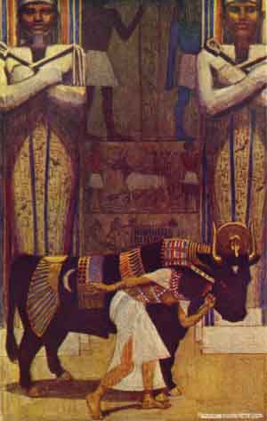

  
[Intangible Textual Heritage](../../index)  [Egypt](../index.md) 
[Index](index)  [Previous](eml17)  [Next](eml19.md) 

------------------------------------------------------------------------

[Buy this Book on
Kindle](https://www.amazon.com/exec/obidos/ASIN/B002KKCXC6/internetsacredte.md)

------------------------------------------------------------------------

  
*Egyptian Myth and Legend*, by Donald Mackenzie, \[1907\], at Intangible
Textual Heritage

------------------------------------------------------------------------

p. 194a

# PLATE I

 

THE GIRL WIFE AND THE BATA BULL

From the painting by Maurice Greiffenghagen

 

------------------------------------------------------------------------

[Next: Plate II: The Farmer Plunders the Peasant](eml19.md)

