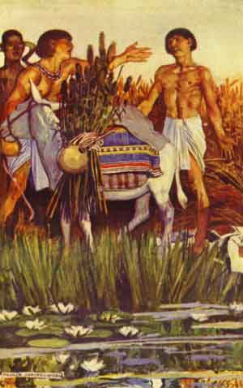

  
[Intangible Textual Heritage](../../index)  [Egypt](../index.md) 
[Index](index)  [Previous](eml18)  [Next](eml20.md) 

------------------------------------------------------------------------

[Buy this Book on
Kindle](https://www.amazon.com/exec/obidos/ASIN/B002KKCXC6/internetsacredte.md)

------------------------------------------------------------------------

  
*Egyptian Myth and Legend*, by Donald Mackenzie, \[1907\], at Intangible
Textual Heritage

------------------------------------------------------------------------

p. 194b

# PLATE II

 

THE FARMER PLUNDERS THE PEASANT

From the painting by Maurice Greiffenghagen

 

------------------------------------------------------------------------

[Next: Plate III: Senuhet Slays the Warrior of Tonu](eml20.md)

