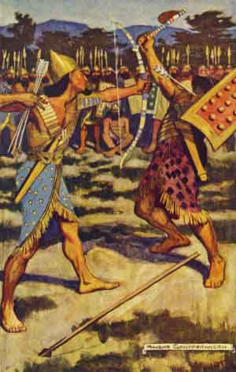

  
[Intangible Textual Heritage](../../index)  [Egypt](../index) 
[Index](index)  [Previous](eml19)  [Next](eml21) 

------------------------------------------------------------------------

[Buy this Book on
Kindle](https://www.amazon.com/exec/obidos/ASIN/B002KKCXC6/internetsacredte)

------------------------------------------------------------------------

  
*Egyptian Myth and Legend*, by Donald Mackenzie, \[1907\], at Intangible
Textual Heritage

------------------------------------------------------------------------

p. 194c

# PLATE III

 

SENUHET SLAYS THE WARRIOR OF TONU

From the painting by Maurice Greiffenghagen

 

------------------------------------------------------------------------

[Next: Plate IV: Queen Ahmes (Wife Of Thothmes I), Mother of the Famous
Queen Hatshepsut](eml21)

