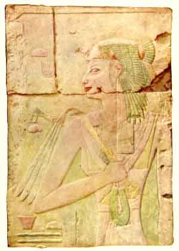

  
[Intangible Textual Heritage](../../index)  [Egypt](../index.md) 
[Index](index)  [Previous](eml20)  [Next](eml22.md) 

------------------------------------------------------------------------

[Buy this Book on
Kindle](https://www.amazon.com/exec/obidos/ASIN/B002KKCXC6/internetsacredte.md)

------------------------------------------------------------------------

  
*Egyptian Myth and Legend*, by Donald Mackenzie, \[1907\], at Intangible
Textual Heritage

------------------------------------------------------------------------

p. 194d

# PLATE IV

 

QUEEN AHMES (WIFE OF THOTHMES I),  
MOTHER OF THE FAMOUS QUEEN HATSHEPSUT

From a plaster cast of the relief on the wall of the Temple at Der-al
Bahari (By courtesy of Mr. William Waldorf Astor)

 

------------------------------------------------------------------------

[Next: Plate V: Luring the Doom Serpent](eml22.md)

