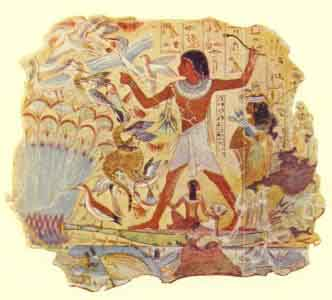

  
[Intangible Textual Heritage](../../index)  [Egypt](../index) 
[Index](index)  [Previous](eml22)  [Next](eml24) 

------------------------------------------------------------------------

[Buy this Book on
Kindle](https://www.amazon.com/exec/obidos/ASIN/B002KKCXC6/internetsacredte)

------------------------------------------------------------------------

  
*Egyptian Myth and Legend*, by Donald Mackenzie, \[1907\], at Intangible
Textual Heritage

------------------------------------------------------------------------

p. 194f

# PLATE V

 

FOWLING SCENE

(Fresco from tomb at Thebes, XVIII Dynasty, about B.C. 1580-1350

; now in British Museum)

The deceased, accompanied by his wife and daughter, stands in a reed
canoe in a marsh filled with large papyrus reeds, and is occupied in
knocking down birds with a stick, which is made in the form of a snake.
In front of him is his hunting cat, which has seized three birds, one
with its hind claws, one with its fore claws, and one by the wings with
its mouth. Numerous butterflies are represented, and the lake is well
stocked with fish. The line of hieroglyphs at the back of the deceased
indicates that the scene is supposed to represent the state of felicity
which he will enjoy in the next world.

 

------------------------------------------------------------------------

[Next: Plate VI: Farm Scene: The Counting and Inspection of the
Geese](eml24)

