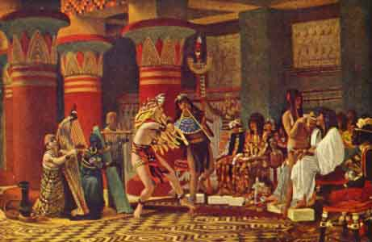

  
[Intangible Textual Heritage](../../index)  [Egypt](../index.md) 
[Index](index)  [Previous](eml24)  [Next](eml26.md) 

------------------------------------------------------------------------

[Buy this Book on
Kindle](https://www.amazon.com/exec/obidos/ASIN/B002KKCXC6/internetsacredte.md)

------------------------------------------------------------------------

  
*Egyptian Myth and Legend*, by Donald Mackenzie, \[1907\], at Intangible
Textual Heritage

------------------------------------------------------------------------

p. 194h

# PLATE VII

 

PASTIME IN ANCIENT EGYPT THREE THOUSAND YEARS AGO

After the painting by Sir Lawrence Alma-Tadema, R.A., in Preston Art
Gallery

 

------------------------------------------------------------------------

[Next: Chapter XV: The Rise of Amon](eml26.md)

