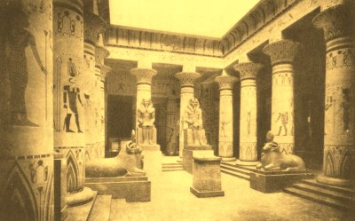
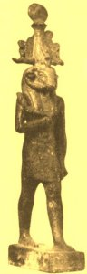
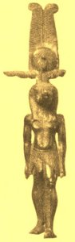
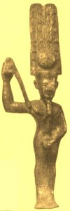
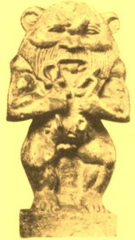
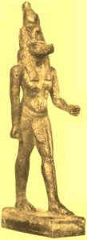

  
[Intangible Textual Heritage](../../index)  [Egypt](../index.md) 
[Index](index)  [Previous](eml28)  [Next](eml30.md) 

------------------------------------------------------------------------

[Buy this Book on
Kindle](https://www.amazon.com/exec/obidos/ASIN/B002KKCXC6/internetsacredte.md)

------------------------------------------------------------------------

  
*Egyptian Myth and Legend*, by Donald Mackenzie, \[1907\], at Intangible
Textual Heritage

------------------------------------------------------------------------

p. 234

# CHAPTER XVIII

### Myths and Lays of the Middle Kingdom

Foreign Brides--Succession by Male and Female Lines--New Religious
Belief--Sebek the Crocodile God--Identified with Set and Sutekh--The
Crocodile of the Sun--The Friend and Foe of the Dead--Sebek Kings--The
Tame Crocodile--Usert, the Earth Goddess--Resemblance to Isis and Neith
--Sutekh and Baal--Significance of Dashur Jewellery--The Great
Sphinx--Literary Activity--Egyptian Folksongs--Dialogue of a Man with
his Soul--"To be or not to be"--Sun Cult Doctrines--"The Lay of the
Harper".

DURING the Twelfth Dynasty Babylon fell and Crete was invaded. Egypt
alone among the older kingdoms successfully withstood the waves of
aggression which were passing over the civilized world. It was not
immune, however to foreign influence. A controlling power in Syria had
evidently to be reckoned with, for raiding bands were constantly
hovering on the frontier. It has been suggested that agreements were
concluded, but no records of any survive. There are indications,
however, that diplomatic marriages took place, and these may have been
arranged for purposes of conciliation. At any rate foreign brides were
entering the royal harem, and the exclusive traditions of Egypt were
being set at defiance.

Senusert II had a favourite wife called Nefert, "the beautiful", who
appears to have been a Hittite. Her son, Senusert III, and her grandson,
Amenemhet III, have been referred to as "new types". [1](#fn_115.md) Their faces, as is shown plainly in the
statuary, have distinct non-Egyptian and non-Semitic characteristics;
they are long

p. 235

and angular--the third Senusert's seems quite Mongoloid--with narrow
eyes and high cheek bones. There can be no doubt about the foreign
strain.

It is apparent that Senusert III ascended the throne as the son of his
father. This fact is of special interest, because, during the Twelfth
Dynasty, succession by the female line was generally recognized in
Egypt. Evidently Senusert II elevated to the rank of Crown Prince the
son of his foreign wife. Amenemhet III appears to have been similarly an
arbitrary selection. No doubt the queens and dowager queens were making
their presence felt, and were responsible for innovations of
far-reaching character, which must have aroused considerable opposition.
It may be that a legitimist party had become a disturbing element. The
high rate of mortality in the royal house during the latter years of the
Dynasty suggests the existence of a plot to remove undesirable heirs by
methods not unfamiliar in Oriental Courts.

Along with the new royal faces new religious beliefs also came into
prominence. The rise of Sebek, the crocodile god, may have been due to
the tendency shown by certain of the Pharaohs to reside in the Fayum.
The town of Crocodilopolis was the chief centre of the hitherto obscure
Sebek cult. It is noteworthy, however, that the reptile deity was
associated with the worship of Set-not the familiar Egyptian Set, but
rather his prototype, Sutekh of the Hittites. Apparently an old tribal
religion was revived in new and developed form.

In the texts of Unas, Sebek is referred to as the son of Neith, the
Libyan "Earth Mother", who personified the female principle, and was
believed to be self-sustaining, as she had been self-produced. She was
"the unknown one" and "the hidden one", whose veil had never been
uplifted. Like other virgin goddesses, she had a fatherless

p. 236

son, the "husband of his mother", who may have been identified with
Sebek as a result of early tribal fusion.

It is suggested that in his crocodile form Sebek was worshipped as the
snake was worshipped, on account of the dread he inspired. But,
according to Diodorus, crocodiles were also regarded as protectors of
Egypt, because, although they devoured the natives occasionally, they
prevented robbers from swimming over the Nile. Opinions, however,
differed as to the influence exercised by the crocodile on the destinies
of Egypt. Some Indian tribes of the present day worship snakes, and do
everything they can to protect even the most deadly specimens. In Egypt
the crocodile was similarly protected in particular localities, while in
others it was hunted down by sportsmen. [1](#fn_116.md) We also find that in religious
literature the reptile is now referred to as the friend and now as the
enemy of the good Osiris. He brings ashore the dead body of the god to
Isis in one legend, [2](#fn_117.md) and in another
he is identified with his murderers. In the "Winged Disk" story the
followers of Set are crocodiles and hippopotami, and are slain by Horus
because they are "the enemies of Ra". Yet Sebek was in the revolutionary
Sixth Dynasty identified with the sun god, and in the *Book of the Dead*
there is a symbolic reference to his dwelling on Sunrise Hill, where he
was associated with Hathor and Horus--the Great Mother and son.

Sebek-Tum-Ra ultimately became the crocodile of the sun, as Mentu became
"bull of the sun", and he symbolized the power and heat of the orb of
day. In this

p. 237

form he was the "radiant green disk"-"the creator", who rose from Nu "in
many shapes and in many colours".

At Ombos, Sebek was a form of Seb, the earth giant, the son of Nut, and
"husband of his mother". He was called the "father of the gods" and
"chief of the Nine Bow Barbarians".

In his Set form, Sebek was regarded in some parts as an enemy and
devourer of the dead. But his worshippers believed that he would lead
souls by "short cuts" and byways to the Egyptian paradise. In the
Pyramid Texts he has the attributes of the elfin Khnûmû, whose dwarfish
images were placed in tombs to prevent decay, for he renews the eyes of
the dead, touches their tongues so that they can speak, and restores the
power of motion to their heads.

The recognition which Sebek received at Thebes may have been due to the
influence of the late kings of the Twelfth Dynasty, and those of the
Thirteenth who had Sebek names. The god is depicted as a man with a
crocodile's head, and he sometimes wears Amon plumes with the sun disk;
he is also shown simply as a crocodile. He was familiar to the Greeks as
Sukhos. Strabo, who visited Egypt in the Roman period, relates that he
saw a sacred crocodile in an artificial lake at Crocodilopolis in the
Fayum. It was quite tame [1](#fn_118.md) and was
decorated with gold ear-rings, set with crystal, and wore bracelets on
its fore paws. The priests opened its jaws and fed it with cakes, flesh,
and honey wine. When the animal leapt into the water and came up at the
other side, the priests followed it and gave it a fresh offering.
Herodotus tells that the fore feet of the sacred crocodile which he saw
were secured by a chain. It was fed not only with

p. 238

choice food, but with "the flesh of sacred victims". When the reptile
died its body was embalmed, and, having been deposited in a sacred
chest, was laid in one of the lower chambers of the Labyrinth. These
subterranean cells were reputed to be of great sanctity, and Herodotus
was not permitted to enter them.

The deity Usert, whose name is associated with the kings Senusert (also
rendered Usertesen), was an earth goddess. She is identified with Isis,
and closely resembles Neith-the Great Mother with a son whose human
incarnation is the Pharaoh. Usert worship may have been closely
associated, therefore, with Sebek worship, because Sebek was the son of
an earth goddess. He rose from Nu, the primordial deep, as the crocodile
rose from Lake Mœris, the waters of which nourished the "earth mother",
and caused green verdure to spring up where formerly there was but sandy
desert. [1](#fn_119.md) Sebek was thus in a new
sense a form of Ra, and a "radiant green sun disk". His association with
Set was probably due to Asiatic influence, and the foreign strain in the
royal house may have come from a district where Set was worshipped as
Sutekh. The Egyptian Set developed from an early conception of a tribal
Sutekh as a result of Asiatic settlement in the eastern Delta in
pre-Dynastic times. The Hittite Sutekh was a sun god and a weather god.
But there were many Sutekhs as there were many Baals. Baal signifies
"lord" or "chief god", and in Egypt was identified with Set and with
Mentu, the bull of war. At Tanis he was "lord of the heaven". Sutekh,
also a "baal" or "lord", appears to have been similarly adaptable in
tendency. If it was due to his influence that the crocodile god of the
Fayum became a solar deity, the

 

COURTYARD OF AN EGYPTIAN TEMPLE (RESTORED)

p. 239

<table data-border="0" width="798">
<colgroup>
<col style="width: 33%" />
<col style="width: 33%" />
<col style="width: 33%" />
</colgroup>
<tbody>
<tr class="odd">
<td data-valign="TOP" width="33%">
 

Khnûmû (ram-headed)
</td>
<td data-valign="TOP" width="33%">
 

Sebek, Crocodile God
</td>
<td data-valign="TOP" width="33%">
 

Min
</td>
</tr>
<tr class="even">
<td data-valign="TOP" width="33%">
 

Bes
</td>
<td data-valign="TOP" width="33%">
 
</td>
<td data-valign="TOP" width="33%">
 

Anubis
</td>
</tr>
</tbody>
</table>

LOCAL GODS WITH ADDED SOLAR AND OTHER ATTRIBUTES

 

foreign ladies in the Pharaoh's harem must have been Hittites, whose
religious beliefs influenced those of their royal sons.

Exquisite jewellery has been found at Dashur, where Amenemhet II and his
grandson Senusert III resided and erected their pyramids--two diadems of
princesses of the royal house, the daughters of the second Senusert's
foreign wife, at Dashur. One is a mass of little gold flowers connected
by gold wires, which recall the reference, in *Exodus*, xxxlx, 3, to the
artisans who "did beat the gold into thin plates, and cut it into
wires". The design is strengthened by large "Maltese crosses" set with
gems. [1](#fn_120.md) Other pieces of
Twelfth-Dynasty jewellery are similarly "innovations", and of the
character which, long centuries afterwards, became known as Etruscan.
But they could not have come from Europe at this period. They resemble
the work for which the Hittites were famous.

The great sphinx may have also owed its origin to the influence
exercised by the Hittites, whose emblem of power was a lion. Certain
Egyptologists [2](#fn_121.md) are quite convinced
that it was sculptured during the reign of Amenemhet III, whose face
they consider it resembles. Nilotic gods had animal heads with human
bodies. The sphinx, therefore, could not have been a god of Egypt.
Scarab beetle seals were also introduced during the Twelfth Dynasty. The
Dynastic civilization of Egypt began with the use of the Babylonian seal
cylinder.

The "Golden Age" is distinguished not only for its material progress,
but also for its literary activity. In this respect it may be referred
to as the "Elizabethan Age" of Ancient Egypt. The compositions appear to

p. 240

have been numerous, and many were of high quality. During the great
Dynasty the kingdom was "a nest of singing birds", and the home of
storytellers. There are snatches of song even in the tomb inscriptions,
and rolls of papyri have been found in mummy coffins containing love
ditties, philosophic poems, and wonder tales, which were provided for
the entertainment of the dead in the next world.

It is exceedingly difficult for us to enter into the spirit of some of
these compositions. We meet with baffling allusions to unfamiliar
beliefs and customs, while our ignorance of the correct pronunciation of
the language make some ditties seem absolutely nonsensical, although
they may have been regarded as gems of wit; such quaint turns of phrase,
puns, and odd mannerisms as are recognizable are entirely lost when
attempts are made to translate them. The Egyptian poets liked to play
upon words. In a Fifth-Dynasty tomb inscription this tendency is
apparent. A shepherd drives his flock over the wet land to tramp down
the seed, and he sings a humorous ditty to the sheep. We gather that he
considers himself to be in a grotesque situation, for he "salutes the
pike", and is like a shepherd among the dead, who converses with strange
beings as he converses with fish. "Salutes" and "pike" are represented
by the same word, and it is as if we said in English that a fisherman
"flounders like flounders" or that joiners "box the box".

A translation is therefore exceedingly bald.

The shepherd is in the water with the fish;  
He converses with the sheath fish;  
He salutes the pike;  
From the West--the shepherd is a shepherd from the West.

"The West" is, of course, the land of the dead.

p. 241

Some of the Twelfth-Dynasty "minor poems" are, however, of universal
interest because their meaning is as clear as their appeal is direct.
The two which follow are close renderings of the originals.

THE WOODCARVER

The carver grows more weary  
    Than he who hoes all day,  
As up and down his field of wood  
    His chisel ploughs away.  
No rest takes he at even,  
    Because he lights a light;  
He toils until his arms drop down  
    Exhausted, in the night.

THE SMITH

A smith is no ambassador--  
    His style is to abuse;  
I never met a goldsmith yet  
    Able to give one news.  
Oh, I have seen a smith at work,  
    Before his fire aglow--  
His "claws" are like a crocodile;  
    He smells like fish's roe.

The Egyptian peasants were great talkers. Life was not worth living if
there was nothing to gossip about. A man became exceedingly dejected
when he had to work in solitude; he might even die from sheer ennui. So
we can understand the ditty which tells that a brickmaker is puddling
all alone in the clay at the time of inundation; he has to talk to the
fish. "He is now a brickmaker in the West." In other words, the lonely
task has been the death of him.

p. 242

This horror of isolation from sympathetic companionship pervades the
wonderful composition which has been called "The Dialogue of a Man with
his Soul". The opening part of the papyrus is lost, and it is uncertain
whether the lonely Egyptian was about to commit suicide or was
contemplating with feelings of horror the melancholy fate which awaited
him when he would be laid in the tomb. He appears to have suffered some
great wrong; his brothers have deserted him, his friends have proved
untrue, and--terrible fate!--he has nobody to speak to. Life is,
therefore, not worth living, but he dreads to die because of the
darkness and solitude of the tomb which awaits him. The fragment opens
at the conclusion of a speech made by the soul. Apparently it has
refused to accompany the man, so that he is faced with the prospect of
not having even his soul to converse with.

"In the day of my sorrow", the man declares, "you should be my companion
and my sympathetic friend. Why scold me because I am weary of life? Do
not compel me to die, because I take no delight in the prospect of
death; do not tell me that there is joy in the 'aftertime'. It is a
sorrowful thing that this life cannot be lived over again, for in the
next world the gods will consider with great severity the deeds we have
done here."

He calls himself a "kindly and sympathetic man", but the soul thinks
otherwise and is impatient with him. "You poor fool," it says, "you
dread to die as if you were one of these rich men."

But the Egyptian continues to lament his fate; he has no belief in joy
after death. The soul warns him, therefore, that if he broods over the
future in such a spirit of despondency he will be punished by being left
forever in

p. 243

his dark solitary tomb. The inference appears to be that those who lack
faith will never enter Paradise.

"The thought of death", says the soul, "is sorrow in itself, it makes
men weep; it makes them leave their homes and throw themselves in the
dust."

Men who display their unbelief, never enjoy, after death, the light of
the sun. Statues of granite may be carved for them, their friends may
erect pyramids which display great skill of workmanship, but their fate
is like that of "the miserable men who died of hunger at the riverside,
or the peasant ruined by drought or by the flood--a poor beggar who has
lost everything and has none to talk to except the fishes".

The soul counsels the man to enjoy life and to banish care and
despondency. He is a foolish fellow who contemplates death with sorrow
because he has grown weary of living; the one who has cause to grieve is
he whose life is suddenly cut short by disaster. Such appears to be the
conclusion which should be drawn from the soul's references to some
everyday happenings of which the following is an example:--

"A peasant has gathered in his harvest; the sheaves are in his boat; he
sails on the Nile, and his heart is filled with the prospect of making
merry. Suddenly a storm comes on. He is compelled to remain beside his
boat, guarding his harvest. But his wife and his children suffer a
melancholy fate. They were coming to meet him, but they lost their way
in the storm, and the crocodiles devoured them. The poor peasant has
good cause to lament aloud. He cries out, saying:

"'I do not sorrow for my beloved wife, who has gone hence and will never
return, so much as for the little children who, in the dawn of life, met
the crocodile and perished.'"

p. 244

The man is evidently much impressed by the soul's reasoning. He changes
his mind, and praises the tomb as a safe retreat and resting place for
one who, like himself, cannot any longer enjoy life. Why he feels so
utterly dejected we cannot tell; the reason may have been given in the
lost portion of the old papyrus. There is evidently no prospect of
enjoyment before him. His name has become hateful among men; he has been
wronged; the world is full of evil as he is full of sorrow.

At this point the composition becomes metrical in construction:

Hateful my name! . . . more hateful is it now  
Than the rank smell of ravens in the heat;  
Than rotting peaches, or the meadows high  
Where geese are wont to feed; than fishermen  
Who wade from stinking marshes with their fish,  
Or the foul odour of the crocodile;  
More hateful than a husband deems his spouse  
When she is slandered, or his gallant son  
Falsely accused; more hateful than a town  
Which harbours rebels who are sought in vain.

Whom can I speak to? . . . Brothers turn away;  
I have no friend to love me as of yore;  
Hearts have turned cold and cruel; might is right;  
The strong are spoilers, and the weakly fall,  
Stricken and plundered. . . . Whom can I speak to?

The faithful man gets sorrow for reward--  
His brother turns his foe--the good he does,  
How swiftly 'tis undone, for thankless hearts  
Have no remembrance of the day gone past.  
Whom can I speak to? I am full of grief--  
There is not left alive one faithful man;  
The world is full of evil without end.

p. 245

Death is before me like a draught prepared  
To banish sickness; or as fresh, cool air  
To one who, after fever, walks abroad.  
Death is before me sweet as scented myrrh;  
Like soft repose below a shelt'ring sail  
In raging tempest. . . . Death before me is  
Like perfumed lotus; like a restful couch  
Spread in the Land of Plenty; or like home  
For which the captive yearns, and warriors greet  
When they return. . . . Ah! death before me is  
Like to a fair blue heaven after storm--  
A channel for a stream--an unknown land  
The huntsman long has sought and finds at last.

He who goes Yonder rises like a god  
That spurns the sinner; lo! his seat is sure  
Within the sun bark, who hath offered up  
Choice victims in the temples of the gods;  
He who goes Yonder is a learnèd man,  
Whom no one hinders when he calls to Ra.

The soul is now satisfied, because the man has professed his faith in
the sun god. It promises, therefore, not to desert him. "Your body will
lie in the earth," it says, "but I will keep you company when you are
given rest. Let us remain beside one another."

It is possible that this composition was intended to make converts for
the sun cult. The man appears to dread the judgment before Osiris, the
King of the Dead, who reckons up the sins committed by men in this
world. His soul approves of his faith in Ra, of giving offerings in the
temples, and of becoming a "learned man"--one who has acquired knowledge
of the magic formulæ which enables him to enter the sun bark. This soul
appears to be the man's Conscience. It is difficult to grasp the
Egyptian ideas regarding the soul which enters Paradise, the soul which
hovers over the mummy, and the conscious

p. 246

life of the body in the tomb. These were as vague as they appear to have
been varied.

One of the most popular Egyptian poems is called "The Lay of the
Harper". It was chanted at the banquets given by wealthy men. "Ere the
company rises," wrote Herodotus, "a small coffin which contains a
perfect model of the human body is carried round, and is shown to each
guest in rotation. He who bears it exclaims: 'Look at this figure. . . .
After death you will be like it. Drink, therefore, and be merry.'" The
"lay" in its earliest form was of great antiquity. Probably a real mummy
was originally hauled through the banquet hall.

LAY OF THE HARPER

'Tis well with this good prince; his day is done,  
His happy fate fulfilled. . . . So one goes forth  
While others, as in days of old, remain.  
The old kings slumber in their pyramids,  
Likewise the noble and the learned, but some  
Who builded tombs have now no place of rest,  
Although their deeds were great. . . .  
Lo! I have heard The words Imhotep and Hordadaf spake--  
Their maxims men repeat. . . . Where are their tombs?--  
Long fallen . . . e'en their places are unknown,  
And they are now as though they ne'er had been.

No soul comes back to tell us how he fares--  
To soothe and comfort us ere we depart  
Whither he went betimes. . . . But let our minds  
Forget of this and dwell on better things. . . .  
Revel in pleasure while your life endures  
And deck your head with myrrh. Be richly clad  
In white and perfumed linen; like the gods  
Anointed be; and never weary grow  
In eager quest of what your heart desires--  
Do as it prompts you . . . until that sad day

p. 247

Of lamentation comes, when hearts at rest  
Hear not the cry of mourners at the tomb,  
Which have no meaning to the silent dead.  
Then celebrate this festal time, nor pause--  
For no man takes his riches to the grave;  
Yea, none returns again when he goes hence.

 

------------------------------------------------------------------------

### Footnotes

[234:1](eml29.htm#fr_115.md) Newberry and
Garstang, and Petrie.

[236:1](eml29.htm#fr_116.md) Herodotus says:
"Those who live near Thebes, and the Lake Mœris, hold the crocodile in
religious veneration. . . . Those who live in or near Elephantine make
the beasts an article of food."

[236:2](eml29.htm#fr_117.md) This is of special
interest, because Hittite gods appear upon the backs of animals.

[237:1](eml29.htm#fr_118.md) The god was not
feared. It had been propitiated and became the friend of man.

[238:1](eml29.htm#fr_119.md) When the Nile rises
it runs, for a period, green and foul, after running red with clay. The
crocodile may have been associated with the green water also.

[239:1](eml29.htm#fr_120.md) The Maltese cross is
believed to be of Elamite origin. It is first met with in Babylon on
seals of the Kassite period. It appears on the neolithic pottery of
Susa.

[239:2](eml29.htm#fr_121.md) Newberry and
Garstang.

------------------------------------------------------------------------

[Next: Chapter XIX: The Island of Enchantment](eml30.md)

