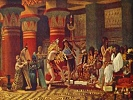

  
[Intangible Textual Heritage](../../index)  [Egypt](../index.md) 
[Index](index)  [Previous](eml33)  [Next](eml35.md) 

------------------------------------------------------------------------

[Buy this Book on
Kindle](https://www.amazon.com/exec/obidos/ASIN/B002KKCXC6/internetsacredte.md)

------------------------------------------------------------------------

  
*Egyptian Myth and Legend*, by Donald Mackenzie, \[1907\], at Intangible
Textual Heritage

------------------------------------------------------------------------

p. 294

# CHAPTER XXIII

### Tale of the Doomed Prince

Pharaoh's Heir--Decree of the Fates--Son must die a Sudden Death--His
Lonely Childhood--The Dog--Prince goes upon his Travels--The Lady of the
Tower--Won by the Disguised Prince--An Angry Father--Prince returns
Home--Perils of Darkness--The Giant and the Crocodile--The Serpent
slain--Mystery of the Prince's Fate--Resemblances to European
Stories--An Unsolved Problem.

Now hear the tale of the doomed prince. Once upon a time there was a
king in Egypt whose heart was heavy because that he had no son. He
called upon the gods, and the gods heard, and they decreed that an heir
should be born to him. In time came the day of the child's birth. The
seven Hathors (Fates) greeted the prince and pronounced his destiny;
they said he would meet with a sudden death, either by a crocodile, or a
serpent, or a dog.

The nurses informed the king what the Hathors had said, and the heart of
His Majesty was troubled. He commanded that a house should be erected in
a lonely place, so that the child might be guarded well, and he provided
servants, and all kinds of luxuries, and gave orders that the prince
should not be taken outside his safe retreat.

It came to pass that the boy grew strong and big. One day he climbed to
the flat roof of the house. Looking down, he saw a dog which followed a
man, and wondered greatly thereat.

p. 295

Then he spoke to one of the servants, saying: "What is that which
follows the man walking along the road?"

"That," answered the servant, "is a dog." '

The boy said: "I should like to have one for myself. Bring a dog to me."

When he spoke thus, the servant informed the king. His Majesty said:
"Let him have a young boar hunter, so that he may not fret."

So the prince was given a dog as he had desired.

The boy grew into young manhood, and his limbs were stout; he was indeed
a prince of the land. He grew restless in the lonely house, and sent a
message to his royal father, saying: "Hear me. Why am I kept a prisoner
here? I am destined to die either by a crocodile, a serpent, or a dog;
it is the will of the gods. Then let me go forth and follow my heart's
desire while I live.'

His Majesty considered the matter, and said he would grant the lad's
wish. So he caused him to be provided with all kinds of weapons, and
consented that the dog should follow him.

A servant of the king conducted the young prince to the eastern
frontier, [1](#fn_131.md) and said: "Now you may
go wherever you desire."

The lad called his dog, and set his face toward the north. He hunted on
his way and fared well. In time he reached the country of Naharina
(Mitanni), and went to the house of a chief.

Now the chief was without a son, and he had but one daughter and she was
very fair. He had caused to be erected for her a stately tower with
seventy windows, on the summit of a cliff 700 feet from the ground. The
fame of the girl went abroad, and her father sent for all the sons of
chiefs in the land and said to them:

p. 296

"My daughter will be given in marriage to the youth who can climb up to
her window."

Day after day the lads endeavoured to scale the cliff, and one afternoon
when they were so engaged the young prince arrived and saw them. He was
given hearty welcome. They took him to their house, they cleansed him
with water and gave him perfumes, and then they set food before him and
gave fodder to his horse. They showed him great kindness, and brought
sandals to him.

Then they said: "Whence come ye, young man?"

The prince answered: "I am the son of one of the Pharaoh's charioteers.
My mother died, and my father then took another wife, who hates me. I
have run away from home."

He said no more. They kissed him as if he were a brother, and prevailed
upon him to tarry with them a while.

"What can I do here?" asked the prince.

The young men said: "Each day we try to scale the cliff and reach the
window of the chief's daughter. She is very fair, and will be given in
marriage to the fortunate one who can climb up to her."

On the next day they resumed their wonted task, and the prince stood
apart, watching them. Then day followed day, and they endeavoured in
vain to reach the window, while he looked on.

It came to pass at length that the prince said to the others: "If you
consent, I will make endeavour also; I should like to climb among you."

They gave him leave to join them in the daily task. Now it chanced that
the beautiful daughter of the chief in Naharina looked down from her
window in the high tower, gazing upon the youths. The prince saw her,
and he began to climb with the sons of the chiefs, and he

p. 297

went up and up until he reached the window of the great chief's
daughter, the fair one. She took him in her arms and she kissed him.

Then one who had looked on, sought to make glad the heart of the girl's
father, and hastened to him and spoke, saying:

"At last one of the youths has reached the window of your daughter."

The great chief asked: "Whose son is he?"

He was told: "The youth is the son of one of the Pharaoh's charioteers,
who fled from Egypt because of his stepmother."

Then was the great chief very angry, and he said: "Am I to give my
daughter in marriage to an Egyptian fugitive? Order him to return at
once to his own land."

Messengers were sent to the youth in the tower, and they said to him:
"Begone! You must return to the place whence you came."

But the fair maid clung to him. She called upon the god, and swore an
oath, saying: "By the name of Ra Harmachis, if he is not to be mine, I
will neither eat nor drink again."

When she had spoken thus s he grew faint, as if she were about to die.

A messenger hastened to her father and told him what the girl had vowed
and how she thereupon sank fainting.

The great chief then sent men to put the stranger to death if he
remained in the tower.

When they came nigh the girl, she cried: "By the god, if you slay my
chosen one, I will die also. I will not live a single hour if he is
taken from me."

The girl's words were repeated to her father, and he,

p. 298

the great chief, said: "Let the young man, this stranger, be brought
into my presence."

Then was the prince taken before the great chief. He was stricken with
fear, but the girl's father embraced him and kissed him, saying: "You
are indeed a noble youth. Tell me who you are. I love you as if you were
mine own son."

The prince made answer: "My father is a charioteer in the army of the
Pharaoh. My mother died, and my father then took another wife, who hates
me. I have run away from home."

The great chief gave his daughter to the prince for wife, and provided a
goodly dwelling, with servants, a portion of land, and many cattle.

It came to pass some time after this that the prince spoke to his wife,
saying:

"It is my destiny to die one of three deaths-either by a crocodile, or a
serpent, or a dog."

"Let the dog be slain at once," urged the woman.

Said the prince: "I will not permit that my dog be slain. Besides, he
would never do me harm."

His wife was much concerned for his safety. He would not let the dog go
out unless he went with it.

It came to pass that the prince travelled with his wife to the land of
Egypt, and visited the place in which he had formerly dwelt. A giant was
with him there. The giant would not allow him to go out after dark,
because a crocodile came up from the river each night. But the giant
himself went forth, and the crocodile sought in vain to escape him. He
bewitched it.

He continued to go out each night, and when dawn came the prince went
abroad, and the giant lay down to sleep. This continued for the space of
two months.

It came to pass on a certain day that the prince made

p. 299

merry in his house. There was a great feast. When darkness fell he lay
down to rest, and he fell asleep. His wife busied herself cleansing and
anointing her body. Suddenly she beheld a serpent which crept out of a
hole to sting the prince. She was sitting beside him, and she called the
servants to fill a bowl with milk and honeyed wine for the serpent, and
it drank thereof and was intoxicated. Then it was rendered helpless, and
rolled over. The woman seized her dagger and slew the serpent, which she
flung into her bath.

When she had finished, she awoke the prince, who marvelled greatly that
he had escaped, and his wife said: "Behold the god has given me the
chance to remove one of your dooms. He will let me strike another blow."

The prince made offerings to the god, and prostrated himself, and he
continued so to do every day.

It came to pass many days afterwards that the prince went out to walk
some distance from his house. He did not go alone, for his dog followed
him. It chanced that the dog seized an animal in flight, and the prince
followed the chase, running. He reached a place near the bank of the
river and went down after the dog. Now the dog was beside the crocodile,
who led the prince to the place where the giant was. The crocodile said:
"I am your doom and I follow you . . . (I cannot contend) with the
giant, but, remember, I will watch you. . . . You may bewitch me (like)
the giant, but if you see (me coming once again you will certainly
perish).

Now it came to pass, after the space of two months, that the prince went
. . .

Note.--Here the British Museum papyrus, which contains several doubtful
sentences, is mutilated and ends abruptly. The conclusion of the story
is left, therefore, to our imaginations.

One cannot help being struck with certain resemblances

p. 300

in the ancient narrative to a familiar type of Celtic story, which
relates the adventures of a king's son who goes forth disguised as "a
poor lad" to seek his fortunes and win a bride by performing some heroic
deed in a foreign country. The lady in the lofty tower is familiar. In
Irish mythology she is the daughter of Balor, King of Night, who had her
secluded thus because it was prophesied that her son would slay him. But
the Cyclopean smith, Mackinley, won her, and her son Lugh, the dawn god,
killed Balor with the "round stone", which was the sun. The mother of
the Greek Hermes, who slew his grandson, Argus, with the "round stone",
was concealed in a secret underground chamber, from which her lover
rescued her.

Apparently the Egyptian prince was safe so long as he resided in a
foreign country, and that may be the reason why his father had him
conducted to the frontier. It would appear also that he has nothing to
fear during the day. The crocodile is bewitched so long as the giant
ties in slumber. In certain European stories a man who works a spell
must similarly go to sleep. When Sigurd (the Norse Siegfried) roasts the
dragon's heart, Regin lies down to sleep, and when Finn-mac-Coul (the,
Scottish Finn) roasts the salmon, Black Arky, his father's murderer,
lies asleep also. (See *Teutonic Myth and Legend*.) In a Sutherlandshire
story a magician goes to sleep while snakes are being boiled to obtain a
curative potion.

The Egyptian protecting giant (also translated "mighty man") is likewise
familiar in a certain class of Scottish (? Mediterranean) folktales.

In our Northern legends which relate the wonderful feats of the
disguised son of a king he invariably lies asleep with his head on the
knees of the fair lady who

p. 301

"combs his hair". She sees "the beast" (or dragon) coming against her
and awakens him. In this Egyptian tale the woman, however, slays the
serpent, which comes against the man instead.

Readers will naturally ask: "Was the prince killed by the crocodile or
by the dog? . . . Or did he escape? Was his wife given the opportunity
to strike a blow?"

In "Celtic" stories the "first blow" is allowed, and it is invariably
successful. One relates that a woman saved a hero's life by striking, as
was her privilege, the first blow, and, as she used a magic wand, she
slew the sleeping giant who was to strike the next "trial blow".

Was the crocodile slain in the end, and did the dog kill his master by
accident? This faithful animal is of familiar type. He is one of the
dogs "which has its day". In Northern tales the dog is sometimes slain
by its master after it has successfully overcome a monster of the night.
The terrible combat renders it dangerous afterwards. Besides, "it had
its day".

Did the Egyptian dog kill the crocodile? Or did the prince's wife slay
the dog, thinking the crocodile was unable to injure her husband? And
was the spell then broken, and the crocodile permitted to slay the
prince?

The problem may be solved if, and when, another version of this ancient
story is discovered.

------------------------------------------------------------------------

### Footnotes

[295:1](eml34.htm#fr_131.md) Apparently the prince
was safe from attack so long as he was away from Egypt.

------------------------------------------------------------------------

[Next: Chapter XXIV: Changes in Social and Religious Life](eml35.md)

