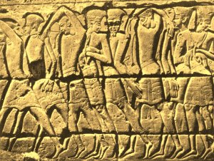
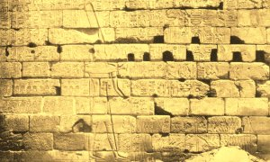

  
[Intangible Textual Heritage](../../index)  [Egypt](../index.md) 
[Index](index)  [Previous](eml38)  [Next](eml40.md) 

------------------------------------------------------------------------

[Buy this Book on
Kindle](https://www.amazon.com/exec/obidos/ASIN/B002KKCXC6/internetsacredte.md)

------------------------------------------------------------------------

  
*Egyptian Myth and Legend*, by Donald Mackenzie, \[1907\], at Intangible
Textual Heritage

------------------------------------------------------------------------

p. 352

# CHAPTER XXVIII

### Egypt and the Hebrew Monarchy

Isaiah foretells Egypt's Fall--The Priest Kings--Rise of the
Libyans--Philistines and Hebrews--A "Corner" in Iron--Saul and
David--Solomon's Alliance with Pharaoh Sheshonk (Shisak)--Jeroboam's
Revolt--Israel Worships the "Lady of Heaven"--The Ethiopian
Kings--Assyria's Great Empire--The "Ten Lost Tribes"--Pharaoh Taharka
and Hezekiah--Assyrian Army destroyed--Isaiah a Great
Statesman--Assyrian Conquest of Egypt--Sack of Thebes.

"THE burden of Egypt. Behold, the Lord rideth upon a swift cloud, and
shall come into Egypt: and the idols of Egypt shall be moved at his
presence, and the heart of Egypt shall melt in the midst of it. And I
will set the Egyptians against the Egyptians: and they shall fight every
one against his brother, and every one against his neighbour; city
against city, and kingdom against kingdom. And the spirit of Egypt shall
fail in the midst thereof. . . . The brooks of defence shall be emptied
and dried up; the reeds and flags shall wither. The paper reeds [1](#fn_164.md) by the brooks, by the mouth of the
brooks, and everything sown by the brooks, shall wither, be driven away,
and be no more. The fishers also shall mourn, and all they that cast
angle into the brooks shall lament, and they that spread nets upon the
waters shall languish. Moreover, they that work in fine flax, and they,
that weave networks, shall be confounded. And they shall be broken in
the purposes thereof, all that make sluices and ponds for fish"
(*Isaiah*, xix).

From the death of Rameses III to the period of

p. 353

\[paragraph continues\] Isaiah, the great
Hebrew prophet and politician, we must pass in review about five
centuries of turbulence and change. The last great Pharaoh of the
Nineteenth Dynasty was followed by nine weak rulers bearing the name of
Rameses. Little is known, or is worth knowing, regarding them. They were
but puppets in the hands of the powerful priests of Amon-ra, who had
become the commanders of the army, the chief treasurers, grand viziers,
and high judges of Egypt. The Oracle of Amon-ra confirmed all their
doings. In the end the great Theban god became the rival of Osiris as
Judge of the Dead, and the high priest, Herihor, thrust aside Rameses
XII and seized the crown. Another priest king reigned at Tanis (Zoan) in
the Delta.

Egypt was thrown into confusion under ecclesiastical rule, and land fell
rapidly in value. Robbery on the highways and especially in tombs became
a recognized profession, and corrupt officials shared in the spoils; the
mummies of great Pharaohs, including Sed I and Rameses II, had to be
taken by pious worshippers from the sepulchral chambers and concealed
from the plunderers. No buildings were erected, and many great temples,
including the Ramesseum, fell into disrepair.

After the passing of an obscure and inglorious century we find that the
mingled tribes of Libyans and their western neighbours and conquerors,
the Meshwesh, had poured into the Delta in increasing numbers, and
penetrated as far south as Heracleopolis. Egypt was powerless in
Palestine. The Philistines had moved southward, and for a period were
overlords of the Hebrews. They had introduced iron) and restricted its
use among their neighbours, as is made evident in the Bible.

Now there was no smith found throughout all the land of Israel: for the
Philistines said, Lest the Hebrews make them

p. 354

swords or spears; but all the Israelites went down to the Philistines,
to sharpen every man his share, and his coulter, and his axe, and his
mattock. Yet they had a file for the mattocks, and for the coulters, and
for the forks, and for the axes, And to sharpen the goads. So it came to
pass in the day of battle, that there was neither sword nor spear found
in the hand of any of the people that were with Saul and Jonathan; but
with Saul and with Jonathan his son was there found (*1 Samuel*, xiii,
19-22).

Thus the Hebrews at the very beginning of their history as a nation had
experience of a commercial "corner", which developed their business
instincts, no doubt. Their teachers were Europeans who represented one
of the world's oldest civilizations. [1](#fn_165.md) The oppression which they endured welded
together the various tribes, and under Saul the Hebrews made common
cause against the Philistines. When handsome, red-cheeked David, [2](#fn_166.md) who had probably a foreign strain in his
blood, had consolidated Judah and Israel, the dominance of the Cretan
settlers came to an end; they were restricted to the sea coast, and they
ceased to have a monopoly of iron. Solomon, the chosen of the priests,
was supported by a strong army, which included mercenaries, and became a
great and powerful monarch, who emulated the splendour of the Pharaohs
of the Eighteenth Dynasty. His supremacy in southern Syria was secured
by an alliance with Egypt.

And Solomon made affinity with Pharaoh king of Egypt, and took Pharaoh's
daughter, and brought her into the city of David, until he had made an
end of building his own house, and the house of the Lord, and the wall
of Jerusalem round about (*1 Kings*, iii, 1).

The Pharaoh with whom Solomon had come to an

p. 355

understanding was Sheshonk (Shishak), a vigorous ruler and successful
military leader, who established peace in his kingdom. He secured his
Delta frontier from attack by laying a firm hand on the territory
between Egypt and the "buffer state" of the Hebrews. In time we read
that he had "taken Gezer" (an independent city state) "and burnt it with
fire, and slain the Canaanites that dwelt in the city, and given it for
a present unto his daughter, Solomon's wife" (*1 Kings*, ix, 16).

Sheshonk was the first king of the Libyan (Twenty-Second) Dynasty, which
lasted for about two centuries. He was the descendant of a
Meshwesh-Libyan mercenary who had become high priest of Her-shef at
Heracleopolis and the commander of the local troops. Under this foreign
nobleman and his descendants the nome flourished and became so powerful
that Sheshonk was able to control the Delta region, where he allied
himself with other Libyan military lords. In the end he married the
daughter of the last weak priest king of Tanis, and was proclaimed
Pharaoh of Egypt. He made Bubastis his capital, and the local goddess,
the cat-headed Bast, became the official deity of the kingdom. Amon was
still recognized, but at the expense of other Delta deities who shared
in the ascendancy of "the kindly Bast". Sheshonk held nominal sway over
Thebes, and appointed his son high priest of Anion-ra, and he was able
to extract tribute from Nubia.

Sheshonk's chief need was money, for he had to maintain a strong
standing army of mercenaries. He must have cast envious eyes on the
wealth which had accumulated in Solomon's kingdom, and, as it proved,
was not slow to interfere in its internal affairs when opportunity
offered. He extended his hospitality to Jeroboam, the leader of the
Israelites who desired to be relieved of the heavy taxes imposed by
Solomon. "Solomon

p. 356

sought therefore to kill Jeroboam" (*1 Kings*, xi, 40). When Rehoboam
came to the throne, Jeroboam pleaded on behalf of the oppressed ten
tribes of the north, but the new king was advised to say: "My little
finger shall be thicker than my father's loins". A revolt ensued, and
Jeroboam became king of the north, supported, evidently, by Shishak. The
golden calf was then worshipped by Jeroboam's subjects; it was probably
the symbol of the Hathor-like "Lady of Heaven", whose worship was
revived even in Jerusalem, when Jeremiah said: "The children gather
wood, and the fathers kindle the fire, and the women knead their dough,
to make cakes to the queen of heaven, and to pour out drink offerings
unto other gods" (Jeremiah, vii, 18). The religious organization, based
upon the worship of the God of Israel, which had been promoted by David,
was thus broken up; "there was war between Rehoboam and Jeroboam all
their days" (*1 Kings*, xiv, 30).

The opportunity afforded for invasion was quickly seized by Sheshonk.
According to his own annals, he swept through Palestine, securing great
spoils; indeed he claims that his mercenaries penetrated as far north as
the River Orontes. It is stated in the Bible that he plundered
Jerusalem, and "took away the treasures of the house of the Lord, and
the treasures of the king's house; he even took away all; and he took
away all the shields of gold which Solomon had made" (*1 Kings*, xiv,
25-6).

About a century after the death of Sheshonk the power of the royal house
is found to have declined; the various hereditary Libyan lords showed
but nominal allegiance to the Crown. A rival kingdom had also arisen in
the south. When the priest kings were driven from Thebes they founded a
theocracy in the Nubian colony,

 

GREAT SEA AND LAND RAID: PHILISTINE PRISONERS

From the bas-relief on the gate of the temple of Rameses III at Medinet
Habu

p. 357

 

AMON PRESENTING TO SHESHONK LIST OF CITIES CAPTURED IN ISRAEL AND JUDAH

From the bas-relief on the great Temple at Karnak

which became known as Ethiopia, and there the Oracle of Amon controlled
the affairs of State.

In time the Ethiopian kingdom became strong enough to control a large
part of Upper Egypt, and Thebes was occupied. Then Plankhy, the most
capable of all the Ethiopian rulers, extended his conquests until he
forced the princes of the north to acknowledge his supremacy.

Piankhy's most serious rival was Tefnekht, prince of Sais, who assembled
an army of allies and fought his way southward as far as Thebes. He was
driven back by Plankhy, who ultimately swept in triumph to Sais and
compelled the submission of Tefnekht and his allies. He did not,
however, effect the permanent occupation of Lower Egypt.

Shabaka, the first Pharaoh of the Ethiopian (Twenty-Fifth) Dynasty,
ruled over all Egypt, having secured by force of arms the allegiance of
the princes, or petty kings, of the north. He is believed to be the
Biblical "So, King of Egypt" (*2 Kings*, xvii, 4). Syria and Palestine
had become dependencies of the great Empire of Assyria, which included
Babylonia and Mesopotamia and extended into Asia Minor. Shabaka had
either dreams of acquiring territory in southern Syria, or desired to
have buffer states to protect Egypt against Assyrian invasion, for he
entered into an alliance with some of the petty kings. These included
King Hoshea of Israel, who, trusting to Egypt's support, "brought no
present (tribute) to the King of Assyria as he had done year by year"
(*2 Kings*, xvii, 4). Sargon II of Assyria anticipated the rising, and
speedily stamped it out. He had Ilu-bi'-di of Hamath flayed alive; he
defeated a weak Egyptian force; and took Hanno, Prince of Gaza, and King
Hoshea prisoners. Then he distributed, as he has re-recorded, 27,290
Israelites--"the ten lost tribes"--

p. 358

between Mesopotamia and the Median highlands. [1](#fn_167.md) Large numbers of troublesome peoples
were drafted from Babylonia into Samaria, where they mingled with the
remnants of the tribes which remained. Thus came to an end the kingdom
of the northern Hebrews; that of Judah--the kingdom of the
Jews--remained in existence for another century and a half.

Taharka, the third and last Ethiopian Pharaoh, whose mother was a
negress, is referred to in the Bible as Tirhakah (Isaiah, xxxvii, 9).
Like Shabaka, he took an active part in Asian politics, and allied
himself with, among others, Lull, King of Tyre, and Hezekiah, King of
Judah. Sargon "the later", as he called himself, had been assassinated,
and his son, Sennacherib, had to deal with several revolts during the
early years of his reign. Ionians had invaded Cilicia, and had to be
subdued; many of the prisoners were afterwards sent to Nineveh. Trouble
was constantly brewing in Babylonia, where the supremacy of Assyria was
being threatened by a confederacy of Chaldeans, Elamites, and Aramæans;
a pretender even arose in Babylon, and Sennacherib's brother, the
governor, was murdered, and the city had to be besieged and captured.
This "pretender", Merodach-Baladan, [2](#fn_168.md) had been concerned in the Egypto-Syrian
alliance, and Sennacherib found it necessary to push westward, as soon
as he had overrun Chaldea, to deal with the great revolt. He conquered
Phœnicia, with the

p. 359

exception of Tyre, but King Luli had taken refuge in Cyprus. Hastening
southward he scattered an army of allies, which included Pharaoh
Taharka's troops, and, having captured a number of cities in Judah, he
laid siege to Jerusalem. Hezekiah held out, but, according to the
Assyrian account, made terms of peace with the emperor, and afterwards
sent great gifts to Nineveh. A later expedition appears to have been
regarded as necessary, however, and, according to the Biblical account,
it ended disastrously, for Sennacherib's army was destroyed by a
pestilence. Isaiah, who was in Jerusalem at the time, said: "Thus saith
the Lord . . . Behold I will send a blast upon him, and he shall hear a
rumour and shall return to his own land, and I will cause him to fall by
the sword in his own land" (*2 Kings*, xix, 7).

And it came to pass that night, that the angel of the Lord went out, and
smote in the camp of the Assyrians an hundred and four score and five
thousand. . . . So Sennacherib, King of Assyria, departed (*2 Kings*,
xix, 35, 36).

The Assyrian came down like the wolf on the fold,  
And his cohorts were gleaming in purple and gold;  
And the sheen of their spears was like stars on the sea,  
When the blue wave rolls nightly on deep Galilee.

Like the leaves of the forest when summer is green,  
That host with their banners at sunset was seen:  
Like the leaves of the forest when autumn hath blown,  
That host on the morrow lay withered and strown.

For the angel of death spread his wings on the blast,  
And breathed in the face of the foe as he passed;  
And the eyes of the sleepers waxed deadly and chill,  
And their hearts but once heaved--and for ever grew still!

And there lay the steed with his nostril all wide,  
But through it there rolled not the breath of his pride;

p. 360

And the foam of his gasping lay white on the turf,  
And cold as the spray of the rock-beating surf.

And there lay the rider distorted and pale,  
With the dew on his brow, and the rust on his mail:  
And the tents were all silent--the banners alone--  
The lances unlifted--the trumpet unblown.

Arid the widows of Ashur are loud in their wail,  
And the idols are broke in the temple of Baal;  
And the might of the Gentle, unsmote by the sword,  
Hath melted like snow in the glance of the Lord.

Byron.

Isaiah, statesman and scholar, had been no party to the alliance between
Egypt and Judah and the other Powers who trusted in the Babylonian
Pretender; in fact, he had denounced it at the very outset. He
entertained great contempt for the Egyptians. "Lo, thou trustest in the
staff of this broken reed, on Egypt; whereon if a man lean, it will go
into his hand and pierce it" (*Isaiah*, xxxvi, 6) . . . . "The princes
of Zoan" (Tanis), he said, "are become fools, and the princes of Noph
(Memphis [1](#fn_169).md) are deceived" (*Isaiah*,
xix, 13). He foretold the fall of Tyre and the subjection of Egypt, and
admonished the pro-Egyptians of Judah, saying: "Woe to the rebellious
children . . . that walk into Egypt . . . to strengthen themselves in
the strength of Pharaoh, and to trust in the shadow of Egypt" (*Isaiah*,
xxx, 1, 2). "For the Egyptians", he warned Hezekiah, "shall help in vain
and to no purpose . . . their strength is to sit still . . . write it
before them in a tablet", he added, "and note it in a book" (*Isaiah*,
xxx, 7, 8). He had summed up the situation with characteristic sagacity.

Sennacherib's campaigns paralysed the kingdom of

p. 361

the Jews. Thousands of prisoners were deported, and when peace again
prevailed Hezekiah had left only "the remnant that is escaped of the
house of Judah" (*2 Kings*, xix, 30).

After Sennacherib was murdered, as the result of a revolt which
disturbed Babylon, his son, Assar-haddon, [1](#fn_170.md) had to deal with another western rising
fomented by that scheming Ethiopian Pharaoh Taharka, who was riding
speedily on the road to ruin.

About 674 B.C. the young Assyrian emperor conducted a vigorous campaign
in Syria, and struck at the root of his imperial troubles by invading
Egypt, which he conquered, and divided up between some twenty princes,
the chief of whom was the half-Libyan Neche of Sais. Taharka endeavoured
to reconquer his kingdom, and Assar-haddon set out with a strong army to
deal with him, but died on the march.

A few years later Ashur-banipal, the new Assyrian emperor, defeated
Taharka at Memphis. Necho of Sais, who had been intriguing with the
Ethiopian king, was pardoned, and appointed chief agent of the emperor
in Egypt, which had become an Assyrian province.

Taharka gave no further trouble. When he died, however, his successor,
Tanut-amon, King of Ethiopia, endeavoured to wrest Upper and Lower Egypt
from the Assyrians. Necho marched southward with a force of Assyrian
troops, but was defeated and slain at Memphis. But the triumph of
Tanut-amon was shortlived. Ashur-banipal once again entered Egypt and
stamped out the last spark of Ethiopian power in that unhappy country.
Thebes was captured and plundered, the images of the great gods were
carried away to Nineveh, and the temples were despoiled of all their
treasure. Half a century later,

p. 362

when Nahum, the Hebrew prophet, foretold the fall of Nineveh, "the
bloody city . . . full of lies and robbery . . . the noise of the whip,
and the noise of the rattling of the wheels, and of the prancing horses,
and of the jumping chariots" . . . he referred in his own graphic manner
to the disaster which fell upon Thebes at the hands of the vengeful
Assyrians.

"Art thou better than populous No (Thebes) that was situate among the
rivers", cried the prophet, "that had the waters round about it . . .
Ethiopia and Egypt were her strength and it was infinite. . . . Yet was
she carried away, she went into captivity: her young children also were
dashed in pieces at the top of all the streets; and they cast lots for
her honourable men, and all her great men were bound in chains"
(*Nahum*, iii, 8-10).

So the glory departed from Thebes, never again to return. Amon was cast
down from his high place, the priesthood was broken up, and the
political schemers who escaped the Assyrians found refuge in Ethiopia,
where the kings submitted to their rule and became "as clay in the hands
of the potter", with the result that the civilization of the Nubian
power gradually faded away. Psamtek, who, according to Herodotus, had
fled to Syria on the death of his father Necho, became Assyrian governor
(Shaknu) in Egypt, and the country was left to settle down in its shame
to produce the wherewithal demanded in tribute year by year by the
mighty Emperor Ashur-banipal of Assyria.

------------------------------------------------------------------------

### Footnotes

[352:1](eml39.htm#fr_165.md) Papyri.

[354:1](eml39.htm#fr_166.md) "The remnant of the
country of Caphtor" (Crete).--*Jeremiah*, xlvii, 4.

[354:2](eml39.htm#fr_167.md) "A youth and ruddy
and of a fair countenance" (*1 Samuel* xvii, 42).

[358:1](eml39.htm#fr_168.md) These tribes were
worshippers of the "golden calf". There is no proof that they were not
absorbed by the peoples among whom they settled. A good story is told of
a well-known archæologist. He was approached by a lady who supports the
view that the British are descended from the "ten lost tribes". "I am
not an Anglo-Israelite," he said; "I am afraid I am an
Anglo-Philistine".

[358:2](eml39.htm#fr_169.md) He "sent letters and
a present to Hezekiah" (Isaiah, xxxix, 1). The shadow of the sundial of
Ahaz had gone "ten degrees backward". According to an astronomical
calculation there was a partial eclipse of the sun-of the upper
part--which was visible at Jerusalem on 11 January, 689, B.C., about
11-30 a.m. (See also a *Chronicles*, xxxii.)

[360:1](eml39.htm#fr_170.md) Or Napata, in
Ethiopia.

[361:1](eml39.htm#fr_171.md) Or Esarhaddon

------------------------------------------------------------------------

[Next: Chapter XXIX: The Restoration and the End](eml40.md)

