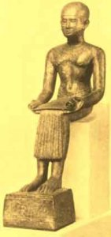
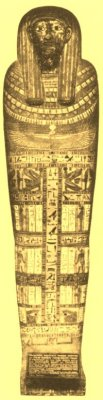
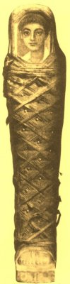

  
[Intangible Textual Heritage](../../index)  [Egypt](../index) 
[Index](index)  [Previous](eml39) 

------------------------------------------------------------------------

[Buy this Book on
Kindle](https://www.amazon.com/exec/obidos/ASIN/B002KKCXC6/internetsacredte)

------------------------------------------------------------------------

  
*Egyptian Myth and Legend*, by Donald Mackenzie, \[1907\], at Intangible
Textual Heritage

------------------------------------------------------------------------

p. 363

# CHAPTER XXIX

### The Restoration and the End

The God of the People--Egypt yearns for the Past--Rise of Saite Kings
--Osiris as Great Father--Christianized Horus Legend--Scythians and
Cimmerians--End of Assyrian Empire--Jeremiah and Pharaoh
Necho--Surrender of Jerusalem--Early Explorers--Zedekiah and Pharaoh
Hophra--Jerusalem sacked--Babylonian Captivity--Amasis and the
Greeks--Coming of King Cyrus--Fall of Babylon--Persian Conquest of
Egypt--Life in the Latter Days --Homely Letters--Cry of a Lost Soul.

THE civilization of ancient Egypt began with Osiris and ended with
Osiris. Although the deified king had been thrust into the background
for long centuries by the noble and great, he remained the god of the
common people. "The dull crowd", as Plutarch called them, associated the
ideas about their gods, "with changes of atmosphere according to the
seasons, or with the generation of corn and sowings and ploughings, and
in saying that Osiris is buried when the sown corn is hidden by the
earth, and comes to life and shows himself again when it begins to
sprout. . . . They love to hear these things, and believe them, drawing
conviction from things immediately at hand and customary." The peasant
lived and died believing in Osiris. "As Osiris lives, so shall he also
live; as Osiris died not, so shall he also not die; as Osiris perished
not, so shall he also not perish." [1](#fn_171)
Egypt was made prosperous by Osiris: he gave it the corn which brought
all its wealth and power. The

p. 364

greatest Pharaohs were those who, reverencing Osiris, cut new irrigating
canals, and boasted like Amenemhet I:

I loved the corn god . . . I have grown the grain  
In every golden valley where the Nile  
Entreated me. . . .

Egypt's Bata-like peasants constituted the strongest army commanded by
the Pharaohs; they won golden spoils from Nature, which were of more
account than the spoils from Syrian battlefields and the tribute of
subject kings. Those constant toilers, who were innately conservative in
their methods and customs and beliefs, bulk largely in the background of
ancient Egyptian history; they were little affected by the changes which
passed over the country century after century; once a political storm
died down, they settled back into their own habits of life; they were
"the nails that held the world (of Egypt) together".

We have seen the Pharaohs and their nobles going after strange gods,
marrying alien wives, and adopting new manners and customs, forgetting
those traditions which are the inspiration of national life and the
essence of true patriotism. When Egypt fell and was ground under the
heel of the Assyrian it was from the steadfast, although unlettered,
peasants that the strength of the restoration was derived; they
remembered the days that were, and they remembered Osiris. "Those
Egyptians who live in the cultivated parts of the country", wrote
Herodotus, "are of all I have seen the most ingenious, being attentive
to the improvement of memory beyond the rest of mankind."

The Assyrian conquest stirred Egypt to its depths. When Thebes was
sacked, and Amon-ra cast down from his high place, the worshippers of
Osiris were reviving

p. 365

the beliefs and customs of the Old Kingdom, for they had never gone
wholeheartedly after Ra and Amon or Sutekh and Astarte. When
Ashur-banipal shattered the power of the Asiatic nobles of Egypt and
drove out the Ethiopians, he also rescued the Egyptian people from their
oppressors and strengthened the restoration movement which had begun
under the Ethiopian kings.

Ashur-banipal was unable to retain for long his hold upon the land of
the Pharaohs. Persistent revolts occupied his attention at the very
heart of his empire. His brother, the subject king of Babylon, had
secured the co-operation of the Elamites, the Aramæans, the Chaldeans,
and the Arabians, and a fierce struggle ensued, until in the end Babylon
was besieged and captured and Elam was devastated. Meanwhile Cimmerians
were invading Asia Minor and the Aryan Medes were pressing into Elam.
When peace was at length restored Assyria, although triumphant, was
weakened as a result of its terrible struggles, and the empire began to
go to pieces.

Assyria's misfortunes gave Psamtek his opportunity. About two years
after his rival, Tanut-amon, was driven out of Thebes, he had come to an
understanding with King Gyges of Lydia, who, having driven off the first
attack of Cimmerians, was able to send him Ionian and Carian
mercenaries. Psamtek then ceased to pay tribute to Ashur-banipal, and
was proclaimed Pharaoh of United Egypt. As he had married a daughter of
Taharka, the Ethiopian, his succession to the throne was legalized
according to the "unwritten law" of Egypt. The Assyrian officials and
soldiers were driven across the Delta frontier.

Herodotus relates an interesting folktale regarding the rise of Psamtek.
He was informed that the Egyptians

p. 366

chose twelve kings to reign over them, and these "connected themselves
with intermarriages, and engaged to promote the common interest",
chiefly because an oracle had declared that the one among them who
offered a libation to Ptah in a brazen vessel should become the Pharaoh.
One day in the labyrinth eleven of the kings made offerings in golden
cups, but the priest had brought out no cup for Psamtek, who used his
brazen helmet. The future Pharaoh was promptly exiled to a limited area
in the Delta. He visited the oracle of the serpent goddess at Buto, and
was informed that his cause would prosper when the sea produced brazen
figures of men. Soon afterwards he heard that a body of Ionians and
Carians, clad in brazen armour, had come oversea and were plundering on
the Egyptian coast. He immediately entered into an alliance with them,
promising rich rewards, vanquished his rivals in battle, and thus became
sole sovereign of Egypt.

Sais was then the capital, and its presiding deity, the goddess Neith,
assumed great importance; but by the mass of the people she was regarded
as a form of Isis. The great city of Memphis, however, was the real
centre of the social and religious life of the new Egypt which was the
old. Thebes had ceased to have any political significance. No attempt
was made to restore its dilapidated temples, from which many of the gods
had been deported to Assyria, where they remained until the Persian age.
Amon had fallen from his high estate, and his cult was presided over by
a high priestess, a sister of Psamtek's queen, the "wife" of the god.
With this lady was afterwards associated one of Psamtek's daughters, so
that the remnant of the Amon endowments might come under the control of
the royal house. Ra of Heliopolis shrank to the position of a local
deity. The conservative Egyptians,

p. 367

as a whole, had never been converted to sun worship.

Osiris was restored as the national god in his Old Kingdom association
with Ptah, the Great Father, the world deity, who had his origin upon
the earth; his right eye was the sun and his left eye was the moon. But
although the sun was "the eye of Osiris", the ancient deity was no more
a sun god than Ra was an earth god. As Osiris-ra he absorbed certain
attributes of the solar deity, but as Ra had similarly absorbed almost
every other god, the process was not one of change so much as
adjustment. [1](#fn_172) Ra ceased to be
recognized as the Great Father of the Egyptian Pantheon. "Behold, thou
(Osiris) art upon the seat of Ra." Osiris was essentially a god of
vegetation and the material world; he was the soul of Ra, but his own
soul was the soul of Seb, the earth god, which was hidden now in a tree,
now in all animal, now in an egg: the wind was the breath and spirit of
Osiris., and his eyes gave light. He was not born from the sun egg like
Ra. Seb, the earth giant, in his bird form was before the egg, and
Osiris absorbed Seb. Osiris became "the Great Egg", which was "the only
egg", for the Ra "egg" had been appropriated from the earth worshippers.
He was both Seb and the "egg"--"thou egg who becometh as one renewed".
The father of Ra was Nu (water); the father of Osiris was Tanen
(earth). [2](#fn_173)

But although he fused with Ptah-Tanen and became the Great Father,
Osiris was not divested of his ancient lunar attributes. He was
worshipped as the Apis bull;

p. 368

his soul was in the bull, and it had come from the moon as a ray of
light. Here then we have a fusion of myths of divergent origin. Osiris
was still the old lunar god, son of the Great Mother, but he had become
"husband of his mother" or mothers, and also his own father, because he
was the moon which gave origin to the sacred bull. He was also the world
giant whose soul was hidden. The Egyptian theologians of the restoration
clung to all the old myths of their mingled tribal ancestors and
attached them to Osiris.

So Osiris absorbed and outlived all the gods. In early Christian times
the Serapeum, the earthly dwelling place of Serapis (Osiris-Apis), was
the haunt of society Hadrian, writing to the consul Servian, said that
the Alexandrians "have one god, Serapis, who is worshipped by
Christians, Jews, and Gentiles". The half-Christianized Egyptians
identified Christ with Horus, son of Osiris, and spoke of the Saviour as
the young avenger in the "Legend of the Winged Disk", who swept down the
Nile valley driving the devil (Set) out of Egypt. As early Gaelic
converts said: "Christ is my Druid", those of the land of the Pharaohs
appear to have declared similarly: "Christ is my Horus".

Horus and his mother, Isis, came into prominence with Osiris. Set, as
Sutekh, was banished from Egypt, and was once again regarded as the
devil. The cult of Isis ultimately spread into Europe. [1](#fn_174)

But not only were the beliefs of the Old Kingdom revived; even its
language was imitated in the literature and inscriptions of the Saite
period, and officials were given the titles of their predecessors who
served Zoser and Khufu. Art revived, drawing its inspiration from the
remote past, and once again the tomb scenes assumed a

p. 369

rural character and all the mannerisms of those depicted in Old Kingdom
times. Egypt yearned for the glories of other days, and became an
imitator of itself. Everything that was old became sacred; antiquarian
knowledge was regarded as the essence of wisdom. Hieroglyphic writing
was gradually displaced by Demotic, and when the Greeks found that the
learned priests alone were able to decipher the ancient inscriptions,
they concluded that picture writing was a sacred art; hence the name
"hieroglyphics", derived from *hieros*, sacred, and *glypho*, I engrave.

The excess of zeal displayed by the revivalists is illustrated in their
deification of Imhotep, the learned architect of King Zoser of the Third
Dynasty (see Chapter VIII). His memory had long been revered by the
scribes; now he was exalted to a position not inferior to that held by
Thoth in the time of Empire. As the son of Ptah, he was depicted as a
young man wearing a tight-fitting cap, sitting with an open scroll upon
his knees. He was reputed to cure diseases by the power of spells, and
was a patron of learning, and he was a guide or priest of the dead, whom
he cared for until they reached the Osirian Paradise. In Greek times he
was called Imûthes, and identified with Asklepios.

Animal worship was also carried to excess. Instead of regarding as
sacred the representative of a particular species, the whole species was
adored. Cats and rams, cows and birds, and fishes and reptiles were
worshipped wholesale and mummified. The old animal deities were given
new forms; Khnûmû, for instance, was depicted as a ram-headed hawk, Bast
as a cat-headed hawk, and Anubis as a sparrow with the head of a jackal.

Psamtek reigned for over fifty-four years, and Egypt prospered. At
Memphis he extended the temple of

p. 370

Ptah and built the Serapeum, in which the sacred bull was worshipped. He
waged a long war in Philistia and captured Ashdod, and had to beat back
from his frontier hordes of Scythians and Cimmerians, peoples of Aryan
speech, who had overrun Asia Minor and were pressing down through Syria
like the ancient Hittites; during their reign of terror King Gyges of
Lydia was defeated and slain.

The Greeks were encouraged to settle in Egypt, and their folklays became
current in the Delta region. Herodotus related a version of the tale of
Troy which was told to him by the priests. It was to the effect that
Paris fled to Egypt when Menelaus began military operations to recover
Helen, and that he was refused the hospitality of the Pharaoh. In the
*Odyssey* Menelaus says to Telemachus:

Long on the Egyptian coast by calms confined,  
Heaven to my fleet refused a prosperous wind,  
No vows had we preferred, nor victim slain,  
For this the gods each favouring gale restrain.

Od., iv, 473.

When Psamtek's son, Necho, came to the throne the Assyrian empire was
going to pieces. Nahum was warning Nineveh:

Behold, I am against thee, saith the Lord of hosts. . . . I will shew
the nations thy nakedness and the kingdoms thy shame. . . . The gates of
thy land shall be set wide open unto thine enemies; the fire shall
devour thy bars. . . . Thy shepherds slumber, O King of Assyria: thy
nobles shall dwell in the dust: thy people is scattered upon the
mountains, and no man gathereth them. There is no healing of thy bruise;
thy wound is grievous: all that hear the bruit of thee shall clap the
hands over thee (*Nahum*, iii).

After Ashur-banipal had devastated Elam it was occupied

p. 371

by the Aryan Medes. About 607 B.C. Cyaxares, the Median king, who had
allied himself with the revolting Babylonians, besieged Nineveh, which
was captured and ruthlessly plundered. The last Assyrian king,
Sin-shar-ishkun, the second son of Ashur-banipal, is identified with the
Sardanapalus of legend who set fire to his palace and perished in its
flames so that he might not fall into the hands of his enemies.
Tradition attached to his memory the achievements of his father.

Pharaoh Necho took advantage of Assyria's downfall by seizing Palestine.
King Josiah of Judah went against him at Megiddo and was defeated and
slain. "And his servants carried him in a chariot dead from Megiddo and
brought him to Jerusalem" (*2 Kings*, xxiii, 30). Jehoahaz was selected
as Josiah's successor, but Necho deposed him and made him a prisoner,
and, having fixed Judah's tribute at "an hundred talents of silver and a
talent of gold", he "Made Eliakim, the son of Josiah, king . . . and
turned his name to Jehoiakim" (*2 Kings*, xxiii, 34). But although Necho
had been strong enough to capture Kadesh, his triumph was shortlived.
Less than four years later Nebuchadrezzar, King of Babylon, who claimed
Syria, routed Necho's army at Carchemish, and the Egyptians were forced
to hasten back to their own land. "This is the day of the Lord of hosts,
a day of vengeance", cried Jeremiah. . . . "Come up ye horses; and rage
ye chariots; and let the mighty men come forth: the Ethiopians and the
Libyans, that handle the shield; and the Lydians (mercenaries) that
handle and bend the bow. . . . The sword shall devour. . . . Let not the
swift flee away, nor the mighty man escape. . . . The nations have heard
of thy shame", cried the Hebrew prophet to the escaping Egyptians
(*Jeremiah*, xlvi). "And the King of Egypt came not again any more out
of his land: for the King

p. 372

of Babylon had taken from the river of Egypt unto the River Euphrates
all that pertained to the King of Egypt (*2 Kings*, xxiv, 7).

Necho had come to an understanding with Nebuchadrezzar, and interfered
no more in Palestine. A few years later Jehoiakim rebelled against the
King of Babylon, expecting that Necho would support him, despite the
warnings of Jeremiah, and Jerusalem was besieged and forced to
surrender. Jehoiakim had died in the interval, and his son, Jehoiachin,
and a large number of "the mighty of the land" were deported to Babylon
(2 Kings, xxiv). Mattaniah, son of Josiah, was selected to rule over
Jerusalem, his name being changed to Zedekiah.

Necho, according to Herodotus, had undertaken the construction of a
canal between the Mediterranean and the Red Sea, hut desisted after a
time on account of a warning received from an oracle. He then devoted
himself to building a large fleet. His father was reputed to have
endeavoured to discover the source of the Nile, and it was probably with
desire to have the problem solved that Necho sent an expedition of
Phœnicians to circumnavigate Africa. When the vessels, which started
from the Red Sea, returned three years later by the Straits of Morocco,
the belief was confirmed that the world was surrounded by the "Great
Circle"--the ocean.

Apries, the second king after Necho, is the Pharaoh Hophra of the Bible.
He had dreams of conquest in Syria, and formed an alliance which
included unfortunate Judah, so that "Zedekiah rebelled against the King
of Babylon" (*Jeremiah*, lii, 3). Nebuchadrezzar took swift and terrible
vengeance against Josiah's unstable son. Jerusalem was captured after a
two years' siege and laid in ruins (about 586 B.C.). Zedekiah fled, but
was captured, "And the King of Babylon slew the sons of

p. 373

Zedekiah before his eyes. . . . Then he put out the eyes of Zedekiah;
and the King of Babylon bound him in chains and carried him to Babylon,
and put him in prison till the day of his death" (*Jeremiah*, lii, 10,
11). The majority of the Jews were deported; a number fled with Jeremiah
to Egypt. So ended the kingdom of Judah.

Oh! weep for those that wept by Babel's stream,  
Whose shrines are desolate, whose land a dream.  
Tribes of the wandering foot and weary breast,  
How shall ye flee away and be at rest!

Byron.

Jeremiah proclaimed the doom of Judah's tempter, crying: "Thus saith the
Lord; Behold I will give Pharaoh-hophra, King of Egypt, into the hand of
his enemies, and into the hand of them that seek his life; as I gave
Zedekiah, King of Judah, into the hand of Nebuchadrezzar, King of
Babylon, his enemy, and that sought his life" (*Jeremiah*, xliv, 30).

Apries fell about 568 B.C. According to Herodotus, the Egyptians
revolted against him, apparently because of his partiality to the
Greeks; his army of Ionian and Carian mercenaries was defeated by a
native force under Amasis (Ahmes II), whose mother was a daughter of
Psamtek II. A mutilated inscription at Babylon is believed to indicate
that Nebuchadnezzar invaded Egypt about this time, but it is not
confirmed by any surviving Nilotic record. Apries was kept a prisoner by
the new king, but the Egyptians demanded his death, and he was
strangled.

Amasis reigned for over forty years. He was well known to the Greeks.
Herodotus says that he regulated his time in this manner: from dawn
until the city square

p. 374

was crowded he gave audience to whoever required it; the rest of the day
he spent making merry with friends of not very high morals. Some of his
nobles remonstrated with him because of his "excessive and unbecoming
levities", and said he should conduct himself so as to increase the
dignity of his name and the veneration of his subjects. Amasis answered:
"Those who have a bow bend it only when they require to; it is relaxed
when not in use. And if it were not, it would break and be of no service
in time of need. It is just the same with a man; if he continually
engaged in serious pursuits, and allowed no time for diversion, he would
suffer gradual loss of mental and physical vigour."

Amasis "was very partial to the Greeks, and favoured them at every
opportunity", Herodotus says. He encouraged them to settle at
Naucratis, [1](#fn_175) where the temple called
Hellenium was erected and Greek deities were worshipped. Amasis erected
a magnificent portico to Neith at Sais, had placed in front of Ptah's
temple at Memphis a colossal recumbent figure 75 feet long, and two
erect figures 20 feet high, and caused to be built in the same city a
magnificent new temple to Isis. To the Græco-Libyan city of Cyrene, with
which he cultivated friendly relations, he gifted "a golden statue of
Minerva". He married a princess of the Cyrenians. Herodotus relates that
during the wedding celebrations Amasis "found himself afflicted with an
imbecility which he experienced under no other circumstances"; probably
he had been drinking heavily, as he was too prone to do. His cure was
attributed to Venus, who was honoured with a statue for reward.

Amasis was not over popular with the Egyptians. Not only did he favour
the Greeks, but promulgated a

<table data-border="0" width="798">
<colgroup>
<col style="width: 50%" />
<col style="width: 50%" />
</colgroup>
<tbody>
<tr class="odd">
<td data-valign="TOP" width="50%">
 

Painted and Gilded Figure of Ptah-Seker-Asar (Ptah-Sokar-Osiris) on a stand with a cavity containing a small portion of a body
</td>
<td data-valign="TOP" width="50%">
 

Imhotep (Imuthes) 
the architect of the first Pyramid, who became a god in the Restoration Period and "son of Ptah or Ptah Osiris" 
(British Museum)
</td>
</tr>
</tbody>
</table>

RESTORATION PERIOD DEITIES

p. 375

<table data-border="0" width="798">
<colgroup>
<col style="width: 50%" />
<col style="width: 50%" />
</colgroup>
<tbody>
<tr class="odd">
<td data-valign="TOP" width="50%">
 

1. Fine example of Restoration Period Coffin for priest of Amon and Bast.
</td>
<td data-valign="TOP" width="50%">
 

2. Characteristic Græco-Roman Coffin with painted portrait.
</td>
</tr>
</tbody>
</table>

MUMMY CASES

 

law to compel every citizen to make known once a year the source of his
earnings. It is not surprising to find that he had to send Greek
soldiers to Memphis to overawe the offended natives, who began to
whisper treasonable sayings one to another.

His foreign policy was characterized by instability. Although he
cultivated friendly relations for the purpose of mutual protection, he
gave no assistance in opposing the Persian advance westward.

About the middle of the reign of Amasis a new power arose in the East
which was destined to shatter the crumbling edifices of old-world
civilization and usher in a new age. "Cyrus, the Achæmenian, King of
Kings", who was really a Persian, overthrew King Astyages (B.C. 550) of
the Medes and founded the great Aryan Medo-Persian empire and pressed
westward to Asia Minor. Amasis formed alliances with the kings of
Babylon, Sparta, and Lydia, and occupied Cyprus, which he evacuated when
the Persians overthrew the Lydian power. Egypt had become "a shadow"
indeed. Cyrus next turned his attention to Babylonia, besieging and
capturing city after city. The regent, Belshazzar, ruled as king in
Babylon, which, in 539 B.C., was completely invested. On the last night
of his life, deeming himself secure, "Belshazzar the king made a great
feast to a thousand of his lords, and drank wine before the thousand"
(*Daniel*, v, i).

In that same hour and hall,  
The fingers of a hand  
Came forth against the wall,  
And wrote as if on sand:  
The fingers of a man;--  
A solitary hand  
Along the letters ran,  
And traced them like a wand.  
.    .    .    .    .    .

p. 376

"Belshazzar's grave is made,  
His kingdom passed away,  
He, in the balance weighed,  
Is light and worthless clay;  
The shroud his robe of state,  
His canopy the stone;  
The Mede is at his gate!  
The Persian on his throne!"

Byron.

So Babylon fell. Cyrus, who was proclaimed its king, allowed the Jews to
return home, and the first lot saw the hills of Judah in 538 B.C.,
nearly half a century after Zedekiah was put to shame.

Cambyses, a man of ungovernable temper and subject to epileptic fits,
succeeded Cyrus in 530 B.C. Nine months after the death of Amasis, the
ineffectual intriguer (525 B.C.), he moved westward with a strong army
and conquered Egypt. Psamtek III, after the defeat of his army of
mercenaries at Pelusium, on the east of the Delta, retreated to Memphis.
Soon afterwards a Persian herald sailed up the Nile to offer terms, but
the Egyptians slew him and his attendants and destroyed the boat.
Cambyses took speedy revenge. He invested Memphis, which ere long
surrendered. According to Herodotus, he committed gross barbarities.
Pharaoh's daughter and the daughters of noblemen were compelled to fetch
water like slaves, nude and disgraced before the people, and Pharaoh's
son and two thousand Egyptian youths, with ropes round their necks, were
marched in procession to be cut to pieces as the herald of Cambyses had
been, and even Pharaoh was executed. On his return from Nubia, where he
conducted a fruitless campaign, Cambyses is said to have slain a newly
found Apis bull, perhaps because Amasis had "loved Apis more than any
other

p. 377

king". At Sais the vengeful Persian, according to Egyptian tradition,
had the mummy of Amasis torn to pieces and burned.

With the conquest by Persia the history of ancient Egypt may be brought
to an end. Before the coming of Alexander the Great, in B.C. 332, the
shortlived and weak Dynasties Twenty-eight to Thirty flickered like the
last flames of smouldering embers. Then followed the Ptolemaic age,
which continued until 30 B.C., when, with the death of the famous
Cleopatra, Egypt became "the granary of Rome".

Under the Ptolemies there was another restoration. It was modelled on
the civilization of the latter half of the Eighteenth Dynasty, and
Amenhotep, son of Hapi, the architect and magician who had been honoured
by Queen Tiy's royal husband, was elevated to the rank of a god. A large
proportion of the foreign population embraced Egyptian religion, and the
dead were given gorgeous mummy cases with finely carved or painted
portraits.

Vivid glimpses of life in Egypt from the second to the fourth century
A.D.,--are afforded by the papyri discovered at Oxyrhynchus, chiefly by
Messrs. Grenfell and Hunt. Wealthy and populous Alexandria had its
brilliant and luxury-loving social groups. Invitations to dinner were
sent out in much the same form as at the present day. The following is
dated second century A.D.:

Cbæremon requests your company at dinner at the table of the lord of
Serapis in the Serapeum to-morrow, the 15th, at 9 o'clock.

The worship of Apis was fashionable. A lady wrote to a friend about the
beginning of the fourth century:

Greeting, my dear Serenia, from Petosiris. Be sure, dear, to

p. 378

come up on the 20th for the birthday festival of the god, and let me
know whether you are coming by boat or by donkey in order that we may
send for you accordingly. Take care not to forget. I pray for your
continued health.

There were spoiled and petted boys even in the third century. One wrote
to his indulgent father:

Theon to father Theon, greeting. It was a fine thing of you not to take
me with you to the city. If you won't take me with you to Alexandria I
won't write you a letter, or speak to you, or say goodbye to you, and if
you go to Alexandria I won't take your hand or ever greet you again.
This is what will happen if you won't take me. Mother said to Archelaus:
"It quite upsets me to be left behind". It was good of you to send me
presents. . . . Send me a lyre I implore you. If you don't, I won't eat,
I won't drink--there now!

Alexandria was always a hotbed of sedition. A youthful citizen in good
circumstances wrote to his brother:

I learned from some fishermen that Secundus's house has been searched
and my house has been searched. I shall therefore be obliged if you will
write me an answer on this matter so that I may myself present a
petition to the Prefect. . . . Let me hear about our bald friend, how
his hair is growing again on the top; be sure and do.

Marriage engagements were dissolved when prospective sons-in-law were
found to be concerned in lawless actions; prisoners were bailed out;
improvident people begged for loans from friends to take valuables and
clothing out of pawn; country folk complained that merchants sent large
cheeses when they ordered small ones. Young men were expected to write
home regularly. The following is a father's letter:--

I have been much surprised, my son, at not receiving hitherto a letter
from you to tell me how you are. Nevertheless, sir,

p. 379

answer me with all speed, for I am quite distressed at having heard
nothing from you.

So the social life of an interesting age is made articulate for us, and
we find that human nature has not changed much through the
centuries. [1](#fn_176)

In the Ptolemaic age a papyrus was made eloquent with the lamentation of
a girl wife in her tomb. At fourteen she was married to the high priest
of Ptah, and after giving birth to three daughters in succession she
prayed for a son, and a son was born. Four brief years went past and
then she died. Her husband heard her crying from the tomb, entreating
him to eat and drink and be merry, because the land of the dead was a
land of slumber and blackness and great weariness . . . . . "The dead
are without power to move . . . sire and mother they know not, nor do
they long for their children, husbands, or wives. . . . Ah, woe is me!
would I could drink of stream water, would I could feel the cool north
wind on the river bank, so that my mind might have sweetness and its
sorrow an end."

It is as if the soul of ancient Egypt, disillusioned in the grave, were
crying to us in the darkness "down the corridors of time".

------------------------------------------------------------------------

### Footnotes

[363:1](eml40.htm#fr_172) Erman, *Handbuch*.

[367:1](eml40.htm#fr_173) The various gods
became manifestations of Osiris. In the Osirian hymns, which were added
to from time to time, Osiris is addressed: "Thou art Tum, the forerunner
of Ra . . . the soul of Ra . . . the pupil of the eye that beholdest Tum
. . . lord of fear, who causeth himself to come into being" (*The Burden
of Isis*, Dennis).

[367:2](eml40.htm#fr_174) *The Burden of Isis*;
the egg, pp. 39, 45, 55; the sun, pp. 23, 24, 41, 49, 53; Tatenen
(Tanen), p. 49; Seb, pp. 32, 47.

[368:1](eml40.htm#fr_175) An image of Isis was
found on the site of a Roman camp in Yorkshire.

[374:1](eml40.htm#fr_176) "Mighty in ships."

[379:1](eml40.htm#fr_177) The translations are
from *Oxyrhynchus Papyri* (Egyptian Fund) Parts 2 and 3.

 
