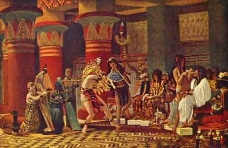

  
[Intangible Textual Heritage](../../index)  [Egypt](../index) 

------------------------------------------------------------------------

[Buy this Book on
Kindle](https://www.amazon.com/exec/obidos/ASIN/B002KKCXC6/internetsacredte)

------------------------------------------------------------------------

<table width="75%">
<colgroup>
<col style="width: 50%" />
<col style="width: 50%" />
</colgroup>
<tbody>
<tr class="odd">
<td width="50%" data-valign="TOP"></td>
<td width="50%" data-valign="CENTER"><h1 id="egyptian-myth-and-legend" data-align="CENTER">Egyptian Myth and Legend</h1>
<h2 id="by-donald-mackenzie" data-align="CENTER">by Donald Mackenzie</h2>
<h4 id="section" data-align="CENTER">[1907]</h4></td>
</tr>
</tbody>
</table>

------------------------------------------------------------------------

[Contents](#contents)    [Start Reading](eml00)    [Page
Index](pageidx)    [Text \[Zipped\]](eml.txt.gz)

------------------------------------------------------------------------

|                                                                                                                           |
|---------------------------------------------------------------------------------------------------------------------------|
|  |

This highly readable book covers Egyptian religion, history, and culture
through its entire civilization. We are accustomed to history measured
in decades or centuries. Egypt requires thinking in terms of millenia.
There was not one monolithic Egyptian belief system; it went through
profound changes over time; this book describes this evolution in great
detail. Mackenzie includes many extracts from religious texts, folk
tales, and historical documents.

------------------------------------------------------------------------

 [Title Page](eml00)  
[Preface](eml01)  
[Contents](eml02)  
[Introduction](eml03)  
[Chapter I: Creation Legend of Sun Worshippers](eml04)  
[Chapter II: The Tragedy of Osiris](eml05)  
[Chapter III: Dawn of Civilization](eml06)  
[Chapter IV: The Peasant who became King](eml07)  
[Chapter V: Racial Myths in Egypt and Europe](eml08)  
[Chapter VI: The City of the Elf God](eml09)  
[Chapter VII: Death and the Judgment](eml10)  
[Chapter VIII: The Religion of the Stone Workers](eml11)  
[Chapter IX: A Day in Old Memphis](eml12)  
[Chapter X: The Great Pyramid Kings](eml13)  
[Chapter XI: Folk Tales of Fifty Centuries](eml14)  
[Chapter XII: Triumph of the Sun God](eml15)  
[Chapter XIII: Fall of the Old Kingdom](eml16)  
[Chapter XIV: Father Gods and Mother Goddesses](eml17)  
[Plate I: The Girl Wife and the Bata Bull](eml18)  
[Plate II: The Farmer Plunders the Peasant](eml19)  
[Plate III: Senuhet Slays the Warrior of Tonu](eml20)  
[Plate IV: Queen Ahmes (Wife Of Thothmes I), Mother of the Famous Queen
Hatshepsut](eml21)  
[Plate V: Luring the Doom Serpent](eml22)  
[Plate V: Fowling Scene](eml23)  
[Plate VI: Farm Scene: The Counting and Inspection of the
Geese](eml24)  
[Plate VII: Pastime in Ancient Egypt Three Thousand Years Ago](eml25)  
[Chapter XV: The Rise of Amon](eml26)  
[Chapter XVI: Tale of the Fugitive Prince](eml27)  
[Chapter XVII: Egypt's Golden Age](eml28)  
[Chapter XVIII: Myths and Lays of the Middle Kingdom](eml29)  
[Chapter XIX: The Island of Enchantment](eml30)  
[Chapter XX: The Hyksos and their Strange God](eml31)  
[Chapter XXI: Joseph and the Exodus](eml32)  
[Chapter XXII: Amon, the God of Empire](eml33)  
[Chapter XXIII: Tale of the Doomed Prince](eml34)  
[Chapter XXIV: Changes in Social and Religious Life](eml35)  
[Chapter XXV: Amenhotep the Magnificent and Queen Tiy](eml36)  
[Chapter XXVI: The Religious Revolt of the Poet King](eml37)  
[Chapter XXVII: The Empire of Rameses and the Homeric Age](eml38)  
[Chapter XXVIII: Egypt and the Hebrew Monarchy](eml39)  
[Chapter XXIX: The Restoration and the End](eml40)  
