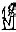
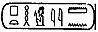
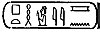
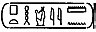
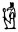

  
[Intangible Textual Heritage](../../index)  [Egypt](../index)  [EHH
Index](../ehh)  [Index](index)  [Previous](gate14)  [Next](gate16) 

------------------------------------------------------------------------

p. 43

# THE BOOK OF GATES

## CHAPTER I.

### THE ALABASTER SARCOPHAGUS OF SETI I.

THE text of the "Book of Gates," printed in the following pages, is
taken from the alabaster sarcophagus of king Seti I., B.C. 1370, which
is preserved in the Museum of Sir John Soane, at 13, Lincoln's Inn
Fields. This sarcophagus is, undoubtedly, one of the chief authorities
for the text of that remarkable book; but before any attempt is made to
describe the arrangement of the scenes and the inscriptions which
accompany them, it will be well to recall the principal facts connected
with its discovery by Giovanni Battista Belzoni, who has fortunately
placed them on record in his *Narrative of the Operations and recent
discoveries within the pyramids, temples, tombs and Excavations in Egypt
and Nubia*, London, 1820, p. 233 ff. In October, 1815, Belzoni began to
excavate in the Biban-al-Muluk, i.e., the Valley of the Tombs of the
Kings, on the western bank of the Nile at Thebes, and in the

p. 44

bed of a watercourse he found a spot where the ground bore traces of
having been "moved." On the 19th of the month his workmen made a way
through the sand and fragments of stone which had been piled up there,
and entered the first corridor or passage of a magnificent tomb, which
he soon discovered to have been made for one of the great kings of
Egypt. A second corridor led him to a square chamber which, being thirty
feet deep, formed a serious obstacle in the way of any unauthorized
intruder, and served to catch any rain-water which might make its way
down the corridors from the entrance. Beyond this chamber are two halls,
and from the first of these Belzoni passed through other corridors and
rooms until he entered the vaulted chamber in which stood the
sarcophagus. [1](#fn_0) The sarcophagus chamber
is situated at a distance of 320 feet from the entrance to the first
corridor, and is 180 feet below the level of the ground. Belzoni
succeeded in bringing the sarcophagus from its chamber into the light of
day without injury, and in due course it arrived in England; the
negotiations which he opened with the Trustees of the British Museum, to
whom its purchase was first proposed, fell through, and he subsequently
sold it to Sir John Soane, it is said for the sum of £2000. An
examination of the sarcophagus shows that both it and its cover were
hollowed out of monolithic blocks of alabaster,

p. 45

and it is probable, as Mr. Sharpe says, [1](#fn_1) that these were quarried in the mountains
near Alabastronpolis, i.e., the district which was known to the
Egyptians by the name of Het-nub, and is situated near the ruins known
in modern times by the name of Tell al-'Amarna. In the Yet-nub quarries
large numbers of inscriptions, written chiefly in the hieratic
character, have been found, and from the interesting selection from
these published by Messrs. Blackden and Fraser, we learn that several
kings of the Ancient and Middle Empires carried on works in them, no
doubt for the purpose of obtaining alabaster for funeral purposes. The
sarcophagus is 9 ft. 4 in. long, 3 ft. 8 in. wide, in the widest part,
and 2 ft. 8 in. high at the shoulders, and 2 ft. 3 in. at the feet; the
cover is 1 ft. 3 in. high. The thickness of the alabaster varies from 21
to 4 inches. The skill of the mason who succeeded in hollowing the
blocks without breaking, or even cracking them, is marvellous, and the
remains of holes nearly one inch in diameter suggest that the drill was
as useful to him as the chisel and mallet in hollowing out the blocks.
When the sarcophagus and its cover were finally shaped and polished,
they were handed over to an artisan who was skilled in cutting
hieroglyphics and figures of the gods, &c., in stone, and both the
insides and outsides were covered by him

p. 46

with inscriptions and vignettes and mythological scones which
illustrated them. Both inscriptions and scenes were then filled in with
a kind of paint made from some preparation of copper, and the vivid
bluish green colour of this paint must have formed a striking contrast
to the brilliant whiteness of the alabaster when fresh from the quarry.
At the present time large numbers of characters and figures are denuded
of their colour, and those in which it still remains are much
discoloured by London fog and soot.

The first to attempt to describe the contents of the texts and scenes on
the sarcophagus of SETI I. was the late Samuel Sharpe, who, with the
late Joseph Bonomi, published "The Alabaster Sarcophagus of Oimenepthah
I., King of Egypt," London, 1864, 4to; the former was responsible for
the letterpress, and the latter for the plates of scenes and texts. For
some reason which it is not easy to understand, Mr. Sharpe decided that
the hieroglyphic characters which formed the prenomen of the king for
whom the sarcophagus was made were to be read "Oimenepthah," a result
which he obtained by assigning the phonetic value of O to the
hieroglyphic sign for Osiris 
. The prenomen is sometimes written  , or  , and  , and is to be read either
SETI-MEN-EN PTAH, or SETI-MEN-EN-PTAH. Mr. Sharpe did not, apparently,
realize that both the signs 
 and  

p. 47

were to be read "Set," and he gave to the first the phonetic value of A
and to the second the value of O; he next identified "Aimenepthah" or
"Oimenepthah" with the Amenophath of Manetho, and the Chomaepthah of
Eratosthenes, saying, "hence arises the support to our reading his name
(i.e., the king's) Oimenepthah." Passing over Mr. Sharpe's further
remarks, which assert that the sarcophagus was made in the year B.C.
1175 (!), we must consider briefly the arrangement of the texts and
scenes upon the insides and outsides of the sarcophagus and its covers.
On the upper outside edge of the sarcophagus runs a single line of
hieroglyphics which contains speeches supposed to be made to the
deceased by the four children of Horus; this line is in two sections,
each of which begins at the right hand side of the head, and ends at the
left hand side of the foot. Below this line of hieroglyphics are five
large scenes, each of which is divided into three registers, and these
are enclosed between two dotted bands which are intended to represent
the borders of the "Valley of the Other World." On the inside of the
sarcophagus are also five scenes, but there is no line of hieroglyphics
running along the upper edge. On the bottom of the sarcophagus is a
finely cut figure of the Goddess Nut, and round and about her are texts
selected from the Theban *Recension of the Book of the Dead*; on the
inside of the cover is a figure of the goddess Nut, with arms
outstretched. On the outside of the

p. 48

cover, in addition to the texts which record the names and titles of the
deceased, are inscribed two large scenes, each of which is divided into
three registers, like those inside and outside the sarcophagus.

The line of text on the upper outside edge reads:--

p. 50

I. Speech of MESTHA: "I am Mestha, I am \[thy\] son, O Osiris, king,
lord of the two lands, Men-Maat-Ra, whose word is *maat*, son of the
Sun, Seti Mer-en-Ptah, whose word is *maat*, and I have come so that I
may be among those who protect thee. I make to flourish thy house, which
shall be doubly established, by the command of Ptah, by the command of
Ra himself."

Speech of ANPU: "I am Anpu, who dwelleth in (or, with) the funeral
chest." He saith, "Mother Isis descendeth . . . . . . . . bandages for
me, Osiris, king Men-Maat-Ra, whose word is *maat*, son of the Sun, Seti
Mer-en-Ptah, whose word is *maat*, from him that worketh against me."

Speech of TUAMATEF: "I am Tuamatef, I am thy son Horus, I love thee, and
I have come to avenge thee, Osiris, upon him that would work his
wickedness

p. 51

upon thee, and I will set him under thy feet for ever, Osiris, king,
lord of the two lands, Men-Maat-Ra, son of the Sun, \[proceeding\] from
his body, loving him, lord of crowns (or, risings) Seti Mer-en-Ptah,
whose word is *maat*, before the Great God."

To be said: "Ra liveth, the Tortoise dieth! Strong are the members of .
. . . . Osiris, king Men-Maat-Ra, whose word is *maat*, for Qebhsennuf
guardeth them. Ra liveth, the Tortoise dieth! In a sound state is he who
is in the sarcophagus, in a sound state is he who is in the sarcophagus,
that is to say, the son of the Sun, Seti Mer-en-Ptah, whose word is
*maat*."

Speech of NUT: Nut, the great one of Seb, saith: "O Osiris, king, lord
of the two lands, Men-Maat-Ra, whose word is *maat*, who loveth me, I
give unto thee purity on the earth, and splendour (or, glory) in the
heavens, and I give unto thee thy head for ever."

II\. Speech of NUT, who is over the HENNU BOAT: "This is my son, Osiris,
king, Men-Maat-Ra, whose word is *maat*. His father Shu loveth him, and
his mother Nut loveth him, Osiris, son of Ra, Seti Mer-en-Ptah, whose
word is *maat*."

Speech of HAPI: "I am Hapi. I have come that I might be among those who
protect thee, I bind together for thee thy head, \[and thy members,
smiting down for thee thine enemies beneath thee, and I give

p. 52

thee\] thy head, O Osiris, king, Men-Maat-Ra, whose word is *maat*, son
of Ra, Seti Mer-en-Ptah, whose word is *maat*."

Speech Of ANPU, the Governor of the divine house: I am Anpu, the
Governor of the divine house. O Osiris, king, lord of the two lands,
Men-Maat-Ra, whose word is *maat*, son of the Sun, \[proceeding\] from
his body, the lord of crowns, Seti Mer-en-Ptah, whose word is *maat*,
the *Shennu* beings go round about thee, and thy members remain
uninjured, O Osiris, king, Men-Maat-RA, whose word is *maat* for ever."

Speech Of QEBHSENNUF: "I am thy son, I have come that I might be among
those who protect thee. I gather together for thee thy bones, and I
piece together for thee thy limbs. I bring unto thee thy heart, and I
set it upon its seat in thy body. I make to flourish (or, germinate) for
thee thy house after thee, \[O thou who\] liv\[est\] for ever."

To be said: "Ra liveth, the Tortoise dieth! Let enter the bones of
Osiris, king Men-Maat-Ra, whose word is *maat*, the son of the Sun, Seti
Mer-en-Ptah, whose word is *maat*, let them enter into their
foundations. Pure is the dead body which is in the earth,

p. 53

and pure are the bones of Osiris, king Men-Mast-Ra, whose word is
*maat*, like Ra \[for ever!\]."

On the bottom of the sarcophagus is a large, full-length figure of the
goddess NUT who is depicted in the form of a woman with her arms ready
to embrace the body of the king. Her face and the lower parts of the
body below the waist are in profile, but she has a front chest, front
shoulders, and a front eye. Her feet are represented as if each was a
right foot, and each only shows the great toe. One breast is only shown.
The hair of the goddess is long and falls over her back and shoulders;
it is held in position over her forehead by a bandlet. She wears a deep
collar or necklace, and a closely-fitting feather-work tunic which
extends from her breast to her ankles; the latter is supported by two
shoulder straps, each of which is fastened with a buckle on the
shoulder. She has anklets on her legs, and bracelets on her wrists, and
armlets on her arms. The inscriptions which are cut above the head, and
at both sides, and under the feet of the goddess contain addresses to
the king by the great gods of the sky, and extracts from the *Book of
the Dead*; they read:--

p. 55

### INSCRIPTION ON THE BOTTOM OF THE SARCOPHAGUS OF SETI I.

I. The words of Osiris the king, the lord of the two lands, MEN-MAAT-RA,
whose word is *maat*, the son of Ra (i.e., the Sun), SETI MER-EN-PTAH,
whose word is maat, who saith, "O thou goddess NUT, support thou me, for
I am thy son. Destroy thou my defects of immobility, together with those
who produce them."

II\. The goddess NUT, who dwelleth in HET-HENNU, saith, "This \[is my\]
son Osiris, the king, the lord of the two lands, MEN-MAAT-RA, whose word
is *maat*, the son of Ra, \[proceeding\] from his body, who loveth him,
the lord of crowns, Osiris, SETI MER-EN-PTAH."

III\. The god SEB saith, "This \[is my\] son MEN-MAAT-RA, who loveth me.
I have given unto him purity upon earth, and glory in heaven, him the
Osiris, king, the lord of the two lands, MEN-MAAT-RA, "whose word is
*maat*, the son of Ra, the lover of Nut, that is to say, SETI
MER-EN-PTAH, whose word is *maat*, before the lords of the Tuat."

IV\. Words which are to be said:--"O Osiris, king, lord of the two
lands, MEN-MAAT-RA, whose word is *maat*, the son of Ra, \[proceeding\]
from his body, that is to say, SETI MER-EN-PTAH, whose word is *maat*.
Thy mother NUT putteth forth \[her\] two hands and arms over thee,
Osiris, king, lord of the two lands, MEN-MAAT-RA, whose word is *maat*,
son of Ra,

p. 57

whom he loveth, lord of diadems, SETI MER-EN-PTAH, whose word is *maat*.
Thy mother NUT hath added the magical powers which are thine, and thou
art in her arms, and thou shalt never die. Lifted up and driven away are
the calamities which were to thee, and they shall never \[more\] come to
thee, and shall never draw nigh unto thee, Osiris, king, the lord of the
two lands, MEN-MAAT-RA, whose word is *maat*. Horus hath taken up his
stand behind thee, Osiris, son of Ra, lord of diadems, SETI MER-EN-PTAH,
whose word is *maat*, for thy mother NUT hath come unto thee; she hath
purified (or, washed) thee, she hath united herself to thee, she hath
supplied thee as a god, and thou art alive and stablished among the
gods."

V. The great goddess NUT saith, "I have endowed him with a soul, I have
endowed him with a spirit, and I have given him power in the body of his
mother TEFNUT, I who was never brought forth. I have come, and I have
united myself to OSIRIS, the king, the lord of the two lands,
MEN-MAAT-RA, whose word is *maat*, the son of Ra, the lord of diadems,
SETI MER-EN-PTAH, whose word is *maat*, with life, stability, and power.
He shall not die. I am NUT of the mighty heart, and I took up my being
in the body of my mother TEFNUT in my name of Nut; over my mother none
hath

p. 59

gained the mastery. I have filled every place with my beneficence, and I
have led captive the whole earth; I have led captive the South and the
North, and I have gathered together the things which are into my arms to
vivify Osiris, the king, the lord of the two lands, MEN-MAAT-RA, the son
of the Sun, \[proceeding\] from his body, the lover of SEKER, the lord
of diadems, the governor whose heart is glad, SETI MER-EN-PTAH, whose
word is *maat*. His soul shall live for ever! "

VI\. \["Nut,"\] saith Osiris, the king MEN-MAAT-RA, whose word is
*maat*, "Raise thou me up! I am \[thy\] son, set thou free him whose
heart is at rest from that which maketh \[it to be still\]."

VII\. Osiris, the king, the lord of the two lands, MEN-MAAT-RA, whose
word is *maat*, the son of the Sun, loving him, SETI MER-EN-PTAH, saith
the

### CHAPTER OF COMING FORTH BY DAY AND OF MAKING A WAY THROUGH AMMEHET. [1](#fn_2)

Saith Osiris, the king, the lord of the two lands, MEN-MAAT-RA, whose
word is *maat*, the son of the Sun, \[proceeding\] from his body, loving
him, the lord of crowns, SETI MER-EN-PTAH, whose word is *maat*, "Homage
to you, O ye lords of *maat*, who are free from iniquity, who exist and
live for ever and to the double *henti* period of everlastingness,
MEN-MAAT-RA, whose word is *maat*, the son of the Sun, \[proceeding\]
from his body, loving him, the lord of diadems, SETI MER-EN-PTAH,

p. 61

whose word is *maat*, before you hath become a *khu* (i.e., a spirit) in
his attributes, he hath gained the mastery through his words of power,
and he is laden with his splendours. O deliver ye the Osiris, the king,
the lord of the two lands, MEN-MAAT-RA, whose word is *maat*, the son of
the sun, the lord of diadems, SETI MER-EN-PTAH, whose word is *maat*,
from the Crocodile of this Pool of Maati. He hath his mouth, let him
speak therewith. Let there be granted unto him broad-handedness in your
presence, because I know you, and I know your names. I know this great
god unto whose nostrils ye present offerings of *tchefau*. REKEM is his
name. He maketh a way through the eastern-horizon of heaven. REKEM
departeth and I also depart; he is strong and I am strong. O let me not
be destroyed in the MESQET Chamber. Let not the Sebau fiends gain the
mastery over me. Drive not ye me away from your Gates, and shut not fast
your arms against the Osiris, the king, the lord of the two lands,
MEN-MAAT-RA, whose word is *maat*, the son of the Sun, \[proceeding\]
from his body, loving him, the lord of diadems, SETI MER-EN-PTAH, whose
word is *maat*, because \[my\] bread is in the city of PE, [1](#fn_3) and my ale is in the city Of TEP, and my
arms are united

p. 63

in the divine house which my father hath given unto me. He hath
stablished for me a house in the high place of the lands, and there are
wheat and barley therein, the quantity of which is unknown. The son of
my body acteth for me there as *kher-heb*. [1](#fn_4) Grant ye, unto me sepulchral offerings, that
is to say, incense, and *merhet* unguent, and all beautiful and pure
things of every kind whereon the God liveth. Osiris, the king,
MEN-MAAT-RA, whose word is *maat*, the son of the Sun, \[proceeding\]
from his body, loving him, the lord of diadems, the ruler of joy of
heart, SETI MER-EN-PTAH, whose word is *maat*, existeth for ever in all
the transformations which it pleaseth \[him to make\]. He floateth down
the river, he saileth up into SEKHET-AARU, [2](#fn_5) he reacheth SEKHET-HETEP. [3](#fn_6) I am the double Lion-god." [4](#fn_7)

VIII\. Saith Osiris, the king, the lord of the two lands, MEN-MAAT-RA,
whose word is *maat*, son of the Sun, loving him, SETI MER-EN-PTAH,
whose word is *maat*:--"O ward off that destroyer from my father Osiris,
the king, the lord of the two lands, MEN-MAAT-RA, whose word is *maat*,
and let his divine protection be under my legs, and let them live.
Strengthen thou Osiris, son of the Sun, lord of diadems, SETI
MER-EN-PTAH, whose word is *maat*, with thy hand. Grasp thou him with
thy hand, let him enter thy hand, let

p. 65

him enter thy hand, O Osiris, king, lord of the two lands, MEN-MAAT-RA,
Whose word is *maat*, thou shalt not perish. NUT cometh unto thee, and
she fashioneth thee as the Great Fashioner, and thou shalt never decay;
she fashioneth thee, she turneth thy weakness into strength, she
gathereth together thy members, she bringeth thy heart into thy body,
and she hath placed thee at the head of the living doubles (*kau*), O
Osiris, king, lord of the two lands, MEN-MAAT-RA, whose word is maat,
before the beautiful god, the lord of TA-TCHESERT."

IX\. Saith Osiris, the king, the lord of the two lands, MEN-MAAT-RA,
whose word is *maat*, the son of the Sun, \[proceeding\] from his body,
loving him, the lord of diadems, SETI MER-EN-PTAH, whose word is *maat*,

### \[THE CHAPTER OF CAUSING THE SOUL TO BE UNITED TO ITS BODY IN THE UNDERWORLD\] [1](#fn_8)

Hail, ye gods who bring (ANNIU)! \[Hail\] ye gods who run (PEHIU)!
\[Hail\] thou who dwellest in his embrace, thou great god, grant thou
that may come unto me my soul from wheresoever it may be. If it would
delay, then lot my soul be brought unto me from wheresoever it may be,
for thou shalt find the Eye of Horus standing by thee like those
watchful gods. If it lie down, let it lie down in ANNU (Heliopolis), the
land where \[souls are joined to their bodies\] in thousands. Let my
soul be brought

p. 67

unto me from wheresoever it may be. Make thou strong, O guardian of sky
and earth, this my soul. If it would tarry, do thou cause the soul to
see its body, and thou shalt find the Eye of Horus standing by thee even
as do those \[gods who watch\]."

"Hail, ye gods who tow along the boat of the lord of millions of years,
who bring \[it\] into the upper regions of the Tuat, who make it to pass
over Nut, and who make the soul to enter into its *sahu* (i.e.,
spiritual body), let your hands be full of weapons, and grasp them and
make them sharp, and hold chains in readiness to destroy the serpent
enemy. Let the Boat rejoice, and let the great god pass on in peace, and
behold, grant ye that the soul of Osiris, king MEN-MAAT-RA, whose word
is *maat*, may emerge from the thighs \[of Nut\] in the eastern horizon
of heaven, for ever and for ever."

X. Osiris, the king, the lord of the two lands, MEN-MAAT-RA
SETEP-\[EN\]-RA, whose word is *maat*, the son of Ra, loving PTAH-SEKRI,
the lord of diadems, SETI MER-EN-PTAH, whose word is *maat*, saith:--"O
ye *shennu* beings, go ye round behind me, and let not these my members
be without strength."

XI\. Osiris, the king, the lord of the two lands, MEN-MAAT-RA AA-RA,
whose word is *maat*, the son of the sun, \[proceeding\] from his body,
loving him, lord of diadems, SETI MER-EN-PTAH, saith:--"O Nut, lift thou
me up. I am thy son. Do away from me that which maketh me to be without
motion." \[Nut saith\]:--O Osiris, the king the lord of the two lands,
MEN-MAAT-RA

p. 69

\[paragraph continues\] AA-RA whose word is *maat*, the soil or the sun,
\[proceeding\] from his body, loving him, the lord or diadems, SETI
MER-EN-PTAH, Whose word is *maat*, I have given thee thy head to be on
thy body, and all the members of him that is SETI MER-EN-PTAH, whose
word is *maat*, shall never lack strength."

On the outside of the cover, beneath the two scenes and texts which
occupied the upper part of it, was a horizontal line of hieroglyphics
which contained two short speeches, the one by the goddess Nut, and the
other by Thoth. The speech of Nut is a duplicate of the opening lines of
that found on the bottom of the sarcophagus (see above § v., p. 55); the
speech of Thoth is much mutilated, and can have contained little except
the promise to be with the king, and a repetition of the royal name and
titles. On the inside of the cover were texts, many portions of which
are identical, as we see from the fragments which remain, with the
Chapters from the *Book of the Dead* which are found on the bottom of
the sarcophagus, and which have been transcribed above. At each side of
the figure of the winged goddess which was cut on the breast was a
figure of the god Thoth, who is seen holding a staff surmounted by the
symbol of "night.". When the cover was complete there were probably four
such figures upon it, and the texts which accompanied them were, no
doubt,

p. 70

identical with those found in Chapter CLXI. of the *Book of the Dead*.

The scenes and inscriptions which cover the inside and outside of the
sarcophagus are described and transcribed in the following chapters.

p. 71

### APPENDIX TO CHAPTER I.

#### BELZONI'S ACCOUNT OF HIS DISCOVERY OF THE TOMB OF SETI I.

"ON the 16th (of October) I recommenced my excavations in the Valley of
Beban el Malook, and pointed but the fortunate spot, which has paid me
for all the trouble I took in my researches. I may call this a fortunate
day, one of the best perhaps of my life; I do not mean to say, that
fortune has made me rich, for I do not consider all rich men fortunate;
but she has given me that satisfaction, that extreme pleasure, which
wealth cannot purchase; the pleasure of discovering what has been long
sought in vain, and of presenting the world with a new and perfect
monument of Egyptian antiquity, which can be recorded as superior to any
other in point of grandeur, style, and preservation, appearing as if
just finished on the day we entered it; and what I found in it will show
its great superiority to all others. Not fifteen yards from the last
tomb I described, I caused the earth to be opened at the foot of a steep
hill, and under a torrent, which, when it rains, pours a great quantity
of water over the very spot I have

p. 72

caused to be dug. No one could imagine, that the ancient Egyptians would
make the entrance into such an immense and superb excavation Just under
a torrent of water; but I had strong reasons to suppose, that there was
a tomb in that place, from indications I had observed in my pursuit. The
Fellahs who were accustomed to dig were all of opinion, that there was
nothing in that spot, as the situation of this tomb differed from that
of any other. I continued the work, however, and the next day, the 17th,
in the evening we perceived the part of the rock that was cut, and
formed the entrance. On the 18th, early in the morning, the task was
resumed, and about noon the workmen reached the entrance, which was
eighteen feet below the surface of the ground. The appearance indicated,
that the tomb was of the first rate; but still I did not expect to find
such a one as it really proved to be. The Fellahs advanced till they saw
that it was probably a large tomb, when they protested they could go no
further, the tomb was so much choked up with large stones, which they
could not get out of the passage. I descended, examined the place,
pointed out to them where they might dig, and in an hour there was room
enough for me to enter through a passage that the earth had left under
the ceiling of the first corridor, which is 36 ft. 2 in. long, and 8 ft.
8 in. wide, and, when cleared of the ruins, 6 ft. 9 in. high. I
perceived immediately by the painting on the

p. 73

ceiling, and by the hieroglyphics in *basso relievo*, which were to be
seen where the earth did not reach, that this was the entrance into a
large and magnificent tomb. At the end of this corridor I came to a
staircase 23 ft. long, and of the same breadth as the corridor. The door
at the bottom is 12 ft. high. From the foot of the staircase I entered
another corridor, 37 ft. 3 in. long, and of the same width and height as
the other, each side sculptured with hieroglyphics in *basso relievo*,
and painted. The ceiling also is finely painted, and in pretty good
preservation. The more I saw, the more I was eager to see, such being
the nature of man; but I was checked in my anxiety at this time, for at
the end of this passage I reached a large pit, which intercepted my
progress. This pit is 30 ft. deep, and 14 ft. by 12 ft. 3 in. wide. The
upper part of the pit is adorned with figures, from the wall of the
passage up to the ceiling. The passages from the entrance all the way to
this pit have an inclination downward of an angle of eighteen degrees.
On the opposite side of the pit facing the entrance I perceived a small
aperture 2 ft. wide and 2 ft. 6 in. high, and at the bottom of the wall
a quantity of rubbish. A rope fastened to a piece of wood, that was laid
across the passage against the projections which formed a kind of door,
appears to have been used by the ancients for descending into the pit;
and from the small aperture oil the opposite side hung another, which

p. 74

reached the bottom, no doubt for the purpose of ascending. We could
clearly perceive, that the water which entered the passages from the
torrents of rain ran into this pit, and the wood and rope fastened to it
crumbled to dust on touching them. At the bottom of the pit were several
pieces of wood, placed against the side of it, so as to assist the
person who was to ascend by the rope into the aperture. I saw the
impossibility of proceeding at the moment. Mr. Beechey, who that day
came from Luxor, entered the tomb, but was also disappointed.

"The next day, the 19th, by means of a long beam we succeeded in sending
a man up into the aperture, and having contrived to make a bridge of two
beams, we crossed the pit. The little aperture we found to be an opening
forced through a wall, that had entirely closed the entrance, which was
as large as the corridor. The Egyptians had closely shut it up,
plastered the wall over, and painted it like the rest of the sides of
the pit, so that but for the aperture, it would have been impossible to
suppose, that there was any further proceeding; and anyone would
conclude, that the tomb ended with the pit. The rope in the inside of
the wall did not fall to dust, but remained pretty strong, the water not
having reached it at all; and the wood to which it was attached was in
good. preservation. It was owing to this method of keeping the damp out
of the inner parts of the tomb, that they are so well preserved. I
observed

p. 75

some cavities at the, bottom of the well, but found nothing in them, nor
any communication from the bottom to any other place; therefore we could
not doubt their being made to receive the waters from the rain, which
happens occasionally in this mountain. The valley is so much raised by
the rubbish, which the water carries down from the upper parts, that the
entrance into these tombs is become -much lower than the torrents; in
consequence, the water finds its way into the tombs, some of which are
entirely choked up with earth.

"When we had passed through the little aperture we found ourselves in a
beautiful hall, 27 ft. 6 in. by 25 ft. 10 in., in which were four
pillars 3 ft. square. I shall not give any description of the painting,
till I have described the whole of the chambers. At the end of this
room, which I call the entrance-hall, and opposite the aperture, is a
large door, from which three steps lead down into a chamber with two
pillars. This is 28 ft. 2 in. by 25 ft. 6 in. The pillars are 3 ft. 10
in. square. I gave it the name of the drawing-room; for it is covered
with figures, which though only outlined, are so fine and perfect, that
you would think they had been drawn only the day before. Returning into
the entrance-hall, we saw on the left of the aperture a large staircase,
which descended into a corridor. It is 13 ft. 4 in. long, 7 ft. 6 in.
wide, and has 18 steps. At the bottom we entered a beautiful corridor, 3
6 ft. 6 in. by 6 ft. 11 in.

p. 76

\[paragraph continues\] We perceived that the paintings became more
perfect as we advanced farther into the interior. They retained their
gloss, or a kind of varnish over the colours, which had a beautiful
effect. The figures are painted on a white ground. At the end of this
(corridor we descended ten steps, which I call the small stairs, into
another, 17 ft. 2 in. by 10 ft. 5 in. From this we entered a small
chamber, 20 ft. 4 in. by 13 ft. 8 in., to which I gave the name of the
Room of Beauties; for it is adorned with the most beautiful figures in
*basso relievo*, like all the rest, and painted. When standing in the
centre of this chamber, the traveller is surrounded by an assembly of
Egyptian gods and goddesses. Proceeding farther, we entered a large
hall, 27 ft. 9 in. by 26 ft. 10 in. In this hall are two rows of square
pillars, three on each side of the entrance, forming a line with the
corridors. At each side of this hall is a small chamber; that on the
right is 10 ft. 5 in. by 8 ft. 8 in., that on the left 10 ft. 5 in. by 8
ft. 9½ in. This hall I termed the Hall of Pillars; the little room on
the right, Isis' Room, as in it a large cow is painted, of which I shall
give a description hereafter; that on the left, the Room of Mysteries,
from the mysterious figures it exhibits. At the end of this hall we
entered a large saloon, with an arched roof or ceiling, which is
separated from the Hall of Pillars only by a step so that the two may be
reckoned one. The saloon is 31 ft. 10 in. by 27 ft. On the right is a
small

p. 77

chamber without anything in it, roughly cut, as if unfinished, and
without painting; on the left we entered a chamber with two square
pillars, 25 ft. 8 in. by 22 ft. 10 in. This I called the Sideboard Room,
as it has a projection of 3 ft. in form of a sideboard all round, which
was perhaps intended to contain the articles necessary for the funeral
ceremony. The pillars are 3 ft. 4 in. square, and the whole beautifully
painted as the rest. At the same end of the room, and facing the Hall of
Pillars, we entered by a large door into another chamber with four
pillars, one of which is fallen down. This chamber is 43 ft. 4 in. by 17
ft. 6 in.; the pillars 3 ft. 7 in. square. It is covered with white
plaster, where the rock did not cut smoothly, but there is no painting
on it. I named it the Bull's, or Apis' Room, as we found the carcass of
a bull in it, embalmed with asphaltum; and also, scattered in various
places, ail immense quantity of small wooden figures of mummies 6 or 8
in. long, and covered with asphaltum to preserve them. There were some
other figures of fine earth baked, coloured blue, and strongly
varnished. On each side of the two little rooms were wooden statues
standing erect, 4 ft. high, with a circular hollow inside, as if to
contain a roll of papyrus, which I have no doubt they did. We found
likewise fragments of other statues of wood and of composition.

"But the description of what we found in the centre of the saloon, and
which I have reserved till this place,

p. 78

merits the most particular attention, not having its equal in the world,
and being such as we had no idea could exist. It is a sarcophagus of the
finest oriental alabaster, 9 ft. 5 in. long, and 3 ft. 7 in. wide. Its
thickness is only 2 in., and it is transparent, when a light is placed
in the inside of it. It is minutely sculptured within and without with
several hundred figures, which do not exceed 2 in. in height, and
represent, as I suppose, the whole of the funeral procession and
ceremonies relating to the deceased, united with several emblems, &c. I
cannot give an adequate idea of this beautiful and invaluable piece of
antiquity, and can only say, that nothing has been brought into Europe
from Egypt that can be compared with it. The cover was not there; it had
been taken out, and broken into several pieces, which we found in
digging before the first entrance. The sarcophagus was over a staircase
in the centre of the saloon, which communicated with a subterraneous
passage, leading downwards, 300 ft. in length. At the end of this
passage we found a great quantity of bats' dung, which choked it up, so
that we could go no farther without digging. It was nearly filled up too
by the falling in of the upper part. One hundred feet from the entrance
is a staircase in good preservation; but the rock below changes its
substance, from a beautiful solid calcareous stone, becoming a kind of
black rotten slate, which crumbles into dust only by touching. This
subterraneous passage proceeds in a south-west

p. 79

direction through the mountain. I measured the distance from the
entrance, and also the rocks above, and found that the passage reaches
nearly halfway through the mountain to the upper part of the valley. I
have reasons to suppose, that this passage was used to come into the
tomb by another entrance; but this could not be after the death of the
person who was buried there, for at the bottom of the stairs just tinder
the sarcophagus a wall was built, which entirely closed the
communication between the tomb and the subterraneous passage. Some large
blocks of stone were placed under the sarcophagus horizontally, level
with the pavement of the saloon, that no one might perceive any stairs
or subterranean passage was there. The doorway of the sideboard room had
been walled up, and forced open, as we found the stones with which it
was shut, and the mortar in the jambs. The staircase of the
entrance-hall had been walled up also at the bottom, and the space
filled, with rubbish, and the floor covered with large blocks of stone,
so as to deceive any one who should force the fallen wall near the pit,
and make him suppose, that the tomb ended with the entrance-hall and the
drawing-room. I am inclined to believe, that whoever forced all these
passages must have had some spies with them, who were well acquainted
with the tomb throughout. The tomb faces the north-east, and the
direction of the whole runs straight south-west."

------------------------------------------------------------------------

### Footnotes

[44:1](gate15.htm#fr_0) As Belzoni's narrative is
of interest, his account of his discovery of Seti's tomb is given in the
Appendix to this Chapter.

[45:1](gate15.htm#fr_1) *The Alabaster
Sarcophagus of Oimenepthah I*., King of Egypt. London, 1864, p. 14.

[59:1](gate15.htm#fr_2) This is Chapter LXXII. of
the *Book of the Dead*.

[61:1](gate15.htm#fr_3) Pe and Tep formed a
double city in the Delta.

[63:1](gate15.htm#fr_4) The *kher-heb* was the
priestly official who read the funeral service.

[63:2](gate15.htm#fr_5) I.e., the Field of Reeds.

[63:3](gate15.htm#fr_6) I.e., the Field of Peace.

[63:4](gate15.htm#fr_7) I.e., Shu and Tefnut.

[65:1](gate15.htm#fr_8) This is Chapter LXXXIX.
of the *Book of the Dead*.

------------------------------------------------------------------------

[Next: Chapter II. The Ante-Chamber of the Tuat](gate16)
