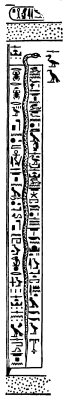

  
[Intangible Textual Heritage](../../index)  [Egypt](../index.md)  [EHH
Index](../ehh)  [Index](index)  [Previous](gate16)  [Next](gate18.md) 

------------------------------------------------------------------------

p. 86

# CHAPTER III.

## THE GATE OF SAA-SET

### THE SECOND DIVISION OF THE TUAT.

THE boat of Ra, having passed between the two halves of the horizon of
the West, now approaches a gateway, the door of which is closed before
him; the door of the second division of the Tuat is different from the
doors of the other divisions, for it consists of a single leaf which
turns upon a pivot working in holes in the top and bottom of the
framework of the door. This door is guarded by a serpent called SAA-SET,
which stands upon its tail. The text referring to this serpent reads:--

p. 87

"He who is over (i.e., has the mastery over) this door openeth to Ra.
  SA saith unto SAT-SET,
'Open thy door to Ra, throw wide open thy door to KHUTI. The hidden
abode is in darkness, so that the transformations of this god may take
place.' This portal is closed after this god hath entered in through it,
and there is lamentation on the part of those who are in their mountain
when they hear this door shut."

In the centre of the scene we see the boat of Ra being towed along by
four gods standing, each of whom grasps the tow-line with both hands.
The god is now in the form of a ram-headed man, who holds the sceptre in
his right hand, and has the solar disk above his horns. He stands within
a shrine which is enveloped in the voluminous folds of the serpent
Mehen, a serpent also stands on his tall before him. In front of the
shrine stands SA, and behind it HEKAU. The gods who tow the boat are
called TUAIU.

p. 88

The sun's boat is met in this section by a company of thirteen gods, who
are under the direction of a god who holds a staff in his hand. The
names of the first seven gods are:--NEPEMEH [1](#fn_9.md), NENHA,  [2](#fn_10.md), BA, HERU, BEHA-AB, KHNEMU, and SETCHET;
the third has the head of a ram, and the fourth that of a hawk. The last
six gods

 

 [  
Click to view](img/08800.jpg.md)  
The Boat of the Sun towed by Gods of the Tuat.

 

are described as "gods who are in the entrances," the god who bears the
staff has no name. The text which refers to the Sun-god reads:--

p. 89

 

 [  
Click to view](img/08900.jpg.md)  
Seven of the Gods of the Entrances who tow the Boat of the Sun through
Saa-Set.

 [  
Click to view](img/08901.jpg.md)  
Six of the Gods of the Entrances who tow the Boat of the Sun through
Saa-Set, and a god who bears a staff.

 

p. 90

"This great god journeyeth along the roads of the

p. 91

\[paragraph continues\] Tuat. This god is drawn by the gods of the Tuat
(in order to make divisions (or, distinctions) in the earth, and to work
out \[his\] designs therein, to weigh words and deeds in Ament, to
magnify the great god above the little god among the gods. who are in
the Tuat, to place the KHU (i.e., the blessed dead) upon, their thrones,
and the damned \[in the place\] to which they have been condemned in the
judgment, and to destroy their bodies by an evil death. Ra saith:--'O
grant ye to me that I may restore the tiara, and that I may have
possession of \[my\] shrine which is in the earth. Let SA and HEKA unite
themselves to me for the working out of plans for you, and for making to
come into being their attributes (or, forms) ye \[have\] (what is yours.
Isis hath made to be at peace the wind, and offerings are there. None
shutteth \[the door\] against you, and the damned do not enter in after
you. That which belongeth to you is to you, O gods.' These gods say unto
Ra, 'There is darkness on the road of the Tuat, therefore let the doors
which are closed be unfolded, let the earth open, so that the gods may
draw along him that hath created them.' Their food \[i.e., the food of
these gods\] is of the funeral offerings, and their drink is from their
cool waters, and their hands are on meat offerings among the Akert
regions of Ament."

On the right of the boat are twenty-four gods, the first twelve of whom
are described as "those

p. 92

who are at peace, the worshippers of Ra," and the second twelve as "the
righteous who are in the Tuat." These beings are thus described by the
accompanying text:--

p. 93

 

 [  
Click to view](img/09300.jpg.md)  
Nine of the gods who adore Ra and are at peace.

 [  
Click to view](img/09301.jpg.md)  
(*Left*) Five of the righteous gods of the Tuat. (*Right*) Three of the
gods who adore Ra and are at peace.

 

p. 94

"These \[are they who\] have worshipped (or, praised) Ra upon earth, who
uttered words of power against Apep, who made their offerings unto him,
and who burnt (*literally*, made) incense to their gods on their own
behalf, after their offerings. They have gained possession of their cool
waters, and they receive their meat, and they eat of their offerings in
the gateway of him whose name is hidden. Their meat is by the gateway,
and their offerings are with him. who is therein. And Ra saith unto
them:--'Your offerings are yours, ye have power over your cool waters,
your souls shall never be hacked to pieces, your meat shall never fail,
\[O ye who have\] praised \[me\], and have vanquished Apep for me.'"

The above passage refers to the "worshippers of Ra who are at peace."

"\[These are\] they \[who\] spake truth upon earth,

p. 95

and who were not addicted to evil thought about the gods. They make
their invocations in this gateway, they live upon *maat* (i.e., truth),
and their cool waters are in their cisterns. Ra saith unto
them:--"'Truth is yours, live ye on your food. Ye yourselves are truth;'
and they have power over these their cool waters, which are waters of
fire to those who have

 

 [  
Click to view](img/09500.jpg.md)  
Seven of the righteous gods of the Tuat.

 

guilt and sin. And these gods say to Ra:--'Let there be stability to the
Disk of Ra. Let him that is in the shrine have the mastery over it, and
let the serpent \[Mehen\] guard him well. May the flames of Khuti which
are in the corners of the hidden shrine grow stronger.' And there shall
be given to them meat in the place of peace in their circle."

p. 96

The above passage refers to the "righteous who are in the Tuat."

On the left side of the boat of Ra are: 1. The god TEM, who is depicted
in the form of an aged man, leaning heavily on a stick which he grasps
in his right hand. 2. Four male beings who are lying prostrate on their
backs. 3. Twenty male beings, with their backs bowed, and their arms
tied together at their elbows behind their backs. The our beings are
described as "the inert," and the twenty as "the apostates of the Hall
of Ra, who have blasphemed Ra upon earth, who have invoked evils upon
him that is in the Egg, who have thrust aside the right, and have spoken
words against KHUTI."

 

 [  
Click to view](img/09600.jpg.md)  
The inert Apostates and Blasphemers of Ra.

 

The text referring to the inert and the apostates reads:--

p. 97

"Tem worketh on behalf of Ra, glorifying the god,

p. 98

and singing praises to his soul, and distributing evil things to his
enemies. \[He saith\]:--'The word of my father Ra is right (*maat*)
against you, and my word is right against you. I am the son who
proceedeth from his father, and I am the father who proceedeth from his
son. Ye are fettered, and ye are tied with strong cord, and it is I who
have sent forth the decree concerning you that ye should be

 

 [  
Click to view](img/09800.jpg.md)  
The Apostates and Blasphemers of Ra, who are doomed to destruction, with
their arms bound.

 

bound in fetters; your arms shall never more be opened. Ra pronounceth
the formula against you, his soul is prepared to attack you; my father
hath gained the mastery over you, and his soul uttereth words against
you. Your evil deeds \[have turned\] against you, your plottings \[have
come\] upon you, your abominable acts \[have recoiled\] upon you, your
destinies are for evil, and your doom bath been

p. 99

decreed before Ra; your unjust and perverted judgments are upon
yourselves, and the wickedness of your words of cursing are upon you.
Evil is the doom which hath been decreed for you before my father. It is
you who have committed sins, and who have wrought iniquity in the Great
Hall; your corruptible

 

 [  
Click to view](img/09900.jpg.md)  
The Apostates and Blasphemers of Ra, who are doomed to destruction, with
their arms bound.

 

bodies shall be cut in pieces, and your souls shall have no existence,
and ye shall never again see Ra with his attributes \[as\] he journeyeth
in the hidden land. Hail, Ra! Adored be Ra! Thine enemies are in the
place of destruction."'

------------------------------------------------------------------------

### Footnotes

[88:1](gate17.htm#fr_9.md) Var., NEPEN.

[88:2](gate17.htm#fr_10.md) Var., NENA.

------------------------------------------------------------------------

[Next: Chapter IV. The Gate Of Aqebi. The Third Division of the
Tuat.](gate18.md)
