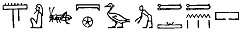

  
[Intangible Textual Heritage](../../index)  [Egypt](../index.md)  [EHH
Index](../ehh)  [Index](index)  [Previous](gate20)  [Next](gate22.md) 

------------------------------------------------------------------------

p. 158

# CHAPTER VII.

## THE JUDGMENT HALL OF OSIRIS.

### THE SIXTH DIVISION OF THE TUAT.

THE boat of Ra having passed through the Fifth Division of the Tuat
arrives at the gateway which leads to the SIXTH DIVISION, or, as the
text says:

"This god cometh forth to this pylon, and he passeth in through it, and
those gods who are in the secret place acclaim him." The gateway is
guarded by twelve bearded mummy forms, who are described as the "gods
and goddesses who are in this pylon," and it is called NEBT-AHA. The
gate which admits to the Sixth Division resembles those already
described; at the entrance to the corridor and at its exit stands a
bearded mummied form, the former being called MAA-AB, and the latter
SHETA-AB. These names mean "Right (or, true) of heart" and

p. 159

 

 [  
Click to view](img/15900.jpg.md)  
The Judgment Hall of Osiris. The Gate of the Serpent Set-em-maa-f.

 

p. 160

\[paragraph continues\] Hidden of heart" respectively, and each is said
to extend his hands and arms to Ra. The corridor is swept by flames. The
gods who acclaim the god say, "Come thou to us, O thou who art at the
head of the horizon, O great god, who dost open the hidden place. Open
thou the holy doors, and unfold the portals of the hidden place."

Between the gate which leads into the SIXTH DIVISION and the Division
itself we find inserted a remarkable scene, which may be thus
described:--In the upper part, from one side to another, a line is
drawn, which is intended to represent the roof of the shrine or canopy
in which the god is seated, and on it rests a row of *kakheru*, i.e.,
spear-head ornaments. From the inside of the roof hang, upside down,
four heads of some kind of horned animal. These are called *Hahaiu*, and
are supposed to be heads of gazelle [1](#fn_13.md)
or oxen. In the space between the spear-head ornaments and the side of
the Tuat is written

 .

The transliteration of these characters appears to be *Ser her Tuat sath
then*; the meaning of the first three

p. 161

words is tolerably clear, i.e., "Osiris, governor of the Tuat," but the
signification of the last signs is doubtful. M. Lefébure translates the
inscription, "Osiris, master of Hades, Earth, and Tanen." Osiris, who
wears the double crown of the South and North, and holds in his right
hand the symbol of "life," and in his left a sceptre, is seated on a
chair of state, which is set on the top of a platform with nine steps.
On each stop stands a god, and the nine gods are described as the
"company which is with SAR, i.e., Osiris." On the topmost step is a
Balance, in which the actions of the deceased are weighed; the beam of
the Balance is supported either by the deceased, or by a stand which is
made in the form of a bearded mummy. One pan of the Balance contains
some rectangular object, and the other a figure of the bird which is
symbolic of evil and wickedness. Behind the Balance is a boat, which is
sailing away from the presence of Osiris; in it is a pig being driven
along by a dog-headed ape which flourishes a stick. In the top left-hand
corner is a figure of Anubis, jackal-headed, and under the floor of the
platform on which Osiris is seated are figures of the enemy of SAR, or
Osiris. From the variant of this scene which is found on the sarcophagus
of Tchehra at Paris, [1](#fn_14.md) as well as from
the sarcophagus of Seti I., we may see that the pig in the

p. 162

boat is called AM-A, i.e., "Eater of the Arm," and the boat is piloted
by a second ape which stands in the bows. On the Paris monument we see a
man wielding a hatchet in a threatening manner and standing near the
Scales, probably with the view of destroying the deceased if the
judgment of Osiris prove adverse to him.

This inscription is in the so-called "enigmatic" writing, [1](#fn_15.md) a fact which was first noticed by
Champollion, but a transcript of it exists on the sarcophagus of Tchehra
in characters which have the ordinary values, [2](#fn_16.md) and this reads as follows:--

p. 163

\[paragraph continues\] "His enemies are under his feet, the gods and
the spirits are before him; he is the enemy of the dead (i.e., the
damned) among the beings of the Tuat, Osiris putteth under restraint
\[his\] enemies, he destroyeth them, and he performeth the slaughter of
them."

The text which refers to Anubis Mr. Goodwin transcribed:--"Hail, O ye
who make to be *maat* the word of your little one, may Thoth weigh the
words, may he make to eat his father."

Immediately over the boat is the short inscription which Goodwin renders
by, "\[When\] this god entereth, he (i.e., the Ape) riseth and putteth
under restraint AM-A (i.e., the Eater of the Arm)." [1](#fn_17.md)

p. 164

Behind the pair of scales is the legend [1](#fn_18.md) which Mr. Goodwin renders, "The
balance-bearer does homage; the blessed spirits in Amenti follow after
him; the morning, star disperses the thick darkness; there is good will
above, justice below. The god reposes himself, he gives bread to the
blessed, who throng, towards him." The translation by M. Lefébure reads,
"The bearer of the hatchet and the bearer of the scales protect the
inhabitant of Amenti, \[who\] takes his repose in Hades, and traverses
the darkness and the shadows. Happiness is above, and justice below. The
god reposes and sheds light produced by truth which he has produced."

p. 165

The upper part of the space between the roof and the platform on which
Osiris sits is occupied by two short inscriptions, which are full of
difficulty.

The meaning of these texts has puzzled several workers, and even the
order in which the characters are to be read has given rise to
differences of opinion. One of the chief difficulties in the matter is
caused by the way in which the two legends are written on the
sarcophagus of Seti I. Looking at the hieroglyphics as they stand, they
seem to form one continuous inscription, but, if we examine the scene as
it appears in the tomb of Rameses II., we see that we must divide them
as above. Mr. Goodwin made an

p. 166

attempt to transcribe and translate a part of the texts, but as he
considered them to form only one inscription we cannot accept his
rendering. M. Lefébure has made translations of both texts, and they
read [1](#fn_19.md):--

I. "They, they hide those which are in the state of the elect. They the
country \[belonging to them, is Ameh in the land. Behold, these are they
whose heads issue. What a mystery is their appearance, \[the
appearance\] of your images!"

II\. "The examination of the words takes place, and he strikes down
wickedness, he who has a just heart, he who bears the words in the
scales, in the divine place of the examination of the mystery of
mysteries of the spirits. The god who rises has made his infernal
\[companions\] all."

For purposes of comparison, the versions of the texts from the tomb of
Rameses VI., as given by Champollion (*Monuments*, pl. 252) are given.
It will be noted that a part of the line immediately over the head of
Osiris, given in different places in the latter scene, is immediately in
front of the double crown of Osiris, and is immediately in front of the
sceptre of the god.

 

------------------------------------------------------------------------

### Footnotes

[160:1](gate21.htm#fr_13.md) "Têtes de gazelles"
(Champollion, *Monuments*, tom. ii., p. 495).

[161:1](gate21.htm#fr_14.md) Sharp, *Inscriptions*,
part ii., pl. 9.

[162:1](gate21.htm#fr_15.md) See Goodwin, *Aeg.
Zeit.*, 1873, p. 138; Renouf, *ibid*., 1874, p. 101; and Champollion,
*Monuments*, pl. 272.

[162:2](gate21.htm#fr_16.md) Lefébure renders, "O
ye who bring the word just or false to me, he, Thoth, examines the
words" (*Records of the Past*, vol. x., p. 114).

[163:1](gate21.htm#fr_17.md) The diver \[when\]
this god rises, he gives up \[the pig\] to the plagues" (Lefébure, *op.
cit*., p. 114).

[164:1](gate21.htm#fr_18.md) See also Champollion,
*Monuments*, tom. ii., p. 490.

[166:1](gate21.htm#fr_19.md) *Records of The Past*,
vol. x., p. 114.

------------------------------------------------------------------------

[Next: Chapter VIII. The Gate Of Set-em-maat-f. The Sixth Division Of
The Tuat--continued.](gate22.md)
