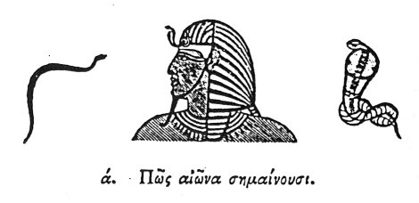

  
[Intangible Textual Heritage](../../index)  [Egypt](../index.md) 
[Index](index)  [Previous](hh002)  [Next](hh004.md) 

------------------------------------------------------------------------

[Buy this Book at
Amazon.com](https://www.amazon.com/exec/obidos/ASIN/1428631488/internetsacredte.md)

------------------------------------------------------------------------

*Hieroglyphics of Horapollo*, tr. Alexander Turner Cory, \[1840\], at
Intangible Textual Heritage

------------------------------------------------------------------------

p. 5

# H O R A P O L L O.

#### ΒΙΒΛΙΟΝ ΠΡΟΩΤΟΝ·

#### BOOK I.

### I. HOW THEY DENOTE ETERNITY.

  [1](#fn_1.md)

To denote Eternity [2](#fn_2.md) they depict the SUN
and MOON, because their elements are eternal. But when they would
represent Eternity [2](#fn_2.md) differently,

p. 6

they delineate a SERPENT with its tail covered by the rest of its body:
the Egyptians call this Ouraius, [1](#fn_3.md) which
in the Greek language signifies Basilisk: [2](#fn_4.md) And they place golden figures of it round
the Gods. The Egyptians say that Eternity is represented by this animal;
because of the three existing species of serpents, the others are
mortal, but this alone is immortal; and [3](#fn_6.md) because it destroys any other animal by
merely breathing upon [4](#fn_5.md) it even without
biting. And hence, inasmuch as it thus appears to have power over life
and death, they place it upon the head of the Gods.

------------------------------------------------------------------------

### Footnotes

[5:1](hh003.htm#fr_1.md)

I. *Denotes Eternal*.

II\. *Head of a God with the Basilisk upon it. The basilisk often passes
over the head, and is occasionally found passing round it*.

III\. *Denotes Immortality*.—Sharpe, 186, 191.

[5:2](hh003.htm#fr_3.md) Eternal power?—a definite
period?—an age?

[6:1](hh003.htm#fr_4.md) ΟΥΡΟ, in Coptic, signifies
a king. Jab. Champ. Tat.—Morell suggests Οὐβαῖος, as a derivative from
‏אוב‎, Ob, a serpent.

[6:2](hh003.htm#fr_5.md) The Cobra
Capella.—Hasselquist is in error when he says that the Arabs call this
serpent Haje. They call it Nasher: and Haiyeh or Hayyeh is a general
name for a serpent.

[6:4](hh003.htm#fr_7.md) Kircher suggests, "By the
hiss."—See also Sanchoniatho Eus. Pr. Ev. lib. i. c. 10.

[6:3](hh003.htm#fr_6.md) Qy. insert" Power?"

------------------------------------------------------------------------

[Next: II. How the Universe](hh004.md)
