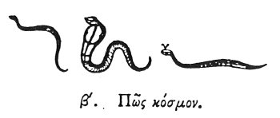

  
[Intangible Textual Heritage](../../index)  [Egypt](../index) 
[Index](index)  [Previous](hh003)  [Next](hh005) 

------------------------------------------------------------------------

[Buy this Book at
Amazon.com](https://www.amazon.com/exec/obidos/ASIN/1428631488/internetsacredte)

------------------------------------------------------------------------

*Hieroglyphics of Horapollo*, tr. Alexander Turner Cory, \[1840\], at
Intangible Textual Heritage

------------------------------------------------------------------------

p. 7

### II. HOW THE UNIVERSE.

  [1](#fn_7)

When they would represent the universe, they delineate a SERPENT
bespeckled with variegated scales, devouring its own tail; by the scales
intimating the stars in the universe. The animal is also extremely
heavy, as is the earth, and extremely slippery, like the water:
moreover, it every year puts off its old age with its skin, as in the
universe the annual period effects a corresponding

p. 8

change, and becomes renovated. And the making use of its own body for
food implies, that all things whatsoever, that are generated by divine
providence in the world, undergo a corruption [1](#fn_8) into it again.

------------------------------------------------------------------------

### Footnotes

[7:1](hh004.htm#fr_8)

I. II. III. *The three species of serpents found upon the monuments*.

The figures of the god Atmou sometimes exhibit instances of a serpent
with its tail in its mouth. See Pl. I. fig. 1. Perhaps the nearest known
approximation to the text is the serpent running round the lid of the
sarcophagus of Ramesses III. at Cambridge, which rusts its head upon its
tail, and may indicate the Universe.

[8:1](hh004.htm#fr_9) De Pauw proposes εἰς αυτὸ,
or εἰς αὑτὰ, which Leemans adopts. But it simply refers to the ancient
doctrine of Generation and Corruption. See Arist. de Gen. et Cor.

------------------------------------------------------------------------

[Next: III. How A Year](hh005)
