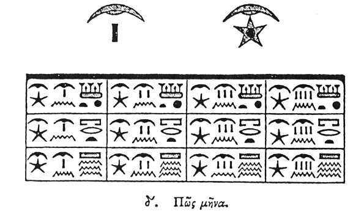

  
[Intangible Textual Heritage](../../index)  [Egypt](../index.md) 
[Index](index)  [Previous](hh005)  [Next](hh007.md) 

------------------------------------------------------------------------

[Buy this Book at
Amazon.com](https://www.amazon.com/exec/obidos/ASIN/1428631488/internetsacredte.md)

------------------------------------------------------------------------

*Hieroglyphics of Horapollo*, tr. Alexander Turner Cory, \[1840\], at
Intangible Textual Heritage

------------------------------------------------------------------------

### IV. HOW A MONTH.

   [1](#fn_12.md)

To represent a *month* they delineate a PALM BRANCH, or, the MOON
INVERTED.

p. 11

\[paragraph continues\] A palm branch for
the reason before mentioned respecting the palm tree; and the moon
inverted, because they say, that, in its increase, when it has come to
fifteen degrees, [1](hh007.htm#fn_14.md) it appears
in figure with its horns erect; and in its decrease, after having
completed the number of thirty days, [2](hh007.htm#fn_15.md) it sets with its horns inverted.

------------------------------------------------------------------------

### Footnotes

[10:1](hh006.htm#fr_13.md)

I. II. *A month*.

*III.* The twelve months, divided into three seasons:

|                         |           |              |              |
|-------------------------|-----------|--------------|--------------|
| *Season of Vegetation.* |           |              |              |
| *Thoth.*                | *Paophi.* | *Hathor.*    | *Choiak.*    |
| *Season of Harvest.*    |           |              |              |
| *Toby.*                 | *Mechir.* | *Phamenoth.* | *Pharmuthi.* |
| *Season of Inundation.* |           |              |              |
| *Pachon.*               | *Paoni.*  | *Epiphi.*    | *Mesori.*    |

 

------------------------------------------------------------------------

[Next: V. How the Current or Civil Year](hh007.md)
