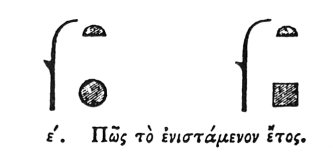

  
[Intangible Textual Heritage](../../index)  [Egypt](../index.md) 
[Index](index)  [Previous](hh006)  [Next](hh008.md) 

------------------------------------------------------------------------

[Buy this Book at
Amazon.com](https://www.amazon.com/exec/obidos/ASIN/1428631488/internetsacredte.md)

------------------------------------------------------------------------

*Hieroglyphics of Horapollo*, tr. Alexander Turner Cory, \[1840\], at
Intangible Textual Heritage

------------------------------------------------------------------------

### V. HOW THE CURRENT OR CIVIL YEAR.

  [3](#fn_13.md)

'To represent the *current year*, they depict \[with the sign of the
year?\] the fourth

p. 12

part of an ARURA: now the Arura is a measure of land of an hundred
cubits. And when they would express a year they say *a quarter* \[add
the quarter?\]: [1](#fn_16.md) for they affirm that
in the rising of the star Sothis, [2](#fn_17.md)
the fourth part of a day intervenes between the (completion of the solar
year and the) following rising (of the star Sothis), because the year of
the God \[the solar year\] consists of only 365 days; [3](#fn_18.md) hence in the course of each
tetracterid [4](#fn_19.md) the Egyptians
intercalate an entire day, for the four quarters complete the day.

------------------------------------------------------------------------

### Footnotes

[11:3](hh007.htm#fr_16.md)

I. *Year as used in dates that refer to the reigns of kings or ages of
individuals*.

II\. *Year as an interval of time*.—Sh. 634, 633.

[11:1](hh006.htm#fr_14.md) During the first fifteen
days?

[11:2](hh006.htm#fr_15.md) During the last fifteen
days.

[12:1](hh007.htm#fr_17.md) Substitute a square?

[12:2](hh007.htm#fr_18.md) i.e. calculating
according to Sothic time.

[12:3](hh007.htm#fr_19.md) Salm. and De Pauw
suggest, and Leem has ventured to insert in the text καὶ τετάρου, i.e.
*and a quarter*, which entirely destroys the passage. Mr. Wilkinson
says, "They had two years, one intercalated, the other not: the former
was calculated from the Heliacal rising of the Dogstar, to that of the
ensuing year, and was hence called the *Sothic year*: it had also the
name of *Squared year*, from the intercalation; and when expressed in
hieroglyphics a square is placed instead of the globe of the solar year,
which last was used in the dates of their tablets, that refer to the
reigns of kings or ages of individuals." Mat. Hier. part ii. p. 134.

[12:4](hh007.htm#fr_20.md) The period of four
Julian years.

------------------------------------------------------------------------

[Next: VI. What They Signify by Delineating a Hawk](hh008.md)
