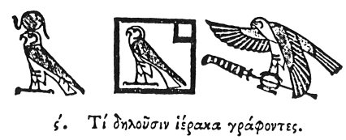

  
[Intangible Textual Heritage](../../index)  [Egypt](../index) 
[Index](index)  [Previous](hh007)  [Next](hh009) 

------------------------------------------------------------------------

[Buy this Book at
Amazon.com](https://www.amazon.com/exec/obidos/ASIN/1428631488/internetsacredte)

------------------------------------------------------------------------

*Hieroglyphics of Horapollo*, tr. Alexander Turner Cory, \[1840\], at
Intangible Textual Heritage

------------------------------------------------------------------------

p. 13

### VI. WHAT THEY SIGNIFY BY DELINEATING A HAWK.

  [1](#fn_20)

When they would signify *God*, or *height*, or *lowness*, or
*excellence*, or *blood*, or *victory*, (or *Ares*, or *Aphrodite*,)
\[Hor or Hathor\] [2](#fn_21), they delineate a
HAWK. They symbolize by it *God*, because the bird is prolific and
long-lived, or perhaps rather because it seems to be an image of the
sun, being capable of looking more intently towards his rays than all
other winged creatures: and hence physicians for the cure of the eyes
use the herb hawkweed: hence

p. 14

also it is, that under the form of a HAWK, they sometimes depict the
*sun* as lord of vision. And they use it to denote *height*, because
other birds, when they would soar on high, move themselves from side to
side, being incapable of ascending vertically; but the hawk alone soars
directly upwards. And they use it as a symbol of *lowness*, because
other animals move not in a vertical line, but descend obliquely; the
hawk, however, stoops directly down upon any thing beneath it. And they
use it to denote *excellence*, because it appears to excel all birds—and
for *blood*, because they say that this animal does not drink water, but
blood—and for *victory*, because it shews itself capable of overcoming
every winged creature; for when pressed by some more powerful bird, it
directly turns itself in the air upon its

p. 15

back, and fights with its claws extended upwards, and its wings and back
below; and its opponent being unable to do the. like, is overcome.

------------------------------------------------------------------------

### Footnotes

[13:1](hh008.htm#fr_21)

I. RA or PHRA, *the Sun, also* HOR.—Sh. 110.

II\. HATHOR.

III\. *This figure is constantly found over the head of the Egyptian
kings in the representations of their victories, as well as upon other
occasions*.

[13:2](hh008.htm#fr_22) Ald. and Treb. omit.

------------------------------------------------------------------------

[Next: VII. How They Indicate the Soul](hh009)
