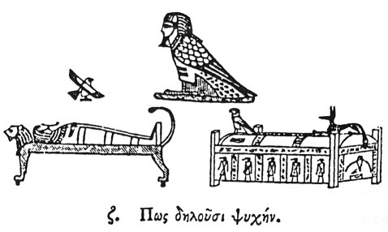

  
[Intangible Textual Heritage](../../index)  [Egypt](../index) 
[Index](index)  [Previous](hh008)  [Next](hh010) 

------------------------------------------------------------------------

[Buy this Book at
Amazon.com](https://www.amazon.com/exec/obidos/ASIN/1428631488/internetsacredte)

------------------------------------------------------------------------

*Hieroglyphics of Horapollo*, tr. Alexander Turner Cory, \[1840\], at
Intangible Textual Heritage

------------------------------------------------------------------------

### VII. HOW THEY INDICATE THE SOUL.

  [1](#fn_22)

Moreover, the HAWK is put for the soul, from the signification of its
name; for among ' the Egyptians the hawk is called BAIETH: and this name
in decomposition signifies soul and heart; for the word BAI is the soul,
and

p. 16

\[paragraph continues\] ETH the heart; and
the heart, according to the Egyptians, is the shrine of the soul; so
that in its composition the name signifies 'soul enshrined in heart.'
Whence also the hawk, from its correspondence with the soul, never
drinks water, but blood, by which, also, the soul is sustained.

------------------------------------------------------------------------

### Footnotes

[15:1](hh009.htm#fr_23)

I. *The departing soul*.

II\. *The hawk found sitting upon the mummy cases*.

III\. *The external mummy case*.

------------------------------------------------------------------------

[Next: VIII. How Ares and Aphrodite (Hor and Hathor)](hh010)
