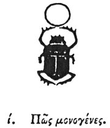

  
[Intangible Textual Heritage](../../index)  [Egypt](../index) 
[Index](index)  [Previous](hh011)  [Next](hh013) 

------------------------------------------------------------------------

[Buy this Book at
Amazon.com](https://www.amazon.com/exec/obidos/ASIN/1428631488/internetsacredte)

------------------------------------------------------------------------

*Hieroglyphics of Horapollo*, tr. Alexander Turner Cory, \[1840\], at
Intangible Textual Heritage

------------------------------------------------------------------------

### X. HOW AN ONLY BEGOTTEN.

  [1](#fn_26)

To denote an only begotten, or generation, or a father, or the world, or
a man, they delineate a SCARABÆUS. [2](#fn_27)

p. 20

And they symbolise by this an *only begotten*, because the scarabæus is
a creature self-produced, being unconceived by a female; for the
propagation of it is unique after this manner:—when the male is desirous
of procreating, he takes dung of an ox, and shapes it into a spherical
form like the world; he then rolls it from the hinder parts from east to
west, looking himself towards the east, that he may impart to it the
figure of the world, (for that is borne from east to west, while the
course of the stars is from west to east): then, having dug a hole, the
scarabæus deposits this ball in the earth for the space of twenty-eight
days, (for in so many days the moon passes through the twelve signs of
the zodiac). By thus remaining under the moon, the race of scarabæi is
endued with

p. 21

life; and upon the nine and twentieth day after having opened the ball,
it casts it into water, for it is aware that upon that day the
conjunction of the moon and sun takes place, as well as the generation
of the world. From the ball thus opened in the water, the animals, that
is the scarabæi, issue forth. The scarabæus also symbolizes
*generation*, for the reason before mentioned —and a father, because the
scarabæus is engendered by a *father* only—and the *world*, because in
its generation it is fashioned in the form of the world—and a *man*,
because there is no female race among them. Moreover there are three
species of scarabæi, the first like a cat, and irradiated, which species
they have consecrated to the sun from this similarity: for they say that
the male cat changes the shape of the pupils of his eyes according to
the course of the sun: for in the morning

p. 22

at the rising of the god, they are dilated, and in the middle of the day
become round, and about sunset appear less brilliant: whence, also, the
statue of the god in the city of the sun is of the form of a cat. Every
scarabæus also has thirty toes, corresponding with the thirty days
duration of the month, during which the rising sun \[moon?\] performs
his course. The second species is the two horned and bull formed, which
is consecrated to the moon; whence the children of the Egyptians say,
that the bull in the heavens is the exaltation of this goddess. The
third species is the one horned and Ibis formed, [1](#fn_28) which they regard as consecrated to Hermes
\[Thoth\], in like manner as the bird Ibis.

------------------------------------------------------------------------

### Footnotes

[19:1](hh012.htm#fr_28)

I. *The Scarabæus signifies the world: it is very commonly found with
the circle, emblematic of the sun, in front of it*.

[19:2](hh012.htm#fr_29) Produced by a single
parent?

[22:1](hh012.htm#fr_30) Cuper. and De Pauw
propose ἰβιόμορφος, *ibis-formed;* which is adopted in the translation
above, but not inserted in the text.

------------------------------------------------------------------------

[Next: XI. What They Imply by Depicting a Vulture](hh013)
