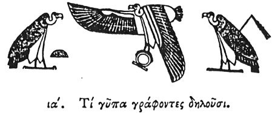

  
[Intangible Textual Heritage](../../index)  [Egypt](../index.md) 
[Index](index)  [Previous](hh012)  [Next](hh014.md) 

------------------------------------------------------------------------

[Buy this Book at
Amazon.com](https://www.amazon.com/exec/obidos/ASIN/1428631488/internetsacredte.md)

------------------------------------------------------------------------

*Hieroglyphics of Horapollo*, tr. Alexander Turner Cory, \[1840\], at
Intangible Textual Heritage

------------------------------------------------------------------------

p. 23

### XI. WHAT THEY IMPLY BY DEPICTING A VULTURE.

  [1](#fn_29.md)

To denote a mother, or vision, or boundary, or foreknowledge, or a year,
or heaven, or one that is compassionate, or Athena \[*Neith*\], or
*Hera* \[*Saté*\], or *two drachmas*, they delineate it *a mother*,
because in this race of creatures there is no male. Gignuntur autem hunc
in modum. Cum amore concipiendi vultur exarserit, vulvam ad Boream
aperiens, ab eo velut comprimitur per dies quinque, during which time

p. 24

she partakes neither of food nor drink, being intent upon procreation.
There are also other kinds of birds which conceive by the wind, but
their eggs are of use only for food, and not for procreation; but the
eggs of the vultures that are impregnated by the wind possess a vital
principle. The vulture is used also as a symbol of vision, because it
sees more keenly than all other creatures; and by looking towards the
west when the sun is in the east, and towards the east when the god is
in the west, it procures its necessary food from afar. And it signifies
a *boundary* \[landmark?\] because, when a battle is to be fought, it
points out the spot on which it will take place, by betaking itself
thither seven days beforehand:—and *foreknowledge*, both from the
circumstance last mentioned,

p. 25

and because it looks towards that army which is about to have the
greater number killed, and be defeated, reckoning on its food from their
slain: and on this account the ancient kings were accustomed to send
forth observers to ascertain towards which part of the battle the
vultures were looking, to be thereby apprized which army was to be
overcome. And it symbolizes a *year*, because the 365 days of the year,
in which the annual period is completed, are exactly apportioned by the
habits of this creature; for it remains pregnant 120 days, and during an
equal number it brings up its young, and during the remaining 120 it
gives its attention to itself, neither conceiving nor bringing up its
young, but preparing

p. 26

itself for another conception; [1](#fn_30.md) and
the remaining five days of the year, as I have said before, it devotes
to another impregnation by the wind. It symbolises also a *compassionate
person*, which appears to some to be the furthest from its nature,
inasmuch as it is a creature that preys upon all things; but they were
induced to use it as a symbol for this, because in the 120 days, during
which it brings up its offspring, it flies to no great distance, but is
solely engaged about its young and their sustenance; and if during this
period it should be without food to give its young, it opens its own
thigh, and suffers its offspring to partake of the blood, that they may
not perish from want of nourishment:—and *Athena* \[*Neith*\], and
*Hera* \[*Saté*\], because

p. 27

among the Egyptians Athena \[ Neith\] is regarded as presiding over the
upper hemisphere, and Hera \[*Saté*\] over the lower; whence also they
think it absurd to designate the heaven in the masculine, τὸν οὑρανὸν,
but represent it in the feminine, τὴν οὑρανὸν, inasmuch as the
generation of the sun and moon and the rest of the stars, is perfected
in it, which is the peculiar property of a female. And the race of
vultures, as I said before, is a race of females alone, and on this
account the Egyptians over any female hieroglyph place the vulture as a
mark of royalty \[maternity?\]. And hence, not to prolong my discourse
by mentioning each individually, when the Egyptians would designate any
goddess who is a mother, they delineate a vulture, for it is the mother
of a female progeny. And they denote by it (οὑρανίαν)

p. 28

*heaven*, (for it does not suit them to say τὸν οὑρανὸν, as I said
before,) because its generation is from thence \[by the wind\]:—and *two
drachmas*, because among the Egyptians the unit \[of money\] is the two
drachmas, [1](#fn_31.md) and the unit is the origin
of every number, therefore when they would denote two drachmas, they
with good reason depict a vulture, inasmuch as like unity it seems to be
mother and generation.

   
Netpe, as the upper hemisphere, or heaven; Isis, as the lower, or earth.

------------------------------------------------------------------------

### Footnotes

[23:1](hh013.htm#fr_31.md)

I. Mother. II. Victory. III. Lower Egypt.

[26:1](hh013.htm#fr_32.md) This division appears to
intimate the three seasons of the Egyptian year,—four months of
Vegetation, four months of *Harvest*, and four of the *Inundation*, and
the five epagomenæ consecrated as the birthdays of the gods.

[28:1](hh013.htm#fr_33.md) Par A. Treb.
Leem.γραμμαί al.—Leemans observes that the Alexandrine Interpreters of
the Old Testament always reckon the money by the didrachma, as in xxx.
Ex. 13, for the drachma they use the half of a didrachma, τὸ ἡ?'μισυ τοῦ
διδράχμου.

------------------------------------------------------------------------

[Next: XII. How They Denote Hephæstus \[Phthah\]](hh014.md)
