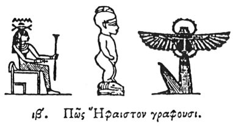

  
[Intangible Textual Heritage](../../index)  [Egypt](../index) 
[Index](index)  [Previous](hh013)  [Next](hh015) 

------------------------------------------------------------------------

[Buy this Book at
Amazon.com](https://www.amazon.com/exec/obidos/ASIN/1428631488/internetsacredte)

------------------------------------------------------------------------

*Hieroglyphics of Horapollo*, tr. Alexander Turner Cory, \[1840\], at
Intangible Textual Heritage

------------------------------------------------------------------------

p. 29

### XII. HOW THEY DENOTE HEPHÆSTUS \[PHTHAH.\]

   [1](#fn_32)

'To denote *Hephæstus* \[*Phthah*\], they delineate a SCARABÆUS and a
VULTURE, and to denote *Athena* \[*Neith*\], [2](#fn_33) a VULTURE and a SCARABÆUS; for to them the
world appears to consist both of male and female, (for Athena \[Neith\]
however they also depict a vulture) and; according to them, these are
the only Gods who are both male and female. [3](#fn_34)

------------------------------------------------------------------------

### Footnotes

[29:1](hh014.htm#fr_34)

I. *Neith, Athena, or Minerva*.

II\. *Phthah Tore, the deformed pigmy God of Memphis, has a scarabæus on
his head, and sometimes stands upon a crocodile*.

III\. *Phthah Socari*.

[29:2](hh014.htm#fr_35) To denote *Phthah*, they
delineate a SCARABÆUS i and a VULTURE, to denote *Neith*?

[29:3](hh014.htm#fr_36) See c. 10 and 11.

------------------------------------------------------------------------

[Next: XIII. What They Intimate When They Depict a Star](hh015)
