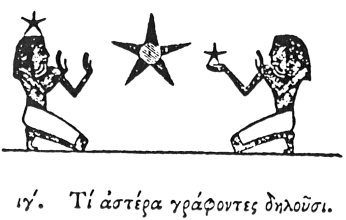

  
[Intangible Textual Heritage](../../index)  [Egypt](../index.md) 
[Index](index)  [Previous](hh014)  [Next](hh016.md) 

------------------------------------------------------------------------

[Buy this Book at
Amazon.com](https://www.amazon.com/exec/obidos/ASIN/1428631488/internetsacredte.md)

------------------------------------------------------------------------

*Hieroglyphics of Horapollo*, tr. Alexander Turner Cory, \[1840\], at
Intangible Textual Heritage

------------------------------------------------------------------------

p. 30

### XIII. WHAT THEY INTIMATE WHEN THEY DEPICT A STAR.

  [1](#fn_35.md)

When they would symbolise the *Mundane God*, or *fate*, or the *number
5*, they depict a STAR. And they use it to denote God, because the
providence of God maintains the order by which the motion of the stars
and the whole universe is subjected to his government, for it appears to
them that without a god nothing whatsoever could endure. And they
symbolise by it fate, because even this is regulated by the dispositions

p. 31

of the stars:—and also the number 5, because, though there are
multitudes of stars in the heavens, five of them only by their motion
perfect the natural order of the world.

------------------------------------------------------------------------

### Footnotes

[30:1](hh015.htm#fr_37.md)

I. *A figure denoting Prayer or Glorifying*.

II\. *The number 5*.

III\. *From the architraves of the Ramesseion*.

------------------------------------------------------------------------

[Next: XIV. What They Denote When They Pourtray A Cynocephalus](hh016.md)
