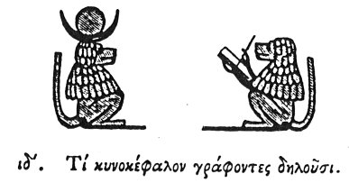

  
[Intangible Textual Heritage](../../index)  [Egypt](../index.md) 
[Index](index)  [Previous](hh015)  [Next](hh017.md) 

------------------------------------------------------------------------

[Buy this Book at
Amazon.com](https://www.amazon.com/exec/obidos/ASIN/1428631488/internetsacredte.md)

------------------------------------------------------------------------

*Hieroglyphics of Horapollo*, tr. Alexander Turner Cory, \[1840\], at
Intangible Textual Heritage

------------------------------------------------------------------------

### XIV. WHAT THEY DENOTE WHEN THEY POURTRAY A CYNOCEPHALUS.

  [1](#fn_36.md)

To denote the *moon*, or the *habitable world*, or *letters*, or a
*priest*, or *anger*, or *swimming*, they pourtray a CYNOCEPHALUS. And
they symbolise the *moon* by it, because the animal has a kind of
sympathy with it at its conjunction

p. 32

with the god. For at the exact instant of the conjunction of the moon
with the sun, when the moon becomes unillumined, then the male
Cynocephalus neither sees, nor eats, but is bowed down to the earth with
grief, as if lamenting the ravishment of the moon: and the female also,
in addition to its being unable to see, and being afflicted in the same
manner as the male, ex genitalibus sanguinem emittit: hence even to this
day cynocephali are brought up in the temples, in order that from them
may be ascertained the exact instant of the conjunction of the sun and
moon. And they symbolise by it the *habitable world*, because they hold
that there are seventy-two primitive countries of the world; and because
these animals, when brought up in the temples, and attended with

p. 33

care, do not die like other creatures at once in the same day, but a
portion of them dying daily is buried by the priests, while the rest of
the body remains in its natural state, and so on till seventy-two days
are completed, by which time it is all dead. They also symbolise
*letters* by it, because there is an Egyptian race of cynocephali that
is acquainted with letters; wherefore, when a cynocephalus is first
brought into a temple, the priest places before him a tablet, and a
reed, and ink, to ascertain whether it be of the tribe that is
acquainted with letters, and whether it writes. The animal is moreover
consecrated to Hermes \[Thoth\], the patron of all letters. And they
denote by it a *priest*, [1](#fn_37.md) because by
nature the cynocephalus does not eat fish, nor

p. 34

even any food that is fishy, like the priests. And it is born
circumcised, which circumcision the priests also adopt. And they denote
by it *anger*, because this animal is both exceedingly passionate and
choleric beyond others:—and swimming, because other animals by
swimming [1](#fn_38.md) appear dirty, but this
alone swims to whatever spot it intends to reach, and is in no respect
affected with dirt.

------------------------------------------------------------------------

### Footnotes

[31:1](hh016.htm#fr_38.md)

I. *Ioh or Pooh, the Moon, a form of Thoth*.

II\. *A common symbol of Thoth*.

[33:1](hh016.htm#fr_39.md) Sacred scribe.

[34:1](hh016.htm#fr_40.md) De Pauw suggests—...—are
borne down by the stream, but this alone swims to the spot it intends to
reach without being carried down by the stream. The passage is very
obscure.

------------------------------------------------------------------------

[Next: XV. How They Denote the Renovation of the Moon](hh017.md)
