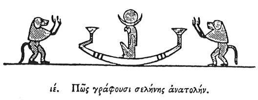

  
[Intangible Textual Heritage](../../index)  [Egypt](../index.md) 
[Index](index)  [Previous](hh016)  [Next](hh018.md) 

------------------------------------------------------------------------

[Buy this Book at
Amazon.com](https://www.amazon.com/exec/obidos/ASIN/1428631488/internetsacredte.md)

------------------------------------------------------------------------

*Hieroglyphics of Horapollo*, tr. Alexander Turner Cory, \[1840\], at
Intangible Textual Heritage

------------------------------------------------------------------------

p. 35

### XV. HOW THEY DENOTE THE RENOVATION OF THE MOON.

  [1](#fn_39.md)

When they would denote the *renovation of the moon*, they again pourtray
a CYNOCEPHALUS in this posture, standing upright, and raising its hands
to heaven, with a diadem upon its head; and for the renovation they
depict this posture, into which the cynocephalus throws itself, as
congratulating the goddess, if we may so express it, in that they have
both recovered light.

------------------------------------------------------------------------

### Footnotes

[35:1](hh017.htm#fr_41.md) *From the temple of
Edfou*.—Sh. E. I. 46. 6. Vocab. 959.

------------------------------------------------------------------------

[Next: XVI. How the Two Equinoxes](hh018.md)
