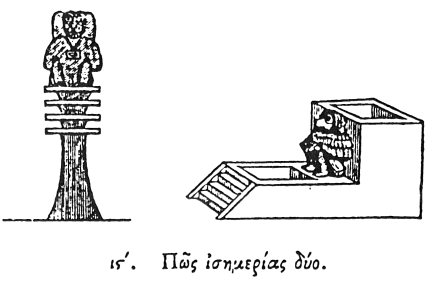

  
[Intangible Textual Heritage](../../index)  [Egypt](../index.md) 
[Index](index)  [Previous](hh017)  [Next](hh019.md) 

------------------------------------------------------------------------

[Buy this Book at
Amazon.com](https://www.amazon.com/exec/obidos/ASIN/1428631488/internetsacredte.md)

------------------------------------------------------------------------

*Hieroglyphics of Horapollo*, tr. Alexander Turner Cory, \[1840\], at
Intangible Textual Heritage

------------------------------------------------------------------------

p. 36

### XVI. HOW THE TWO EQUINOXES.

  [1](#fn_40.md)

Again, to signify the *two Equinoxes* they depict a sitting
CYNOCEPHALUS, for at the two equinoxes of the year it makes water twelve
times in the day, once in each hour, and it does the same also during
the two nights; wherefore not without reason do the Egyptians sculpture
a sitting Cynocephalus on their Hydrologia

p. 37

\[paragraph continues\] (or
[waterclocks](errata.htm#0).md); and they cause the water to run from its
member, because, as I said before, the animal thus indicates the twelve
hours of the equinox. And lest the contrivance, by which the water is
discharged into the Horologium, should be too wide, or on the other hand
too narrow, (for against both these caution must be taken, for the one
that is too wide, by discharging the water quickly, does not accurately
fulfil the measurement of the hour, neither the one that is too narrow,
since it lets forth the water little by little, and too slowly,) they
perforate an aperture to the extremity of the member, and according to
its thickness insert in it an iron

p. 38

tube adapted to the circumstances required. And this they are pleased to
do, not without sufficient reason, more than in other cases. They also
use this symbol, because it is the only animal that at the equinoxes
utters its cries twelve times in the day, once in each hour.

------------------------------------------------------------------------

### Footnotes

[36:1](hh018.htm#fr_42.md)

I. *The Cynocephalus upon the Nilometer, from the ceiling of the
Ramesseion, where it occupies the central position between the last and
first months of the year*.

II\. *A water-clock in the Museum at Leyden*.—Leemans.

------------------------------------------------------------------------

[Next: XVII. How They Denote Intrepidity](hh019.md)
