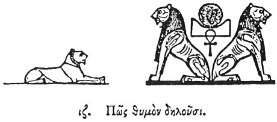

  
[Intangible Textual Heritage](../../index)  [Egypt](../index) 
[Index](index)  [Previous](hh018)  [Next](hh020) 

------------------------------------------------------------------------

[Buy this Book at
Amazon.com](https://www.amazon.com/exec/obidos/ASIN/1428631488/internetsacredte)

------------------------------------------------------------------------

*Hieroglyphics of Horapollo*, tr. Alexander Turner Cory, \[1840\], at
Intangible Textual Heritage

------------------------------------------------------------------------

### XVII. HOW THEY DENOTE INTREPIDITY.

  [1](#fn_41)

When they would denote *intrepidity*, they depict a LION, for he has a
great head, and fiery eyeballs, and a round

p. 39

face, and about it hairs like rays in resemblance of the sun; and hence
it is, that they place lions under the throne of Horus, intimating the
connexion of the animal with the god. And the sun is called Horus from
presiding over the Hours.

------------------------------------------------------------------------

### Footnotes

[38:1](hh019.htm#fr_43)

I. *The Lion signifying Lord*.—Sh. 770.

II\. *Lions supporting the sun in his resting place; from Thebes about
the beginning of the 18th dynasty*.

------------------------------------------------------------------------

[Next: XVIII. How They Denote Strength](hh020)
