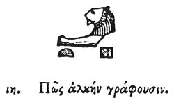

  
[Intangible Textual Heritage](../../index)  [Egypt](../index) 
[Index](index)  [Previous](hh019)  [Next](hh021) 

------------------------------------------------------------------------

[Buy this Book at
Amazon.com](https://www.amazon.com/exec/obidos/ASIN/1428631488/internetsacredte)

------------------------------------------------------------------------

*Hieroglyphics of Horapollo*, tr. Alexander Turner Cory, \[1840\], at
Intangible Textual Heritage

------------------------------------------------------------------------

### XVIII. HOW THEY DENOTE STRENGTH.

  [1](#fn_42)

To denote strength, they pourtray the FOREPARTS OF A LION, because these
are the most powerful members of his body.

------------------------------------------------------------------------

### Footnotes

[39:1](hh020.htm#fr_44) *This hieroglyphic
signifies "Powerful;" and the head by itself "Victrix," as it occurs in
Nitocris or Neith victrix*.

------------------------------------------------------------------------

[Next: XIX. How They Denote a Watchful Person](hh021)
