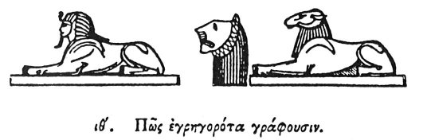

  
[Intangible Textual Heritage](../../index)  [Egypt](../index.md) 
[Index](index)  [Previous](hh020)  [Next](hh022.md) 

------------------------------------------------------------------------

[Buy this Book at
Amazon.com](https://www.amazon.com/exec/obidos/ASIN/1428631488/internetsacredte.md)

------------------------------------------------------------------------

*Hieroglyphics of Horapollo*, tr. Alexander Turner Cory, \[1840\], at
Intangible Textual Heritage

------------------------------------------------------------------------

p. 40

### XIX. HOW THEY DENOTE A WATCHFUL PERSON.

  [1](#fn_43.md)

To denote a *watchful person*, or even a *guard*, they pourtray the HEAD
OF A LION, because the lion, when awake, closes his eyes, but when
asleep keeps them open, which is a sign of watching. Wherefore at the
gates of the temples they have symbolically appropriated lions as
guardians.

------------------------------------------------------------------------

### Footnotes

[40:1](hh021.htm#fr_45.md)

II\. *Watchful*.

I. III. *Andro-Sphinxes, and Crio-Sphinxes, were almost universally
placed in the dromos of a temple. The magnificent lions, presented by
Lord Prudhoe to the British Museum, are from Napata, now Gebel Burkel*.

------------------------------------------------------------------------

[Next: XX. How the Terrible](hh022.md)
