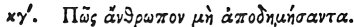

  
[Intangible Textual Heritage](../../index)  [Egypt](../index.md) 
[Index](index)  [Previous](hh024)  [Next](hh026.md) 

------------------------------------------------------------------------

[Buy this Book at
Amazon.com](https://www.amazon.com/exec/obidos/ASIN/1428631488/internetsacredte.md)

------------------------------------------------------------------------

*Hieroglyphics of Horapollo*, tr. Alexander Turner Cory, \[1840\], at
Intangible Textual Heritage

------------------------------------------------------------------------

p. 46

### XXIII. HOW A MAN THAT HAS NOT TRAVELLED ABROAD.

 

To symbolize *a man that has not travelled out of his own country*, they
delineate an ONOCEPHALUS \[creature with an ass's head\], because he is
neither acquainted with history, nor conversant with foreign affairs.

------------------------------------------------------------------------

[Next: XXIV. How an Amulet \[Protection\]](hh026.md)
