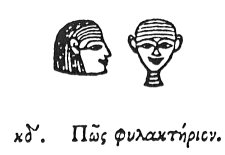

  
[Intangible Textual Heritage](../../index)  [Egypt](../index.md) 
[Index](index)  [Previous](hh025)  [Next](hh027.md) 

------------------------------------------------------------------------

[Buy this Book at
Amazon.com](https://www.amazon.com/exec/obidos/ASIN/1428631488/internetsacredte.md)

------------------------------------------------------------------------

*Hieroglyphics of Horapollo*, tr. Alexander Turner Cory, \[1840\], at
Intangible Textual Heritage

------------------------------------------------------------------------

### XXIV. HOW AN AMULET \[PROTECTION\]. [1](#fn_50.md)

  [2](#fn_49.md)

When they would denote an *amulet*, they pourtray TWO

p. 47

\[paragraph continues\] HUMAN HEADS, one
of a male looking inwards, the other of a female looking outwards, (for
they say that no demon will interfere with any person thus guarded); for
without inscriptions they protect themselves with the two heads.

------------------------------------------------------------------------

### Footnotes

[46:2](hh026.htm#fr_52.md)

*Two heads, one in front and the other in profile, is a common
hieroglyphic signifying Protection, but is not ascertained us an
amule*t.

[46:1](hh026.htm#fr_51.md) Mr. Birch has suggested,
that φυλακτήριον has been substituted by Horapollo for φύλακα, *a Guard
or Protector;* which is extremely happy.

------------------------------------------------------------------------

[Next: XXV. How They Denote an Imperfect Man](hh027.md)
