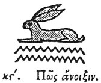

  
[Intangible Textual Heritage](../../index)  [Egypt](../index.md) 
[Index](index)  [Previous](hh027)  [Next](hh029.md) 

------------------------------------------------------------------------

[Buy this Book at
Amazon.com](https://www.amazon.com/exec/obidos/ASIN/1428631488/internetsacredte.md)

------------------------------------------------------------------------

*Hieroglyphics of Horapollo*, tr. Alexander Turner Cory, \[1840\], at
Intangible Textual Heritage

------------------------------------------------------------------------

### XXVI. HOW AN OPENING.

  [1](#fn_52.md)

When they would denote an *opening*, they delineate a HARE, because this
animal always has its eyes open.

------------------------------------------------------------------------

### Footnotes

[48:1](hh028.htm#fr_54.md)

*Denotes* "*opening*" *according to Wilkinson*—*according to Sharpe it
signifies* "*It is lawful*." Qy. "*Open or unprohibited*."

------------------------------------------------------------------------

[Next: XXVII. How Speech](hh029.md)
