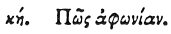

  
[Intangible Textual Heritage](../../index)  [Egypt](../index) 
[Index](index)  [Previous](hh029)  [Next](hh031) 

------------------------------------------------------------------------

[Buy this Book at
Amazon.com](https://www.amazon.com/exec/obidos/ASIN/1428631488/internetsacredte)

------------------------------------------------------------------------

*Hieroglyphics of Horapollo*, tr. Alexander Turner Cory, \[1840\], at
Intangible Textual Heritage

------------------------------------------------------------------------

### XXVIII. HOW DUMBNESS.

 

To denote *dumbness*, they depict the number 1095, which is the number
of days in the space of three years, the year consisting of 365 days,
within which time, if a child does not speak, it chews that it has an
impediment in its tongue.

------------------------------------------------------------------------

[Next: XXIX. How a Voice From a Distance](hh031)
