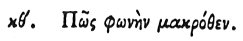

  
[Intangible Textual Heritage](../../index)  [Egypt](../index) 
[Index](index)  [Previous](hh030)  [Next](hh032) 

------------------------------------------------------------------------

[Buy this Book at
Amazon.com](https://www.amazon.com/exec/obidos/ASIN/1428631488/internetsacredte)

------------------------------------------------------------------------

*Hieroglyphics of Horapollo*, tr. Alexander Turner Cory, \[1840\], at
Intangible Textual Heritage

------------------------------------------------------------------------

p. 51

### XXIX. HOW A VOICE FROM A DISTANCE.

 

When they would symbolise a voice *from a distance*, which is called by
the Egyptians Ouaie, they portray the VOICE OF THE AIR, i. e. THUNDER,
than which nothing utters a greater or more powerful voice.

------------------------------------------------------------------------

[Next: XXX. How Ancient Descent](hh032)
