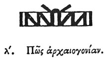

  
[Intangible Textual Heritage](../../index)  [Egypt](../index.md) 
[Index](index)  [Previous](hh031)  [Next](hh033.md) 

------------------------------------------------------------------------

[Buy this Book at
Amazon.com](https://www.amazon.com/exec/obidos/ASIN/1428631488/internetsacredte.md)

------------------------------------------------------------------------

*Hieroglyphics of Horapollo*, tr. Alexander Turner Cory, \[1840\], at
Intangible Textual Heritage

------------------------------------------------------------------------

### XXX. HOW ANCIENT DESCENT.

  [1](#fn_54.md)

To denote *ancient descent* they depict a BUNDLE OF PAPYRUS, and by this
they intimate the *primeval* food; for no one can find the beginning of
food or generation.

------------------------------------------------------------------------

### Footnotes

[51:1](hh032.htm#fr_56.md)

*A roll of papyrus*.

------------------------------------------------------------------------

[Next: XXXI. How Taste](hh033.md)
