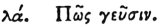

  
[Intangible Textual Heritage](../../index)  [Egypt](../index) 
[Index](index)  [Previous](hh032)  [Next](hh034) 

------------------------------------------------------------------------

[Buy this Book at
Amazon.com](https://www.amazon.com/exec/obidos/ASIN/1428631488/internetsacredte)

------------------------------------------------------------------------

*Hieroglyphics of Horapollo*, tr. Alexander Turner Cory, \[1840\], at
Intangible Textual Heritage

------------------------------------------------------------------------

p. 52

### XXXI. HOW TASTE.

 

To denote *taste* they delineate the EXTREMITY OF THE GULLET, for all
taste is preserved thus far: I am speaking however of *perfect taste*.
But to denote *imperfect taste* they delineate the TONGUE UPON THE
TEETH, inasmuch as all taste is effected by these.

------------------------------------------------------------------------

[Next: XXXII. How Delight](hh034)
