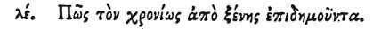

  
[Intangible Textual Heritage](../../index)  [Egypt](../index.md) 
[Index](index)  [Previous](hh036)  [Next](hh038.md) 

------------------------------------------------------------------------

[Buy this Book at
Amazon.com](https://www.amazon.com/exec/obidos/ASIN/1428631488/internetsacredte.md)

------------------------------------------------------------------------

*Hieroglyphics of Horapollo*, tr. Alexander Turner Cory, \[1840\], at
Intangible Textual Heritage

------------------------------------------------------------------------

### XXXV. HOW A MAN RETURNING HOME AFTER A LONG TIME FROM A FOREIGN LAND.

 

To denote a man returning home after a long time from a foreign land
they again delineate the PHŒNIX the bird: for this creature, after an
interval of 580 years, [2](#fn_60.md) when the time
of death is about to overtake him, returns to Egypt, and as soon as he
pays the debt of nature in Egypt, he is mystically served with funeral
rites; and whatever rites the Egyptians pay to the rest of the sacred
animals, the same

p. 56

are due to the Phœnix: [1](#fn_61.md) for it is
said by the Egyptians to rejoice in the sun more than other birds, and
because among them the Nile overflows through the heat of this god; of
which matter we discoursed with you a short time since.

------------------------------------------------------------------------

### Footnotes

[55:2](hh037.htm#fr_62.md) See a similar relation
in Tacitus Ann. vi. 28.

[56:1](hh037.htm#fr_63.md) I have translated this
according to Treb.

------------------------------------------------------------------------

[Next: XXXVI. How They Denote the Heart](hh038.md)
