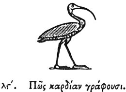

  
[Intangible Textual Heritage](../../index)  [Egypt](../index.md) 
[Index](index)  [Previous](hh037)  [Next](hh039.md) 

------------------------------------------------------------------------

[Buy this Book at
Amazon.com](https://www.amazon.com/exec/obidos/ASIN/1428631488/internetsacredte.md)

------------------------------------------------------------------------

*Hieroglyphics of Horapollo*, tr. Alexander Turner Cory, \[1840\], at
Intangible Textual Heritage

------------------------------------------------------------------------

### XXXVI. HOW THEY DENOTE THE HEART.

  [2](#fn_62.md)

When they would denote the *heart* they delineate the Isis; for this
animal is consecrated to Hermes \[Thoth\],

p. 57

the lord of every heart and of reasoning. The Ibis also is itself in its
own shape like the heart, respecting which great discussions are
maintained by the Egyptians.

------------------------------------------------------------------------

### Footnotes

[56:2](hh038.htm#fr_64.md)

*Ibis, the emblem of Thoth or Hermes*.

------------------------------------------------------------------------

[Next: XXXVII. How Education](hh039.md)
