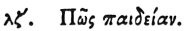

  
[Intangible Textual Heritage](../../index)  [Egypt](../index) 
[Index](index)  [Previous](hh038)  [Next](hh040) 

------------------------------------------------------------------------

[Buy this Book at
Amazon.com](https://www.amazon.com/exec/obidos/ASIN/1428631488/internetsacredte)

------------------------------------------------------------------------

*Hieroglyphics of Horapollo*, tr. Alexander Turner Cory, \[1840\], at
Intangible Textual Heritage

------------------------------------------------------------------------

### XXXVII. HOW EDUCATION.

 

To denote *education* [1](#fn_63) they represent
the HEAVEN DISTILLING DEW, intimating that as falling dew alights on all
Vegetables, and softens those which have a nature susceptible of being
softened, but is unable to operate upon those which essentially remain
hard in the same way as upon the others; so also among men education is
common to all; and a man of an apt disposition receives it as dew, while

p. 58

a man of a disposition less docile is incapable of doing so.

------------------------------------------------------------------------

### Footnotes

[57:1](hh039.htm#fr_65) Qy. An Educator or
Priest? See Ch. 21, fig. 4. See also fig. 3 of Neith, who was the
Minerva, the Goddess of Education, pouring out the waters.

------------------------------------------------------------------------

[Next: XXXVIII. How the Egyptian Letters](hh040)
