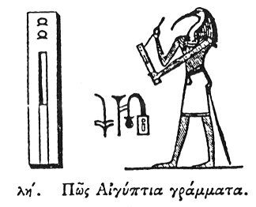

  
[Intangible Textual Heritage](../../index)  [Egypt](../index.md) 
[Index](index)  [Previous](hh039)  [Next](hh041.md) 

------------------------------------------------------------------------

[Buy this Book at
Amazon.com](https://www.amazon.com/exec/obidos/ASIN/1428631488/internetsacredte.md)

------------------------------------------------------------------------

*Hieroglyphics of Horapollo*, tr. Alexander Turner Cory, \[1840\], at
Intangible Textual Heritage

------------------------------------------------------------------------

### XXXVIII. HOW THE EGYPTIAN LETTERS.

  [1](#fn_64.md)

To denote the *Egyptian letters*, or a *sacred scribe*, or a *boundary*,
they delineate INK, and a SIEVE, and a REED, and they thus symbolise the
Egyptian *letters*, because by means of these things all writings among
the Egyptians are executed: for they write with a reed and nothing else:
and they depict a SIEVE, because the sieve being originally

p. 59

an instrument for making bread is constructed of reed; and they thereby
intimate that every one who has a subsistence should learn the letters,
but that one who has not should practise some other art. And hence it is
that among them education is called SBO, [1](#fn_65.md) which when interpreted signifies
sufficient food. Also they symbolize by these a *sacred scribe*, because
he judges of life and death. For there is among the sacred scribes a
sacred book called AMBRES, by which they decide respecting any one who
is lying sick, whether he will live or not, ascertaining it from the
recumbent posture of the sick person. And a *boundary*, because he who
has learnt his letters has arrived at a tranquil harbour of existence,
no longer wandering among the evils of this life.

------------------------------------------------------------------------

### Footnotes

[58:1](hh040.htm#fr_66.md)

I. *Inkstand: the ink and reeds, with one of which Thoth is writing, are
placed in the cavities of the inkstand*.

II\. *A royal scribe*.

III\. *Thoth, the sacred scribe, is usually in this position, behind
Osiris in the judgment of the dead*.

[59:1](hh040.htm#fr_67.md) SBO in Coptic denotes
learning.—Champ.

------------------------------------------------------------------------

[Next: XXXIX. How a Sacred Scribe](hh041.md)
