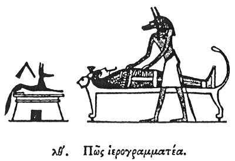

  
[Intangible Textual Heritage](../../index)  [Egypt](../index) 
[Index](index)  [Previous](hh040)  [Next](hh042) 

------------------------------------------------------------------------

[Buy this Book at
Amazon.com](https://www.amazon.com/exec/obidos/ASIN/1428631488/internetsacredte)

------------------------------------------------------------------------

*Hieroglyphics of Horapollo*, tr. Alexander Turner Cory, \[1840\], at
Intangible Textual Heritage

------------------------------------------------------------------------

p. 60

### XXXIX. HOW A SACRED SCRIBE.

  [1](#fn_66)

And again when they would denote a *sacred scribe,* or a *prophet*, or
an *embalmer*, or the *spleen*, or *smelling*, or *laughter*, or
*sneezing*, \[or *government*, or a *judge*,\] they depict a DOG. And by
this they denote a *sacred scribe*, because it is necessary for one who
is desirous of becoming a perfect sacred scribe to be extremely careful,
and to bark perpetually, and to be fierce,

p. 61

fawning upon no one, like dogs. And they symbolise by it a *prophet*,
because the dog gazes intently [1](#fn_67) upon
the images of the gods more than all other animals, as does a prophet.
And an *embalmer* of the sacred animals, because he also surveys the
naked and dissected forms which are preserved by him. And the *spleen*,
because this animal alone of all other creatures has this organ very
light: and whether death or madness seizes him it arises from his
spleen. And those who attend this animal in his exequies, when about
themselves to die, generally become splenetic; for smelling the
exhalations from the dog, when dissecting him, they are affected by
them.

p. 62

And it denotes smelling, and laughter, and sneezing, because the
thoroughly splenetic are neither able to smell, nor laugh, nor sneeze.

------------------------------------------------------------------------

### Footnotes

[60:1](hh041.htm#fr_68)

I. *Anubis on a tomb*.

II\. *Anubis as an embalmer*.

[61:1](hh041.htm#fr_69) In the ceiling of the
Ramesseion is a figure of Anubis seated, as in fig. I., at each end of
the zodiac, gazing at the gods, who represent the intermediate months.

------------------------------------------------------------------------

[Next: XL. In What Manner They Represent Government, or a Judge](hh042)
