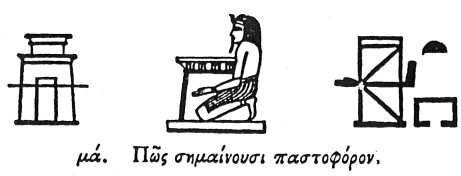

  
[Intangible Textual Heritage](../../index)  [Egypt](../index) 
[Index](index)  [Previous](hh041)  [Next](hh043) 

------------------------------------------------------------------------

[Buy this Book at
Amazon.com](https://www.amazon.com/exec/obidos/ASIN/1428631488/internetsacredte)

------------------------------------------------------------------------

*Hieroglyphics of Horapollo*, tr. Alexander Turner Cory, \[1840\], at
Intangible Textual Heritage

------------------------------------------------------------------------

### XL. IN WHAT MANNER THEY REPRESENT GOVERNMENT, OR A JUDGE.

  [1](#fn_68) [2](#fn_69)

When they denote government, [3](#fn_70) or a
judge, they place

p. 63

close against the dog a ROYAL ROBE, the undress garment: [1](#fn_71) because like the dog, who, as I said
before, gazes intently on the images of the gods, so likewise the
minister, being in the more ancient times a judge also, used to see the
king naked, and on this account they add the royal garment.

------------------------------------------------------------------------

### Footnotes

[62:1](hh042.htm#fr_70)

I. *The figure, which appears to be some spotted skin upon a pole, is
commonly placed beside Osiris or Thoth in the judgment of the dead, in
which Anubis or the Dog is also concerned. It may be some coarse
garment, but it is evidently the panther skin of the Greek Dionysus, the
counter-part of Osiris*.

II\. *Osiris as judge of the dead; another forth of Khem*.

[62:2](hh042.htm#fr_71) Qy. ὀσφραινόμενοι, the
robe bearer, who was one of the officers of the procession. See the
illustration of these chapters from Clemens, in the plate and note at
the end.

[62:3](hh042.htm#fr_72) Qy. Ἄρχοντα, An archon
or minister of state.

[63:1](hh042.htm#fr_73) Very obscure—Treb. reads
nudæ figuræ appositam, placed on a naked figure.—Mer. and De Pauw.
suggest σχήματι γύμνῳ—Caus. καὶ σχῆμα γυμνόν. It seems to have been the
hide of some beast worn next the skin by the King, (as Dionysus and
Hercules are represented,) sod, according to Mr. Wilkinson, by the
priests of a certain grade.—See his Ancient Egypt.

------------------------------------------------------------------------

[Next: XLI. How They Signify the Bearer of the Shrine](hh043)
