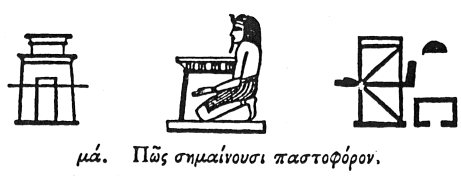

  
[Intangible Textual Heritage](../../index)  [Egypt](../index.md) 
[Index](index)  [Previous](hh042)  [Next](hh044.md) 

------------------------------------------------------------------------

[Buy this Book at
Amazon.com](https://www.amazon.com/exec/obidos/ASIN/1428631488/internetsacredte.md)

------------------------------------------------------------------------

*Hieroglyphics of Horapollo*, tr. Alexander Turner Cory, \[1840\], at
Intangible Textual Heritage

------------------------------------------------------------------------

### XLI. HOW THEY SIGNIFY THE BEARER OF THE SHRINE.

  [2](#fn_72.md)

To signify the *bearer of the shrine*, [3](#fn_73.md) they depict the KEEPER

p. 64

OF A HOUSE, because by him the temple is guarded.

------------------------------------------------------------------------

### Footnotes

[63:2](hh043.htm#fr_74.md)

I. *Shrine or small portable temple, which was borne like the Jewish ark
by staves passed along its sides, as above*.—Sh. 361.

II\. *This figure supporting a shrine is very common*.

III\. *A temple; literally a shrine-house*.—Sh. 362.

[63:3](hh043.htm#fr_75.md) The cell in which the
statue was carried in procession.

------------------------------------------------------------------------

[Next: XLII. How They Represent an Horoscopus \[Observer of the
Hours.\]](hh044.md)
