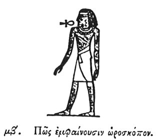

  
[Intangible Textual Heritage](../../index)  [Egypt](../index.md) 
[Index](index)  [Previous](hh043)  [Next](hh045.md) 

------------------------------------------------------------------------

[Buy this Book at
Amazon.com](https://www.amazon.com/exec/obidos/ASIN/1428631488/internetsacredte.md)

------------------------------------------------------------------------

*Hieroglyphics of Horapollo*, tr. Alexander Turner Cory, \[1840\], at
Intangible Textual Heritage

------------------------------------------------------------------------

### XLII. HOW THEY REPRESENT AN HOROSCOPUS \[OBSERVER OF THE HOURS.\]

  [1](#fn_74.md)

To signify an Horoscopus \[observer of the hours\], they delineate a MAN
EATING THE HOURS, not that the man eats the hours, for that is
impossible, but because food is prepared for men according to the hours.

------------------------------------------------------------------------

### Footnotes

[64:1](hh044.htm#fr_76.md) *This figure of a man
with the emblem of life against his mouth is found; and seems to he the
figure alluded to*.

------------------------------------------------------------------------

[Next: XLIII. How They Denote Purity](hh045.md)
