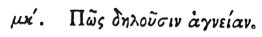

  
[Intangible Textual Heritage](../../index)  [Egypt](../index) 
[Index](index)  [Previous](hh044)  [Next](hh046) 

------------------------------------------------------------------------

[Buy this Book at
Amazon.com](https://www.amazon.com/exec/obidos/ASIN/1428631488/internetsacredte)

------------------------------------------------------------------------

*Hieroglyphics of Horapollo*, tr. Alexander Turner Cory, \[1840\], at
Intangible Textual Heritage

------------------------------------------------------------------------

### XLIII. HOW THEY DENOTE PURITY.

 

To represent *purity* they delineate FIRE AND WATER,

p. 65

because by these elements all purification is perfected.

------------------------------------------------------------------------

[Next: XLIV. How They Intimate a Thing Unlawful, or an
Abomination](hh046)
