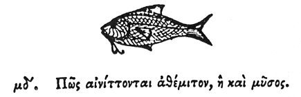

  
[Intangible Textual Heritage](../../index)  [Egypt](../index) 
[Index](index)  [Previous](hh045)  [Next](hh047) 

------------------------------------------------------------------------

[Buy this Book at
Amazon.com](https://www.amazon.com/exec/obidos/ASIN/1428631488/internetsacredte)

------------------------------------------------------------------------

*Hieroglyphics of Horapollo*, tr. Alexander Turner Cory, \[1840\], at
Intangible Textual Heritage

------------------------------------------------------------------------

### XLIV. HOW THEY INTIMATE A THING UNLAWFUL, OK AN ABOMINATION.

  [1](#fn_75)

To denote a *thing unlawful*, or an *abomination*, they delineate a
FISH, because the feeding upon fish is considered in the sacred rites as
abominable, and a pollution: for every fish is an animal that is a
desolator \[laxative as food?\], and a devourer of its own species.

------------------------------------------------------------------------

### Footnotes

[65:1](hh046.htm#fr_77)

*Clemens states that the fish denotes hatred: and, according to Leemans,
it is found in some inscriptions with that signfication*.

------------------------------------------------------------------------

[Next: XLV. How They Represent the Mouth](hh047)
